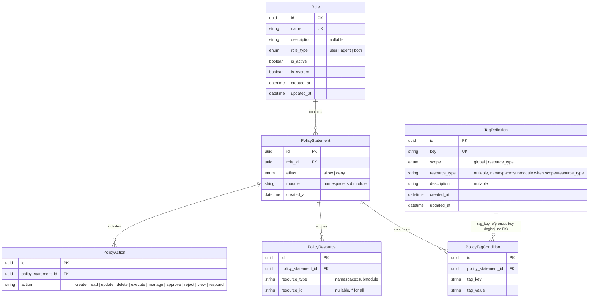

# Data Model — Namespaced Resource Types

## 1. New Entities

No new tables or entities are introduced. This change is purely a **semantic evolution** of existing string columns: the flat resource type identifiers stored in `policy_statements.module` and `policy_resources.resource_type` are replaced with two-layer namespaced values (`module::submodule`). No new tables, columns, or constraints are added.

---

## 2. Modified Entities

### 2.1 `PolicyStatement.module`

| Aspect | Value |
|--------|-------|
| **Table** | `policy_statements` |
| **Column** | `module` (string, NOT NULL, max 100) |
| **Before** | Flat resource type (e.g. `agent`, `role`, `skill`) |
| **After** | Two-layer namespaced identifier (e.g. `agent::management`, `agent::roles`) |
| **Validation** | Enforced against `ResourceTypeManifest` at the application layer (no DB-level enum or CHECK constraint) |
| **Wildcards** | `*::*` (match all), `module::*` (match all submodules within a module) |

### 2.2 `PolicyResource.resource_type`

| Aspect | Value |
|--------|-------|
| **Table** | `policy_resources` |
| **Column** | `resource_type` (string, NOT NULL, max 100) |
| **Before** | Flat resource type (e.g. `agent`, `mcp_server`) |
| **After** | Two-layer namespaced identifier (e.g. `agent::management`, `integration::mcp_hub`) |
| **Validation** | Enforced against `ResourceTypeManifest` at the application layer |
| **Wildcards** | `*::*`, `module::*` — wildcards are orthogonal to `resource_id` (`resource_id = "*"` matches all instances of the given type; `resource_type = "agent::*"` matches the entire module) |

### 2.3 Implicit Consideration: `TagDefinition.resource_type`

| Aspect | Value |
|--------|-------|
| **Table** | `tag_definitions` |
| **Column** | `resource_type` (string, nullable, max 100) |
| **Note** | When `scope = resource_type`, this column scopes the tag to a particular resource type. It currently holds flat values and should accept the new namespaced identifiers for consistency. This is **not explicitly in scope** of the PRD but should be revisited for hygiene. |

---

## 3. Removed Entities / Fields

No columns or tables are removed. The 15 legacy flat resource type values are **deprecated** and will no longer be accepted as valid identifiers after migration:

| Legacy Value | Status |
|--------------|--------|
| `agent` | Replaced by `agent::management` |
| `role` | Replaced by `agent::roles` |
| `skill` | Replaced by `agent::skills` |
| `scheduling` | Replaced by `agent::schedules` |
| `conversation` | Consolidated into `agent::trails` |
| `result` | Consolidated into `agent::trails` |
| `intervene` | Replaced by `agent::human_intervention` |
| `data_type` | Replaced by `agent::data_types` |
| `mcp_server` | Replaced by `integration::mcp_hub` |
| `notification` | Replaced by `integration::notifications` |
| `permissions` | Consolidated into `system::permissions` |
| `group` | Consolidated into `system::permissions` |
| `user` | Consolidated into `system::permissions` |
| `tag` | Consolidated into `system::permissions` |
| `access_request` | Consolidated into `system::permissions` |

Legacy values are migrated automatically; administrators do not need to manually update any policy statements.

---

## 4. Entity-Relationship Diagram

Tables directly involved in the change and their relationships. All string columns annotated `(ns)` accept the new `module::submodule` format; all other columns remain unchanged.

**Notes:**
- `TagDefinition` ↔ `PolicyTagCondition` is a **logical** relationship via matching `key`/`tag_key` values; there is no physical foreign-key constraint between the two tables.
- The `module` and `resource_type` columns remain `String(100)` at the DB level — no type change, only the value format evolves.
- The `effect` enum (`allow`/`deny`) and action values (`create`, `read`, `update`, `delete`, `execute`, `manage`, `approve`, `reject`, `view`, `respond`) are unchanged.

---

## 5. Complete Migration Mapping

### 5.1 Agents Module (`agent::*`) — 12 submodules

| # | Legacy Value(s) | Namespaced Value | Sidebar Label | Notes |
|---|-----------------|------------------|---------------|-------|
| 1 | `role` | `agent::roles` | Agent Roles | Direct map |
| 2 | _(none)_ | `agent::identities` | Agent Identities | **New** — previously unpermissioned |
| 3 | `agent` | `agent::management` | Agent Types / Management | Direct map |
| 4 | _(none)_ | `agent::runtime_control` | Runtime Control | **New** — previously unpermissioned |
| 5 | `skill` | `agent::skills` | Skills | Direct map |
| 6 | _(none)_ | `agent::sops` | SOPs | **New** — previously unpermissioned |
| 7 | _(none)_ | `agent::model_configs` | Model Configs | **New** — previously unpermissioned |
| 8 | `scheduling` | `agent::schedules` | Schedules | Renamed for clarity |
| 9 | `conversation` | `agent::trails` | Agent Trails | Two legacy types consolidate |
| 10 | `result` | `agent::trails` | Agent Trails | into one submodule |
| 11 | `intervene` | `agent::human_intervention` | Human Intervene | Renamed for clarity |
| 12 | `data_type` | `agent::data_types` | Data Types | Direct map, pluralised |
| — | _(none)_ | `agent::outputs` | Agent Outputs | **New** — previously unpermissioned |

### 5.2 Integrations Module (`integration::*`) — 2 submodules

| # | Legacy Value(s) | Namespaced Value | Sidebar Label | Notes |
|---|-----------------|------------------|---------------|-------|
| 13 | `mcp_server` | `integration::mcp_hub` | MCP Hub | Renamed for clarity |
| 14 | `notification` | `integration::notifications` | Notifications | Direct map, pluralised |

### 5.3 System Module (`system::*`) — 3 submodules

| # | Legacy Value(s) | Namespaced Value | Sidebar Label | Notes |
|---|-----------------|------------------|---------------|-------|
| 15 | _(none)_ | `system::observability` | Observability | **New** — previously unpermissioned |
| 16 | `permissions`, `group`, `user`, `tag`, `access_request` | `system::permissions` | Permissions | Five legacy types consolidate into one submodule |
| 17 | _(none)_ | `system::system_config` | System Config | **New** — previously unpermissioned |

### 5.4 Wildcard Semantics

| Wildcard | Scope | Equivalent Module Coverage |
|----------|-------|---------------------------|
| `agent::*` | All 12 agent submodules | agent::roles, agent::identities, agent::management, agent::runtime_control, agent::skills, agent::sops, agent::model_configs, agent::schedules, agent::trails, agent::human_intervention, agent::data_types, agent::outputs |
| `integration::*` | Both integration submodules | integration::mcp_hub, integration::notifications |
| `system::*` | All 3 system submodules | system::observability, system::permissions, system::system_config |
| `*::*` | Every resource type in the manifest | All 17 namespaced identifiers |

### 5.5 Consolidation & Renames Summary

| Category | Count | Detail |
|----------|-------|--------|
| **Direct 1:1 maps** (renames) | 8 | `agent`→`agent::management`, `role`→`agent::roles`, `skill`→`agent::skills`, `intervene`→`agent::human_intervention`, `scheduling`→`agent::schedules`, `mcp_server`→`integration::mcp_hub`, `notification`→`integration::notifications`, `data_type`→`agent::data_types` |
| **Many:1 consolidations** | 2 groups | `conversation`+`result`→`agent::trails`; `permissions`+`group`+`user`+`tag`+`access_request`→`system::permissions` |
| **New submodules** | 7 | `agent::identities`, `agent::runtime_control`, `agent::sops`, `agent::model_configs`, `agent::outputs`, `system::observability`, `system::system_config` |
| **Pluralised** | 2 | `data_type`→`agent::data_types`, `notification`→`integration::notifications` |

---

## 6. Schema File References

Per `docs/config.yaml` `source.schema: backend/app/db/models/`, the following model files are affected:

| File | Change |
|------|--------|
| `backend/app/db/models/policy_statement.py` | No code change required — `module` column (`String(100)`) is size-compatible with namespaced values. Application-layer validation (manifest) enforces the new format. |
| `backend/app/db/models/policy_resource.py` | No code change required — `resource_type` column (`String(100)`) is size-compatible. |
| `backend/app/db/models/policy_action.py` | No change. Actions remain flat strings. |
| `backend/app/db/models/policy_tag_condition.py` | No change. Tag conditions unchanged. |
| `backend/app/db/models/tag_definition.py` | **Out of scope for this change**, but the `resource_type` column (`String(100)`) should eventually accept namespaced values when tags are scoped to a resource type. |
| `backend/app/db/models/identity.py` (Role) | No change. Role model unaffected. |

**Key takeaway**: No SQLAlchemy model files require structural changes. The migration is purely a **data migration** (updating existing row values from flat strings to namespaced strings) paired with **application-layer manifest validation** (rejecting flat values at policy CRUD time).

---

## 7. Master Data Model Update Instructions

After this change is implemented and verified, update the following master documentation files:

### 7.1 `docs/master/data-model/overview.md`

**Section: "User Permissions"** (lines 71–184):

1. **PolicyStatement entity attributes**: Update the description of the `module` field:
   - Before: `string module`
   - After: `string module "namespace::submodule (e.g. agent::management)"`

2. **PolicyResource entity attributes**: Update the description of the `resource_type` field:
   - Before: `string resource_type`
   - After: `string resource_type "namespace::submodule (e.g. integration::mcp_hub)"`

3. **Add a note** after the User Permissions erDiagram block documenting:
   - The `module::submodule` naming convention
   - The three modules: `agent`, `integration`, `system`
   - Wildcard semantics: `*::*`, `module::*`
   - That legacy flat values are no longer accepted

4. **TagDefinition entity attributes**: If `tag_definitions.resource_type` is later updated to accept namespaced values, update the `resource_type` attribute description accordingly.

### 7.2 New Doc (Optional): `docs/master/data-model/modules/iam/entities.md`

If the team deems the IAM/policy domain substantial enough to warrant its own module doc (mirroring the existing pattern of `modules/agents/entities.md`, `modules/security/entities.md`, etc.), create a new file containing:

- The IAM-focused erDiagram (Role, PolicyStatement, PolicyResource, PolicyAction, PolicyTagCondition, TagDefinition)
- Entity descriptions for each table with the updated `module::submodule` semantics
- The migration mapping as a reference table
- Source file references pointing to the model files listed in Section 6

### 7.3 `docs/master/product/features/foundation-platform.md`

Per `spec-change.md` Section "Spec Update Instructions":
- Replace flat resource type identifier references with namespaced equivalents
- Add a section documenting the `module::submodule` naming convention
- Add the sidebar-to-resource-type mapping table
- Document wildcard semantics
- Note that Dashboard remains permission-exempt

### 7.4 `docs/master/technology/` (create or update)

Per `spec-change.md`:
- Update or create a tech-spec document for the permission engine covering:
  - `ResourceTypeManifest` structure with the 17 namespaced identifiers
  - Permission engine wildcard evaluation rules for `::`-delimited modules
  - Code reference map to `backend/app/core/resource_types.py` and `backend/app/services/permissions/permission_engine.py`
