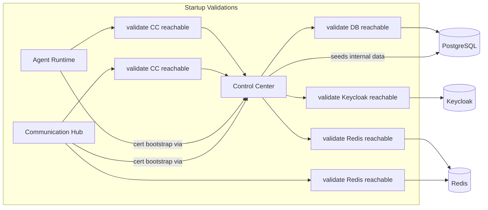
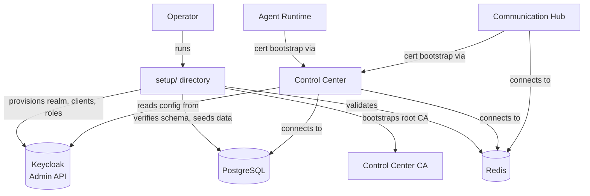
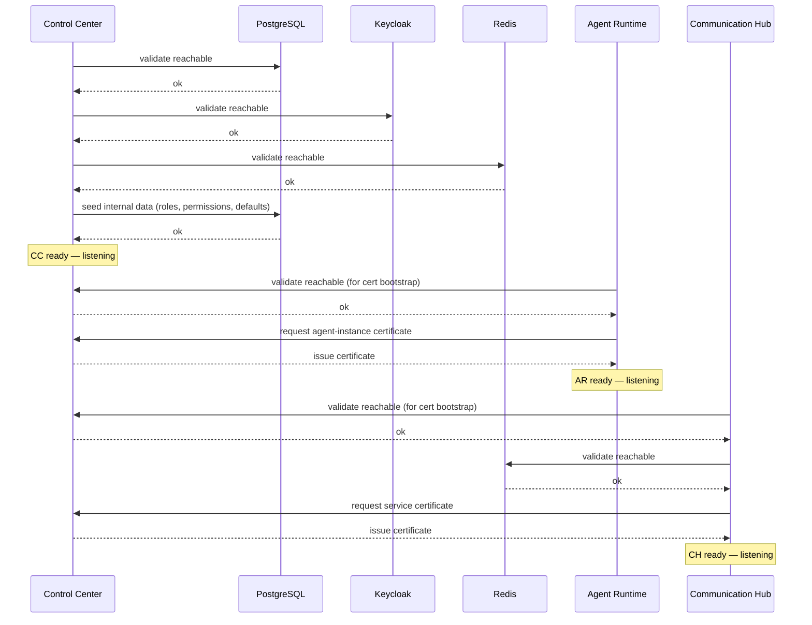

# Architecture: Production-Ready Configuration

## 1. Changed Components

The 3-service architecture (Control Center, Agent Runtime, Communication Hub) shifts from startup-time provisioning to startup-time validation. External infrastructure must be pre-provisioned — the runtime no longer creates or modifies identity provider resources.

### Control Center Changes

| Change | Description |
|--------|-------------|
| **REMOVE** | Startup auto-provisioning of the Keycloak agent realm — the initialization hook and realm management logic are removed from the Control Center startup sequence. |
| **ADD** | Startup validation that external infrastructure (PostgreSQL, Keycloak, Redis) is reachable. Each unreachable service produces a clear, actionable error message and prevents startup. |
| **CHANGE** | Configuration resolution priority: environment variables first, YAML defaults second. |

### Agent Runtime Changes

| Change | Description |
|--------|-------------|
| **CHANGE** | Startup validates that Control Center is reachable (required for certificate bootstrap). If unreachable, logs a clear error and fails to start. |

### Communication Hub Changes

| Change | Description |
|--------|-------------|
| **CHANGE** | Startup validates that Control Center and Redis are reachable (required for certificate bootstrap and message routing). If either is unreachable, logs a clear error and fails to start. |

## 2. New Components

### `setup/` Directory

A dedicated directory, separate from the runtime application, containing all environment bootstrapping scripts. Operators invoke the setup command explicitly — it is never triggered by application startup.

### Consolidated Setup Command

A single setup command replaces the collection of ad-hoc scripts currently used for environment bootstrapping (realm provisioning, client repair, permission management, admin verification, test data seeding, and certificate issuance).

The consolidated command handles:

- Keycloak realm and client provisioning (moved from the runtime to this operator-invoked tool)
- Initial admin user provisioning
- Test data seeding (dev mode only)
- Certificate authority bootstrapping
- Database readiness verification

All operations are idempotent — running the setup command on an already-initialized environment detects existing state and reports it without errors.

## 3. Integration Points

### Environment Variables as Primary Configuration

Environment variables are the primary integration point for all external infrastructure providers. YAML configuration files serve as fallback defaults for development convenience.

| Integration | Configurable via Environment Variables | Falls back to YAML if unset |
|-------------|----------------------------------------|-----------------------------|
| PostgreSQL | Connection host, port, database name, and credentials | Dev-only defaults |
| Redis | Connection host, port, and credentials | Dev-only defaults |
| OIDC Provider | Issuer URL, client ID, and client secret | Bundled Keycloak defaults |
| OpenTelemetry | Traces, metrics, and logs export endpoints | Local dev defaults |

### Configuration Resolution Order

1. Environment variable (if set, use immediately — no YAML lookup)
2. YAML configuration file value (if env var is absent)
3. Built-in default (if neither env var nor YAML value exists)

On startup, each service logs which source was used for every infrastructure connection, giving operators full visibility into the active configuration.

### Validation Instead of Provisioning

Services validate external dependencies at startup rather than provisioning them. If a dependency is unreachable or misconfigured, the service fails to start with a clear error message identifying the missing dependency and the expected configuration variable.

## 4. Data Flow Changes

### New Startup Sequence

### Key Behavioral Changes

- **Before**: Control Center auto-provisions Keycloak realm and clients at startup, silently masking configuration errors.
- **After**: Control Center validates that the expected Keycloak configuration exists. If it does not, the service fails with a clear error directing the operator to run the setup command.
- **Before**: Agent Runtime and Communication Hub start regardless of Control Center availability, potentially failing later with opaque certificate errors.
- **After**: Both services validate Control Center reachability at startup, failing fast with a clear message if the certificate authority is not available.

## 5. Master Arch Update Instructions

After implementation, update the following master specification files:

### `docs/master/architecture/system-overview.md`

- Add the `setup/` directory as a separate, operator-invoked component (not part of the runtime system) in the component diagram.
- Remove Keycloak provisioning from Control Center's responsibilities.
- Add configuration resolution flow to the overview: environment variables → YAML files → built-in defaults.
- Update the component diagram to show startup validation checks against external infrastructure rather than provisioning arrows.

### `docs/master/architecture/modules/control-center/architecture.md`

- Remove the Keycloak realm initialization step from the Control Center startup sequence.
- Add startup validation steps for PostgreSQL, Keycloak, and Redis.
- Document the configuration resolution priority (env vars first, YAML second).
- Replace provisioning flows with validation flows in any sequence diagrams.

### `docs/master/architecture/modules/agent-runtime/architecture.md`

- Add Control Center reachability validation to the Agent Runtime startup sequence.
- Document that certificate bootstrap now depends on pre-validated Control Center availability.

### `docs/master/architecture/modules/communication-hub/architecture.md`

- Add Control Center and Redis reachability validation to the Communication Hub startup sequence.
- Document the dual-dependency check and its role in certificate bootstrap and message routing.
