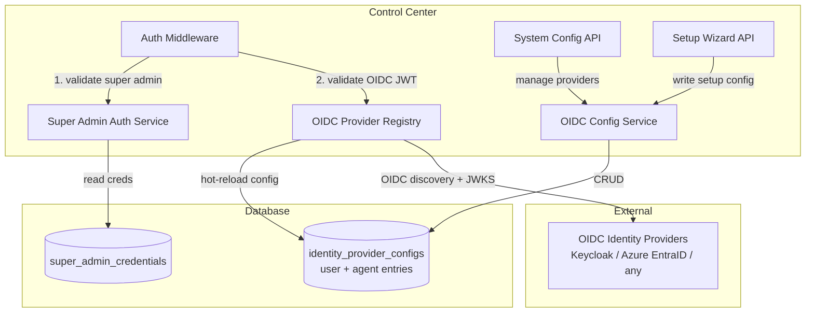
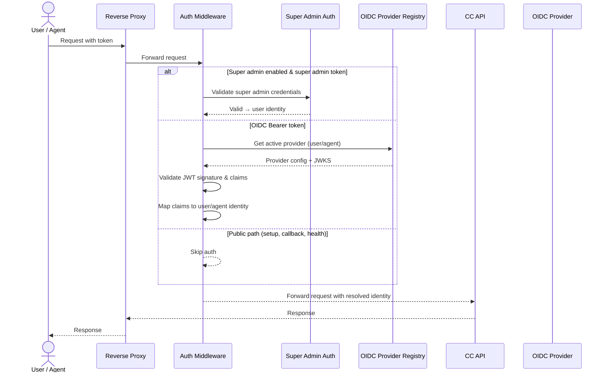
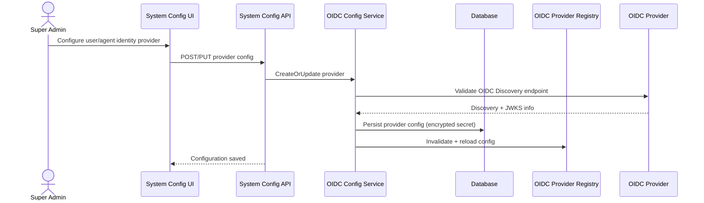

# Architecture: Refine OIDC Integration

## 1. Changed Components

### OIDC Client (`backend/app/core/oidc_client.py`)
- **From**: Reads single provider config from `config/identity.yaml`; assumes Keycloak-specific realm topology.
- **To**: Supports multiple named OIDC providers (user + agent) concurrently. Loads issuer URL, client ID, client secret, and optional claims mapping from database at request time via the OIDC Provider Registry. All Keycloak-specific assumptions removed — uses standard OIDC Discovery (`.well-known/openid-configuration`) for any compliant provider. JWT validation audiences and claim config are per-provider.

### Auth Middleware (`backend/app/middleware/auth.py`)
- **From**: Single auth path: extract Bearer token, validate against one OIDC provider, resolve user.
- **To**: Three-tier auth pipeline:
  1. **Super admin token** — Check for super-admin Bearer token, validate locally against DB-stored hashed credentials (bypasses OIDC entirely).
  2. **OIDC JWT** — Determine provider type (user vs agent) from token claims or request context, validate via OIDC Provider Registry against the active provider config.
  3. **Fallback/public paths** — Routes marked public (setup wizard, OIDC callback, health) skip auth checks.
- Super admin token has short expiry (configurable, default 15 minutes). When super admin is disabled, this path is skipped — only OIDC auth is attempted.

### Config Loading (`backend/app/core/config.py`)
- **From**: Settings reads OIDC config exclusively from `config/identity.yaml` at startup.
- **To**: On startup, Settings class:
  - Loads super admin bootstrap config from environment variables (`SUPER_ADMIN_ENABLED`, `SUPER_ADMIN_USERNAME`, `SUPER_ADMIN_PASSWORD_HASH`) with reasonable defaults.
  - Attempts to load OIDC provider configs from database via OIDC Provider Registry.
  - Falls back to `config/identity.yaml` for one-time migration if no DB config exists.
  - After migration, DB is source of truth; YAML file is no longer read.

### Setup Wizard/API (`backend/app/api/v1/setup.py`)
- **From**: Setup wizard writes OIDC configuration to `config/identity.yaml`.
- **To**: Setup wizard writes OIDC configuration to database via the OIDC Config Service. Reuses the existing `identity_provider_configs` database table. Wizard flow logic (bundled Keycloak vs external OIDC detection, realm creation) is preserved unchanged — only the persistence target changes.

### Identity Services
- **BootstrapService**: Must initialize OIDC Provider Registry at startup. Must run the one-time migration from `config/identity.yaml` to database on upgrade. Must seed the built-in super admin credentials from env vars into the database.
- **RealmManager**: Must support non-Keycloak OIDC providers. Realm creation and client registration calls must use standard OIDC endpoints (dynamic client registration when supported) with graceful fallback for providers that do not support programmatic registration.

---

## 2. New Components

**Super Admin Auth Service** — Validates username/password against DB-stored bcrypt-hashed credentials in the `super_admin_credentials` table. Issues short-lived JWT (signed with Control Center's internal key) for UI access. Supports enable/disable toggle; when disabled, all super admin login attempts are refused regardless of credentials. Credentials are bootstrapped from environment variables on first launch, never hardcoded.

**OIDC Config Service** — Full CRUD for user and agent identity provider configurations in the `identity_provider_configs` table. Validates OIDC Discovery endpoints (issuer reachability, `.well-known/openid-configuration` fetch). Encrypts client secrets at rest. Supports provider type enumeration: `user` and `agent`. Each provider entry includes issuer URL, client ID, encrypted client secret, scopes, and optional claims mapping configuration.

**OIDC Provider Registry** — Maintains an in-memory cache of OIDC provider configurations loaded from the database at startup. Exposes a provider-resolution interface for Auth Middleware and other consumers to look up active provider configs. Supports hot-reload: when OIDC Config Service updates a provider config, the registry is invalidated and reloaded without service restart. Caches JWKS keys per provider with TTL-based refresh.

**System Config API** — New REST endpoints under the existing System Config module for managing identity provider configurations (CRUD) and super admin enable/disable. Includes endpoints for testing OIDC connectivity and performing test logins against configured providers to validate that the integration works before enabling it for regular users.

---

## 3. Integration Points

- **Frontend AuthContext ↔ System Config API**: On app load, AuthContext calls `GET /api/v1/system/identity-providers` to discover active OIDC providers. This determines the login page rendering (show super admin login form, OIDC login buttons, or both).

- **Frontend System Config Page ↔ OIDC Config Service**: The System Config admin page provides forms for adding/editing/removing identity provider configs. On save, calls System Config API which delegates to OIDC Config Service. Test and test-login buttons call the OIDC Config Service's validation endpoints.

- **Auth Middleware ↔ OIDC Provider Registry**: At every authenticated request, Auth Middleware queries the registry for active providers. The registry returns cached provider configs with JWKS keys for JWT signature validation.

- **Setup Wizard API ↔ OIDC Config Service**: When the setup wizard completes, it writes the configured identity provider (bundled Keycloak or external) to the database via OIDC Config Service. It also enables or disables the super admin based on the wizard's outcome.

- **Login Page ↔ Provider Config**: The login page reads available providers from AuthContext and renders appropriate login UI elements. If super admin is enabled, renders a username/password form alongside OIDC login buttons. If only OIDC providers are active, renders SSO buttons. If no providers are configured and super admin is disabled, shows the setup wizard redirect.

- **Control Center ↔ External OIDC Providers**: The registry performs OIDC Discovery and JWKS key fetching directly from configured provider URLs. Token validation happens per-request, with provider-specific audience and claims mapping applied.

---

## 4. Data Flow Changes

### Super Admin Configure Flow

---

## 5. Master Arch Update Instructions

### Update `docs/master/architecture/system-overview.md`
- Add **OIDC Provider Registry** to the Control Center component list: an in-memory config cache that hot-reloads from the database and provides multi-provider JWT validation to Auth Middleware.
- Add **Super Admin Auth Service** as a new internal component of Control Center: local credential validation and short-lived JWT issuance, bootstrapped from environment variables, toggleable on/off.
- Add **OIDC Config Service** as the database-backed configuration manager for identity providers, replacing the static `config/identity.yaml` approach.
- Update the Authentication flow description: document the three-tier auth pipeline (super admin → OIDC → public fallback) and the per-request provider resolution from the registry.
- Add **System Config API** endpoints for identity provider management under the Control Center API surface.

### Update Module Architecture Docs
- **Control Center → Auth** (`docs/master/architecture/modules/control-center-auth.md` if it exists, or create):
  - Document the three-tier authentication pipeline with decision tree.
  - Document super admin token format, expiry, and disablement behavior.
  - Document per-provider OIDC JWT validation path (user vs agent provider resolution).
- **Control Center → System Config** (create or update module doc):
  - Document the identity provider configuration endpoints.
  - Document the OIDC test and test-login validation endpoints.
  - Document the super admin enable/disable endpoints.
- **Control Center → Bootstrap** (update if it exists):
  - Document the startup sequence: env var → super admin credential seeding, identity.yaml → database one-time migration, OIDC Provider Registry initialization.
