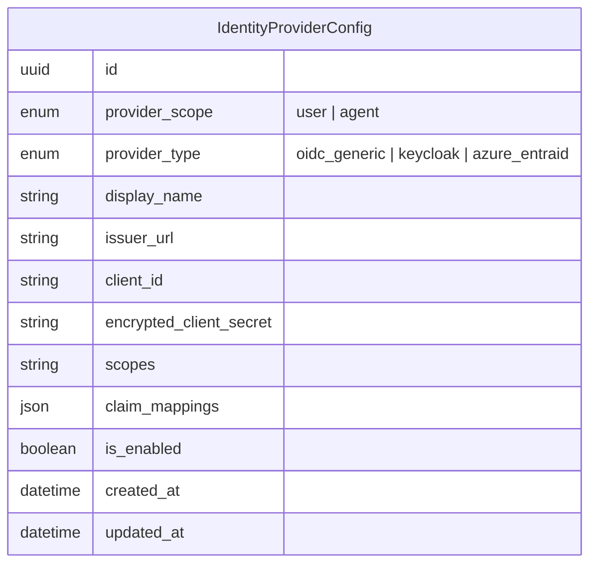
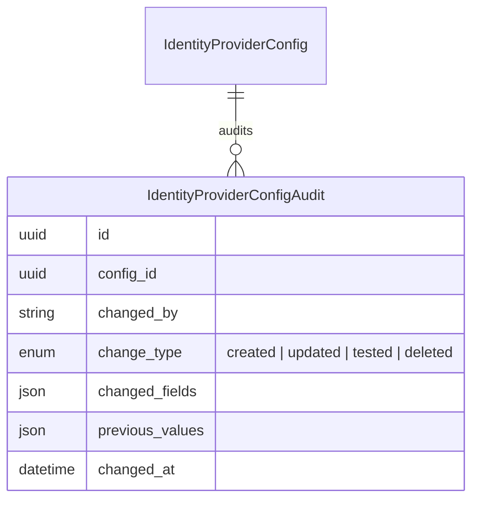
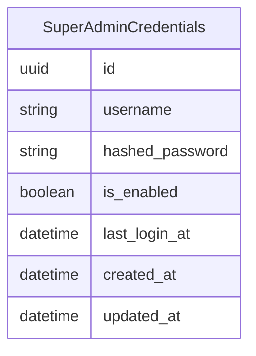
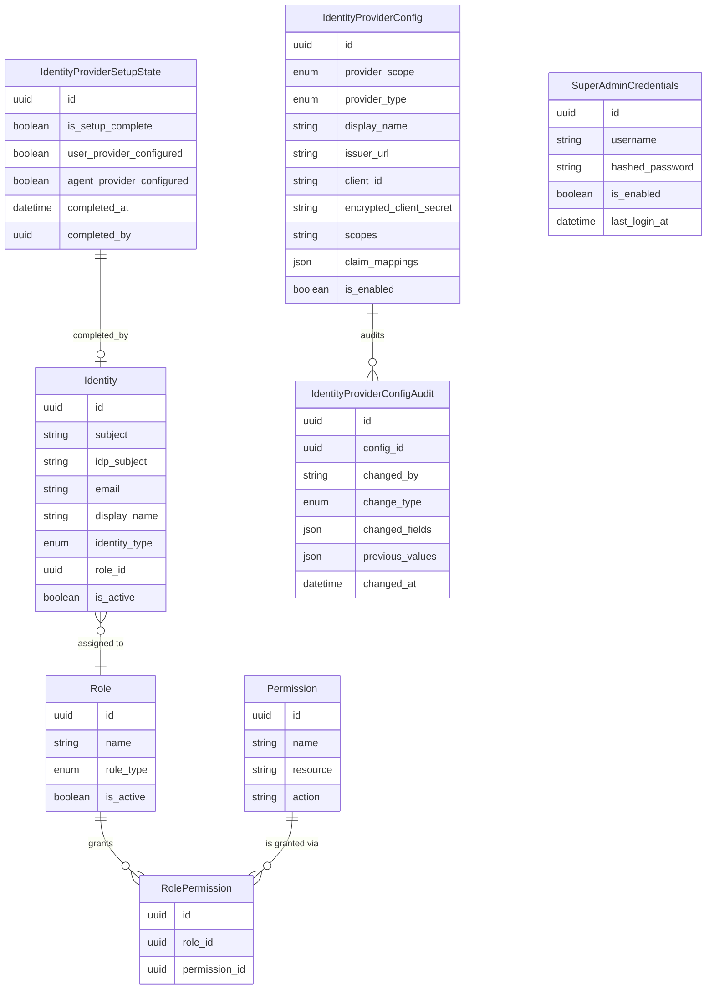

# Data Model: Refine OIDC Integration

## 1. New Entities

### IdentityProviderConfig (restructured)

Represents an OIDC identity provider configuration for authenticating either users or agents. Each deployment has at most one config per scope (user / agent), but they may share the same provider or point to different ones.

| Attribute | Description |
|-----------|-------------|
| `provider_scope` | Which identity domain this config governs — `user` for human logins, `agent` for agent OAuth identities |
| `provider_type` | The OIDC provider flavour; `oidc_generic` covers any standards-compliant provider beyond Keycloak and Azure EntraID |
| `display_name` | Human-readable label shown in the admin UI (e.g. "Corporate SSO", "Agent Identity Realm") |
| `issuer_url` | The OIDC `.well-known/openid-configuration` issuer endpoint; replaces the old `oidc_provider_url` |
| `encrypted_client_secret` | AES-256-GCM encrypted OIDC client secret; never logged or returned unencrypted |
| `scopes` | Space-delimited OIDC scopes to request (e.g. `openid profile email`) |
| `claim_mappings` | JSON map defining how OIDC claims translate to platform fields (e.g. `{"sub": "subject", "email": "email", "name": "display_name"}`) |
| `is_enabled` | Operational toggle; when `false`, authentication through this provider is disabled regardless of config validity |

### IdentityProviderConfigAudit

Immutable audit log recording every administrative change to an identity provider configuration. Provides a full change history for security review and rollback reference.

| Attribute | Description |
|-----------|-------------|
| `config_id` | FK to the `IdentityProviderConfig` that was changed |
| `changed_by` | Identity of the admin (super admin username or OIDC subject) who made the change |
| `change_type` | Nature of the operation; `tested` records a test-login attempt against the config |
| `changed_fields` | Array of field names that were modified |
| `previous_values` | Snapshot of the config values before the change, for rollback reference |

### SuperAdminCredentials

Stores the built-in super admin bootstrap credentials. This is a single-row resource — at most one set of credentials exists. Credentials are initialised from environment variables on first launch and can be updated via the admin UI or env vars. When disabled, the super admin login is refused regardless of password correctness.

| Attribute | Description |
|-----------|-------------|
| `username` | Immutable super admin username; sourced from `SUPER_ADMIN_USERNAME` env var at bootstrap |
| `hashed_password` | Argon2id or bcrypt hash of the super admin password; sourced from `SUPER_ADMIN_PASSWORD_HASH` env var at bootstrap, updatable via UI |
| `is_enabled` | Runtime toggle; when `false`, super admin login is refused. Allows operators to disable super admin once OIDC is confirmed working |
| `last_login_at` | Timestamp of the most recent super admin authentication for audit purposes |

---

## 2. Modified Entities

### IdentityProviderConfig (existing table restructured)

The existing `identity_provider_configs` table is restructured to support independent user and agent provider configs and to adopt generic OIDC terminology.

**Fields added:**
| Field | Type | Reason |
|-------|------|--------|
| `provider_scope` | enum | Distinguishes user identity provider from agent identity provider |
| `display_name` | string | Friendly label for the admin UI |
| `issuer_url` | string | Replaces `oidc_provider_url` with standard OIDC terminology |
| `encrypted_client_secret` | string | Replaces `client_secret`; naming clarifies encryption-at-rest requirement |
| `scopes` | string | OIDC scopes to request; previously hardcoded |
| `claim_mappings` | json | Customizable OIDC claim-to-platform-field mapping; supports any provider |
| `is_enabled` | boolean | Runtime toggle to enable/disable the provider without deleting config |

**Fields renamed:**
| Old Name | New Name | Reason |
|----------|----------|--------|
| `oidc_provider_url` | `issuer_url` | Standard OIDC terminology |
| `client_secret` | `encrypted_client_secret` | Clarifies encryption-at-rest requirement |

**Fields removed:**
| Field | Reason |
|-------|--------|
| `realm_name` | Realm is a Keycloak-specific concept; not applicable to generic OIDC providers. If needed for Keycloak, the realm is part of the issuer URL path |
| `audience` | Absorbed into `scopes` or `claim_mappings`; audience validation is provider-specific and configurable via the JSON mappings field |
| `is_setup_complete` | Setup completion tracking moves back to `IdentityProviderSetupState` where it belongs as a platform-level sentinel |
| `setup_completed_at` | Moved to `IdentityProviderSetupState` |
| `setup_completed_by_id` | Moved to `IdentityProviderSetupState` |

**Enum value changes:**
- `provider_type`: values change from `keycloak_bundled | keycloak_external | azure_entraid` to `oidc_generic | keycloak | azure_entraid`
  - `keycloak_bundled` and `keycloak_external` merge into `keycloak` — the bundled/external distinction is a deployment concern, not a config concern
  - `oidc_generic` added to support any standards-compliant OIDC provider

### IdentityProviderSetupState (existing table restructured)

The single-row sentinel gains fields to track which providers have been configured, supporting the decoupled user/agent provider model while preserving the existing setup wizard flow.

**Fields added:**
| Field | Type | Reason |
|-------|------|--------|
| `user_provider_configured` | boolean | Tracks whether the user identity provider has been configured (via setup wizard or admin UI) |
| `agent_provider_configured` | boolean | Tracks whether the agent identity provider has been configured |

**Existing fields retained:**
- `is_setup_complete` — remains as the master flag for whether the platform is past the initial bootstrap phase
- `completed_at` — timestamp of when setup was first completed
- `completed_by_id` — FK to the identity (super admin or OIDC user) who completed setup

---

## 3. Removed Entities / Fields

No entities are fully removed. The following fields are removed from `IdentityProviderConfig` (detailed above):

| Field | Reason for Removal |
|-------|--------------------|
| `realm_name` | Keycloak-specific; not applicable to generic OIDC. Realm is part of `issuer_url` for Keycloak providers |
| `audience` | Absorbed into `scopes` / `claim_mappings` for provider-agnostic configuration |
| `is_setup_complete` | Redundant — setup state is already tracked by `IdentityProviderSetupState` |
| `setup_completed_at` | Redundant — already tracked in `IdentityProviderSetupState.completed_at` |
| `setup_completed_by_id` | Redundant — already tracked in `IdentityProviderSetupState.completed_by_id` |

---

## 4. Schema File References

Schema files to update (paths from `docs/config.yaml` `source.schema`):

| File | Action |
|------|--------|
| `backend/app/db/models/identity_provider_config.py` | **Modify** — restructure the `IdentityProviderConfig` model: rename/remove/add fields, update `provider_type` enum |
| `backend/app/db/models/identity_provider_setup_state.py` | **Modify** — add `user_provider_configured` and `agent_provider_configured` fields to `IdentityProviderSetupState` |
| `backend/app/db/models/identity_provider_config_audit.py` | **Create** — new `IdentityProviderConfigAudit` model |
| `backend/app/db/models/super_admin_credentials.py` | **Create** — new `SuperAdminCredentials` model |

No changes to `backend/app/db/models/identity.py`, `backend/app/db/models/agents.py`, or `backend/app/db/models/platform_user.py` — existing identity records and agent identities continue to function with the new config model; the OIDC config lookup path changes at the application layer, not the schema layer.

---

## 5. Master Data Model Update Instructions

After implementation, update the following master documentation:

| File | Update |
|------|--------|
| `docs/master/data-model/modules/identity/entities.md` | Replace the Identity & Access erDiagram with the new entity set (see diagram below). Update the entity descriptions table to reflect the restructured `IdentityProviderConfig`, modified `IdentityProviderSetupState`, and new `IdentityProviderConfigAudit` and `SuperAdminCredentials` entities |
| `docs/master/data-model/overview.md` | Update the Identity & Access section erDiagram to match the new entity set. Add `SuperAdminCredentials` to the cross-domain map if relevant |

### Updated Identity & Access Diagram

The revised diagram merges the restructured identity provider entities into the existing identity domain:

### Updated Entity Descriptions

Add to the entity table in `docs/master/data-model/modules/identity/entities.md`:

| Entity | Description |
|--------|-------------|
| **IdentityProviderConfig** | An OIDC identity provider configuration for user or agent authentication. Each scope (`user` / `agent`) has at most one enabled config. Supports any OIDC-compliant provider via `oidc_generic`, plus first-class support for Keycloak and Azure EntraID. Sensitive fields are encrypted at rest. |
| **IdentityProviderConfigAudit** | Immutable audit entry recording every administrative change to an identity provider configuration (create, update, test, delete). Stores a snapshot of previous values for rollback and security review. |
| **IdentityProviderSetupState** | Single-row sentinel tracking whether the initial platform bootstrap is complete, plus per-provider-configured flags for user and agent identity domains. |
| **SuperAdminCredentials** | Stores the built-in super admin bootstrap credentials (single-row). Enables platform access when OIDC is unavailable or misconfigured. Can be disabled once OIDC is operational. Password is always stored hashed; credentials are sourced from environment variables with DB override capability. |
