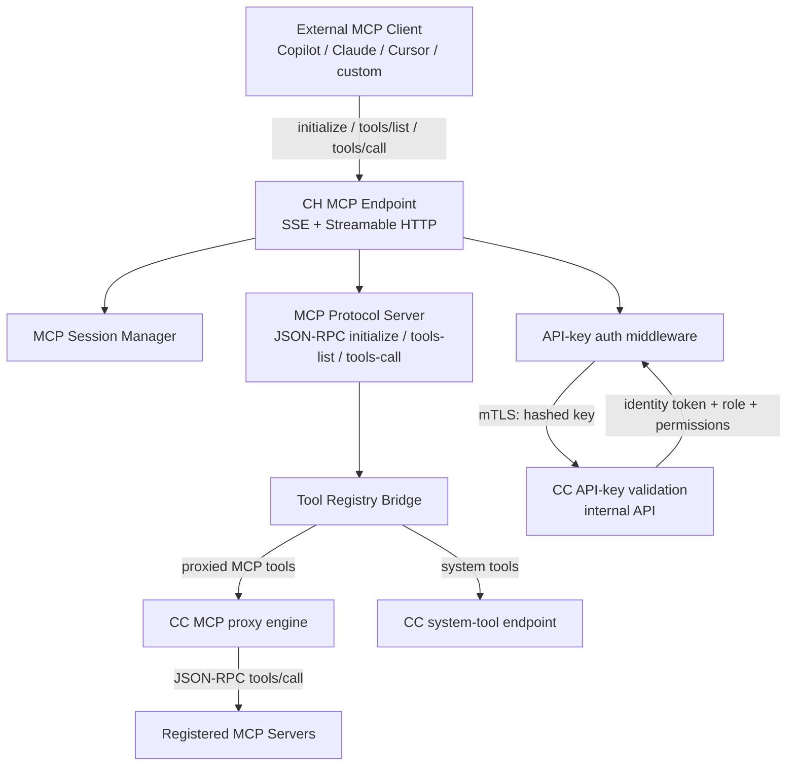
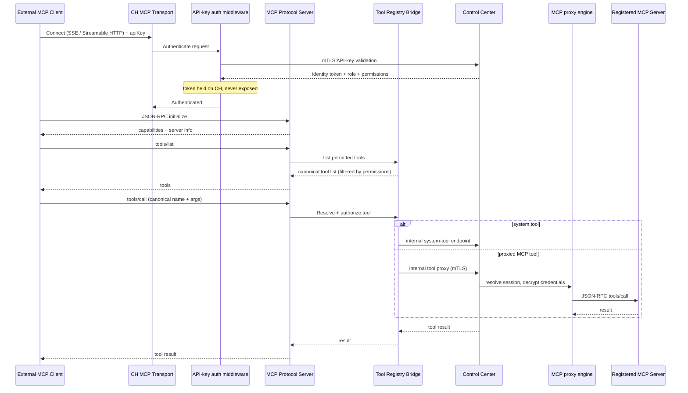

# Architecture — add-mcp-protocol-server

> Protocol/transport change on the Communication Hub (CH). No database schema changes, no Agent Runtime changes, and no new authentication/authorization model. Agents continue to run only in Agent Runtime; the MCP server only lists and proxies tools.

## 1. Changed Components

- **Communication Hub — MCP endpoint** — Today CH exposes only a single REST skills-loading endpoint behind API-key auth. That endpoint is preserved unchanged (no regression), and its system tool becomes one entry in the standard MCP tool catalog served by the new protocol endpoint.
- **API-key authentication middleware (CH)** — Behavior unchanged: validates the client's API key by asking Control Center to resolve it (mTLS), then holds the resolved identity token, role, and permissions for the request. It now also fronts the new MCP protocol endpoint (SSE and Streamable HTTP). The identity token is still held exclusively by CH and never returned to the client.
- **Tool registry / canonical names** — The existing canonical tool naming and permission-filtered tool resolution are reused as the single source of truth for both `tools/list` (what a client may see) and `tools/call` (what a client may invoke).
- **MCP proxy engine (Control Center)** — Reused unchanged. CH continues to route proxied tool calls to CC; CC resolves the session, decrypts credentials, and makes the downstream tool call.

## 2. New Components

New components live entirely on the Communication Hub, layered over the existing API-key middleware and CC proxy path.

- **CH MCP Endpoint (SSE + Streamable HTTP)** — Transport layer accepting standard MCP connections (SSE for streaming clients, Streamable HTTP for stateless clients).
- **MCP Session Manager** — Tracks per-connection protocol state (initialized capability negotiation, per-session identity context) across SSE/Streamable HTTP transports.
- **MCP Protocol Server** — Bridges JSON-RPC methods `initialize`, `tools/list`, `tools/call` to the existing tool registry and proxy path.
- **Tool Registry Bridge** — Resolves canonical tool names, enforces the permission set carried on the authenticated session, and dispatches system tools to CC's system-tool endpoint and proxied MCP tools to CC's MCP proxy engine.

**Security boundary:** the MCP Protocol Server and Tool Registry Bridge operate on the identity token + permissions already resolved by the API-key authentication middleware. The token never crosses the external client boundary.

## 3. Integration Points

| Integration | Direction | Change |
|-------------|-----------|--------|
| External MCP client → CH MCP endpoint | inbound | **New** — standard MCP protocol over SSE / Streamable HTTP |
| CH → CC API-key validation (mTLS) | outbound | **Reused** — API key now authenticates the MCP handshake |
| CH → CC internal MCP tool proxy (mTLS) | outbound | **Reused** — proxied `tools/call` |
| CH → CC system-tool endpoint | outbound | **Reused** — system tools exposed via `tools/list`/`tools/call` |
| Agent Runtime → CH (mTLS cert) | inbound | **Unchanged** — internal agent path is not touched |

- CH still has **no database access**; every data operation routes through CC over mTLS (enforces top-priority rules).
- The MCP server **does not run agents** — it only lists tools and proxies tool calls; agent execution remains in Agent Runtime.

## 4. Data Flow Changes

## 5. Master Arch Update Instructions

Update `docs/master/architecture/` after implementation:

- **`system-overview.md`** — Extend the "Authentication Paths" section and the Communication Hub "Key Responsibilities" bullet to note CH now exposes a standard MCP protocol endpoint (SSE + Streamable HTTP) in addition to the existing REST skills-loading endpoint; identity-token isolation unchanged.
- **`modules/communication-hub/architecture.md`** — Add the MCP Protocol Server, MCP Session Manager, and Tool Registry Bridge to the "Responsibilities" list; extend the dual-authentication diagram to show the MCP protocol endpoint in front of the existing API Key Validator → MCP proxy path.
- **`modules/tool-execution.md`** — Add a note that `tools/list` and `tools/call` for external MCP clients reuse the existing Skill Engine → MCP Hub → External MCP Server chain via the Tool Registry Bridge.
- **`security/api-key-security.md`** — Note that API keys now also authenticate the standard MCP protocol handshake (not just the REST endpoint); permission model and token isolation are unchanged.
