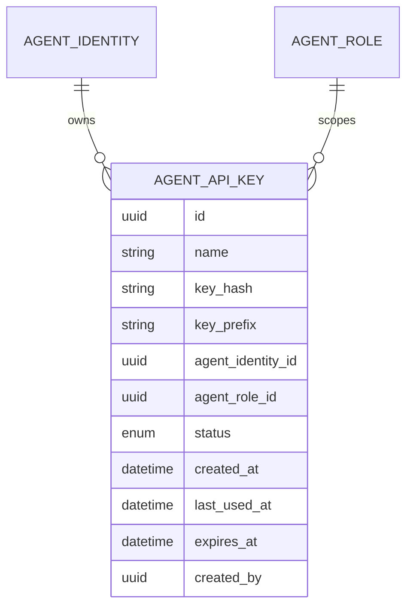

# Data Model — add-mcp-protocol-server

This change introduces one field to the existing API-key entity to support optional expiration. No new entities are added.

## New Entities

_None._ The change reuses the existing `AgentApiKey` entity.

## Modified Entities

### AgentApiKey

Adds an optional `expires_at` timestamp. A `NULL` value means the key never expires; a past value means the key is rejected at authentication.

**Changed attribute:**

| Attribute | Change | Description |
|-----------|--------|-------------|
| `expires_at` | Added (nullable) | Optional expiration timestamp; `NULL` = never expires |

## Removed Entities/Fields

_None._

## Schema File References

- `backend/app/db/models/agent_api_key.py` — update the `AgentApiKey` model to add the `expires_at` column (mapped, `DateTime(timezone=True)`, nullable).
- Alembic migration: `backend/alembic/versions/b5403591994f_add_api_key_expires_at.py` — adds the `expires_at` column.

## Master Data Model Update Instructions

- Update `docs/master/data-model/overview.md` (or the module entity list) to include `expires_at` on the API Key entity, with the note that `NULL` means the key never expires.
