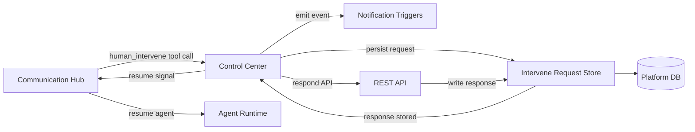
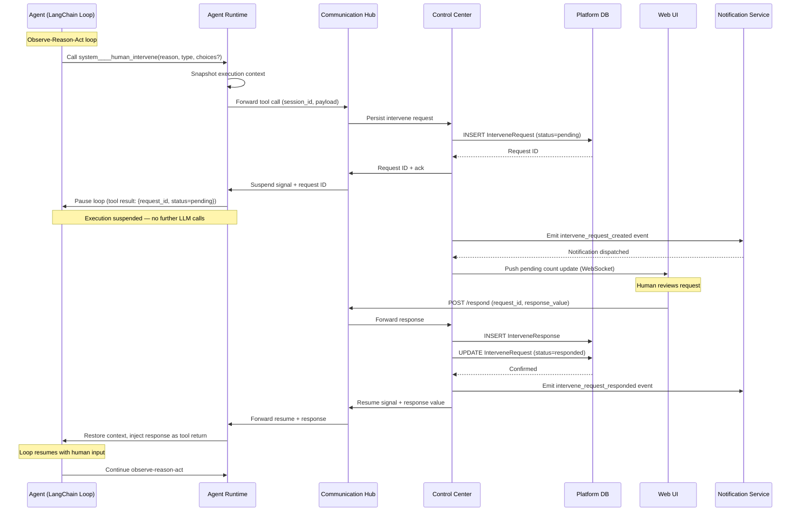

# Architecture Changes: Human Intervene

Adds suspend/resume capability to the agent execution model via a new system tool (`human_intervene`), enabling agents to pause and request human input during the observe-reason-act loop.

---

## 1. Changed Components

### Agent Runtime

- **LangChain executor loop** — Extended to support a `SUSPENDED` state in the observe-reason-act loop. When `human_intervene` is called, the loop pauses after persisting the current execution context snapshot. No further LLM inferences or tool calls are made until the human responds.
- **Tool handler** — New handler registered for `system____human_intervene` that intercepts the tool call, serialises the current execution state, and suspends the session.
- **Resume dispatcher** — New endpoint `/resume` that accepts an intervene response, restores the execution context, and re-enters the LangChain loop with the response value injected as the tool's return value.

### Control Center

- **Permission Manager** — New permission `intervene:respond` to control which operators can respond to intervene requests. Extended permission check on respond API.
- **Audit logging** — Intervene request lifecycle events (created, responded, cancelled, expired) written to the governance audit log.
- **Agent Session Queue** — State machine extended with `waiting_for_human` state. Supports transitions: `running → waiting_for_human` (on intervene), `waiting_for_human → running` (on resume), `waiting_for_human → terminated` (on operator termination while waiting).

### Communication Hub

- **Tool routing table** — `system____human_intervene` added as a routed system tool. Agent Runtime tool calls for this tool are forwarded to Control Center for persistence, then acknowledged.
- **Control message relay** — New message type `intervene_response` routed from Web UI → Control Center → Agent Runtime.
- **Notification trigger** — New trigger type `intervene_request_created` emitted when an intervene request is persisted. Routes to the Notification Integration system.

### Web UI

- **Dashboard** — New filter tab for `waiting_for_human` executions; pending count badge in navigation.
- **Response dialog** — Three dialog variants (approval, choice, text) for responding to intervene requests.
- **Execution detail view** — Inline section showing pending and resolved intervene requests with full audit trail.

---

## 2. New Components

### Intervene Request Store

In-process persistence layer within Control Center (backed by the `InterveneRequest` and `InterveneResponse` tables). Exposes CRUD operations for intervene requests and their responses.

### Intervene Response API (REST)

New API surface on Control Center:

| Endpoint | Method | Purpose |
|----------|--------|---------|
| `/api/v1/intervene/requests` | GET | List intervene requests (filterable by status, type, agent) |
| `/api/v1/intervene/requests/{id}` | GET | Get single request with full context |
| `/api/v1/intervene/requests/{id}/respond` | POST | Submit a response (approval bool, choice string, or text string) |
| `/api/v1/intervene/requests/{id}/cancel` | POST | Cancel a pending request |
| `/api/v1/intervene/metrics` | GET | Dashboard metrics (pending count, avg response time) |

---

## 3. Integration Points

| Integration | Direction | Protocol | Purpose |
|-------------|-----------|----------|---------|
| Agent Runtime → Communication Hub | Tool call | Internal HTTP | Agent calls `human_intervene`; suspended while pending |
| Communication Hub → Control Center | Forward | Internal HTTP | Persist request, check permissions |
| Control Center → Communication Hub | Response | Internal HTTP | Resume signal with response value |
| Communication Hub → Agent Runtime | Resume | Internal HTTP | Re-enter LangChain loop with response |
| Control Center → Notification | Event | Internal pub/sub | Emit `intervene_request_created` / `intervene_request_responded` |
| Web UI → Communication Hub | WebSocket/REST | HTTPS | Operator views and responds to requests |
| Communication Hub → Web UI | WebSocket push | HTTPS | Real-time pending count updates |

---

## 4. Data Flow Changes

## 5. Master Arch Update Instructions

| File | What to change |
|------|----------------|
| `docs/master/architecture/modules/agent-lifecycle.md` | Add `waiting_for_human` lifecycle state to LangChain loop description. Add suspend/resume sequence to async session lifecycle diagram. Update state diagram with new state and transitions. |
| `docs/master/architecture/modules/tool-execution.md` | Add `system____human_intervene` as a system tool in the tool execution chain. Add note about suspend-on-call vs return-on-response difference from regular tools. |
| `docs/master/architecture/modules/communication-hub/architecture.md` | Add intervene request routing to the tool routing table. Add `intervene_response` control message type. |
| `docs/master/architecture/modules/control-center/architecture.md` | Add Intervene Request Store as a new sub-component. Add `/api/v1/intervene/*` endpoints. Add `intervene:respond` to permission model. |
| `docs/master/architecture/modules/agent-runtime/architecture.md` | Add resume dispatcher endpoint. Add suspend/resume handling in LangChain executor loop. |

