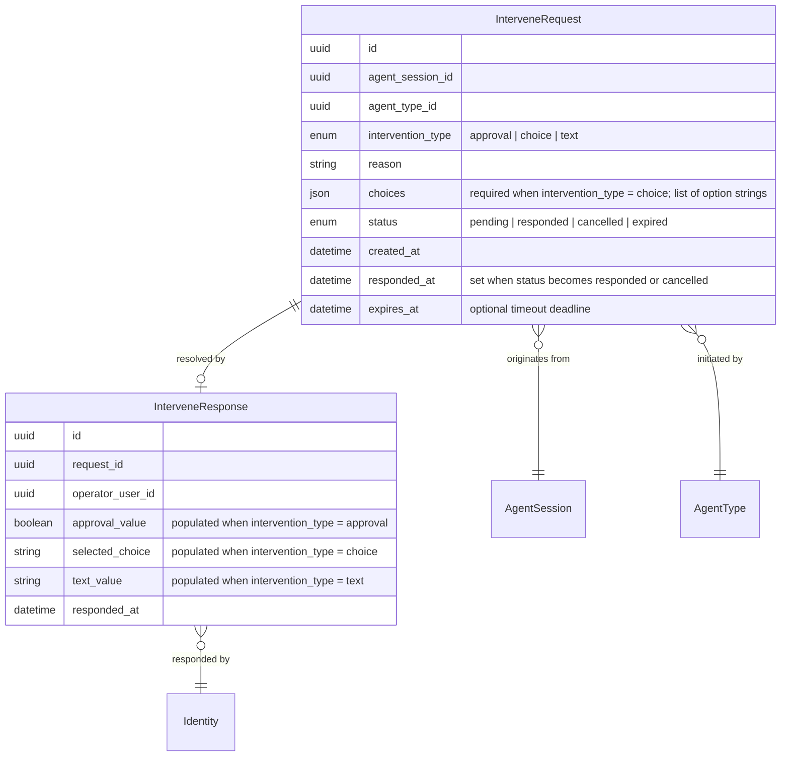

# Data Model Changes: Human Intervene

Adds persistence for agent-initiated human-in-the-loop requests, enabling agents to suspend execution and wait for operator input (approval, choice selection, or free-form text).

---

## 1. New Entities

### InterveneRequest

Represents a single agent-initiated request for human intervention. Created when an agent calls the `system____human_intervene` tool; resolved when an operator responds, the request is cancelled, or the configured timeout elapses.

### InterveneResponse

Captures the operator's response to an intervene request. One response per request (singular, not a conversation thread).

**Entity notes:**
- `InterveneRequest.intervention_type` determines which response field carries the operator's input: `approval` → `InterveneResponse.approval_value` (boolean), `choice` → `InterveneResponse.selected_choice` (string matching one of the `choices` list), `text` → `InterveneResponse.text_value` (free-form string).
- `InterveneRequest.choices` is only set when `intervention_type = choice`; it is `null` for `approval` and `text` types.
- `InterveneRequest.status` transitions: `pending` → `responded` (operator responded), `pending` → `cancelled` (agent execution terminated while waiting), `pending` → `expired` (timeout elapsed without response).
- `InterveneResponse` has a 1:0..1 relationship with `InterveneRequest` — a response only exists once the operator has acted.

---

## 2. Modified Entities

### AgentSession (backend model: AgentJob)

The `status` enum on the agent execution session entity gains a new value.

**New enum value added to `AgentJobStatus` / `status`:**

| Existing Values | New Value | Description |
|----------------|-----------|-------------|
| `queued`, `running`, `completed`, `failed`, `terminated` | **`waiting_for_human`** | Agent execution is paused pending operator response to an intervene request. No further LLM or tool calls are made. Automatically transitions to `running` when the human responds, or to `terminated` if the operator terminates the waiting session. |

**Business rules:**
- Only sessions in `running` state may transition to `waiting_for_human`.
- A session in `waiting_for_human` may transition to `running` (resume), `terminated` (operator terminated), or `failed` (system error during resume).
- Multiple concurrent intervene requests per session are not permitted — a duplicate `human_intervene` call while a `pending` request exists returns the existing request ID.
- When a session transitions from `waiting_for_human` to `terminated`, all `pending` intervene requests for that session are automatically marked `cancelled`.

---

## 3. Removed Entities/Fields

None.

---

## 4. Schema File References

| Action | File | Description |
|--------|------|-------------|
| **Add new model** | `backend/app/db/models/intervene.py` | New SQLAlchemy model file containing `InterveneRequest` and `InterveneResponse` tables. |
| **Modify existing model** | `backend/app/db/models/agents.py` | Add `waiting_for_human` to `AgentJobStatus` enum. Add `intervene_requests` relationship to `AgentJob` (one-to-many). |

---

## 5. Master Data Model Update Instructions

Files to update in `docs/master/data-model/`:

| File | What to change |
|------|----------------|
| `docs/master/data-model/overview.md` | Add `InterveneRequest` and `InterveneResponse` entities to the **Agent Management** domain `erDiagram` block. Add the relationship `AgentSession ||--o{ InterveneRequest : "initiates"`. Add `InterveneRequest ||--o| InterveneResponse : "resolved by"`. Add `InterveneResponse }o--|| Identity : "responded by"`. Add the new entities to the **Cross-Domain Relationship Map** with links to `AgentSession`, `AgentType`, and `Identity`. |
| `docs/master/data-model/modules/agents/entities.md` | Add `InterveneRequest` and `InterveneResponse` entity blocks with attributes, relationships, and entity descriptions. Add `waiting_for_human` to the `AgentSession.status` enum values in the existing `AgentSession` block. Add business rules: "A session in `waiting_for_human` state is paused pending operator response; only one pending intervene request per session is allowed." |

**Entity description (for master doc entity table):**

| Entity | Description |
|--------|-------------|
| **InterveneRequest** | An agent-initiated request for human intervention during execution. Supports three intervention types: `approval` (yes/no), `choice` (select one from a list), and `text` (free-form input). Tracks lifecycle from `pending` through `responded`, `cancelled`, or `expired`. Each request is scoped to a single agent session and agent type. |
| **InterveneResponse** | The operator's response to an intervene request. Exactly one response per request. The response field populated depends on the intervention type: `approval_value` (boolean) for approval requests, `selected_choice` (string) for choice requests, `text_value` (string) for text requests. |
