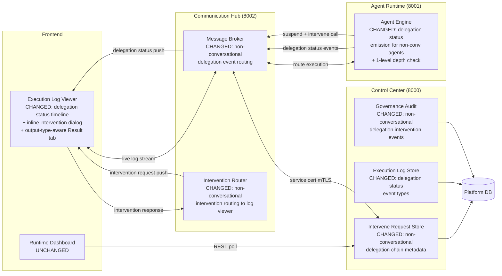
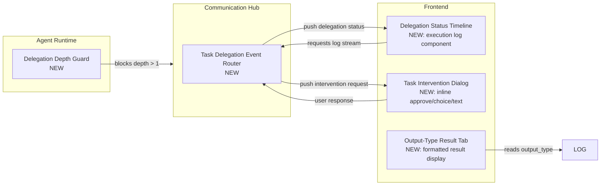
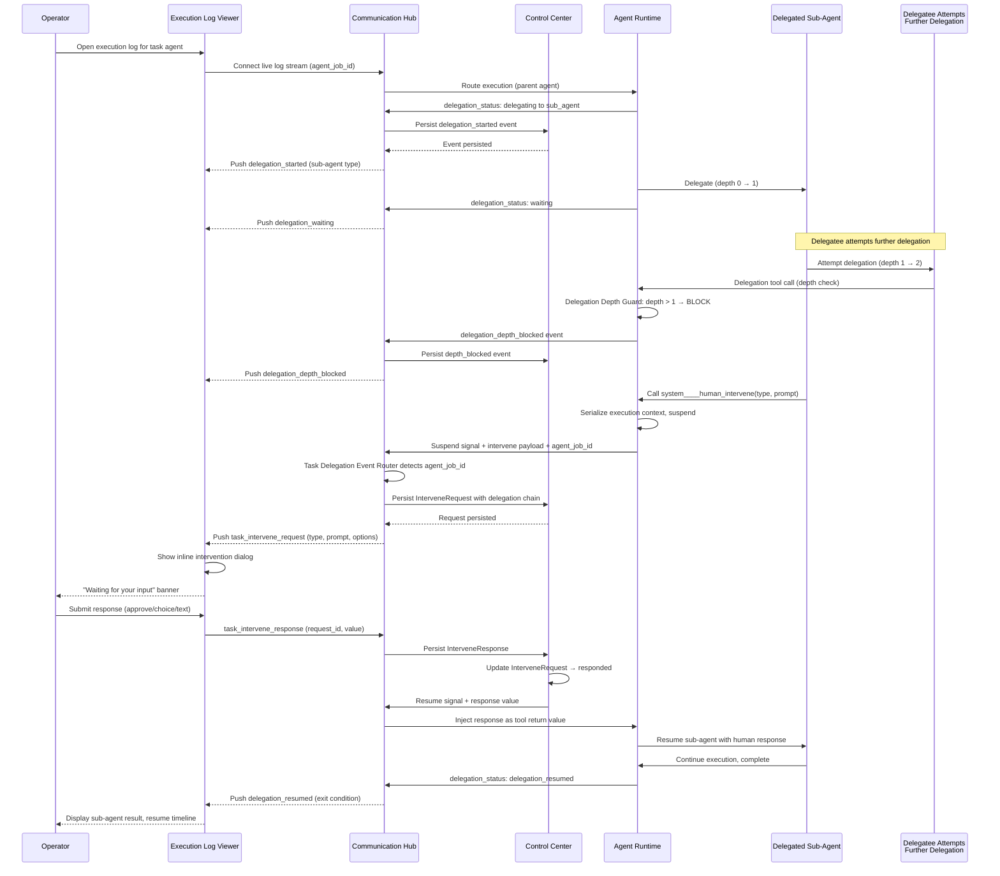

# Architecture: Agent Delegation Visibility & HITL for Non-Conversational Agents

## 1. Changed Components

Existing components that change and how.

- **Communication Hub — Message Broker**: Extended to route delegation status events (`delegating`, `waiting`, `delegation_resumed`) from non-conversational agent executions to the execution log viewer's live stream channel. Previously these events were only routed from conversational agents via WebSocket to the Conversation UI. Adds a new event delivery path for the execution log viewer distinct from the conversation WebSocket channel.
- **Communication Hub — Intervention Router**: Extended to detect intervention requests from non-conversational delegated sub-agents. When a suspend signal carries a non-conversational execution log session context (instead of a `conversation_session_id`), the router pushes the intervention request to the execution log viewer rather than the Conversation UI. The existing conversational routing path is unchanged.
- **Control Center — Intervene Request Store**: Extended to accept non-conversational delegation context metadata (`parent_agent_job_id`, `delegation_depth`) on `InterveneRequest` records. Supports filtering intervention requests by parent task agent session so the execution log viewer can surface only relevant interventions.
- **Control Center — Execution Log Store**: Accepts new execution log event types: `delegation_started`, `delegation_waiting`, `delegation_resumed`, `delegation_depth_blocked`, `delegation_timeout`, `delegation_failed`. These are appended to the execution log stream in real time and pushed to connected log viewers.
- **Control Center — Governance Audit**: Records non-conversational delegation intervention request and response events with full delegation chain traceability, distinct from conversational intervention audit records.
- **Agent Runtime — Agent Engine**: Extended to emit delegation status events for non-conversational agent executions — previously only conversational agents emitted these. Added a delegation depth guard that checks the current delegation level before forwarding a delegation tool call. If the depth exceeds 1 (i.e., a delegatee attempts to further delegate), the call is blocked and a `delegation_depth_blocked` event is emitted. The engine also carries its execution log session context through delegation so CH can route status events and intervention requests back to the correct log viewer.

## 2. New Components

New components added by this change.

- **Delegation Depth Guard** — Agent Runtime: New guardrail that runs before every delegation tool call in non-conversational agent executions. Tracks the current delegation depth via the execution context chain. If a call would exceed depth 1 (the delegatee attempting to further delegate), the call is rejected and a `delegation_depth_blocked` event is emitted to the execution log stream. Depth 0 delegation (parent agent's first delegation) is allowed. Conversational agent delegation is not affected by this guard.
- **Task Delegation Event Router** — Communication Hub: New routing module that manages the delivery of non-conversational delegation status events and intervention requests to execution log viewer clients. Maintains a mapping of active log viewer connections to parent task agent sessions. Pushes delegation status events (`delegating`, `waiting`, `delegation_resumed`) and intervenes requests to the correct log viewer. Falls back to the existing dashboard poll path when no live log viewer is connected.
- **Delegation Status Timeline** — Execution Log Viewer: New UI component in the execution log detail view that renders a real-time timeline of delegation lifecycle events. Shows distinct statuses for each delegation exit condition: successful completion, timeout, runtime failure, depth blocked, and operator-terminated cascade. Updates in real time via the live log stream without requiring manual refresh.
- **Task Intervention Dialog** — Execution Log Viewer: New inline dialog component within the execution log view that surfaces intervention requests from delegated sub-agents. Presents the same three intervention types as the existing flow (approval, choice, text). Supports dismissal with a persistent "Waiting for Input" banner that re-surfaces the dialog on click. On reconnect, queries pending interventions for the parent session and re-surfaces any outstanding dialogs.
- **Output-Type Result Tab** — Execution Log Viewer: New tab in the execution log details dialog that renders the agent's output formatted according to the agent type's `output_type` definition. Markdown output is rendered as rich formatted HTML. Typed JSON output is displayed as a structured tree/table with the schema definition visible. Auto output is displayed as raw text. The tab label includes the output type badge (Markdown / Typed / Auto) so operators can see the expected format at a glance.

## 3. Integration Points

New or changed integration points between services.

### Agent Runtime → Communication Hub (Internal HTTP)

- **New event type: `delegation_status`** — AR emits delegation lifecycle events (status + agent_type + depth) for non-conversational agent executions. Previously only conversational agents emitted these.
- **New event type: `delegation_depth_blocked`** — AR emits when the Delegation Depth Guard blocks a delegatee's delegation attempt. Includes the blocked agent type and current depth.
- **Changed suspend signal for `human_intervene`** — Now includes non-conversational execution log session context so CH can identify the correct log viewer to push the intervention request to, instead of requiring a `conversation_session_id`.

### Communication Hub → Execution Log Viewer (Live Stream Channel)

- **New event type: `delegation_started`** — CH pushes to the log viewer when a non-conversational agent begins delegating to a sub-agent. Payload includes sub-agent type and delegation depth.
- **New event type: `delegation_waiting`** — CH pushes while the sub-agent executes. Payload includes the sub-agent's current status.
- **New event type: `delegation_resumed`** — CH pushes when the parent agent resumes after sub-agent completion. Payload includes the sub-agent's result summary and exit condition.
- **New event type: `delegation_depth_blocked`** — CH pushes when the depth guard blocks a delegatee's delegation. Payload includes the blocked agent type.
- **New event type: `task_intervene_request`** — CH pushes when a delegated sub-agent calls `human_intervene`. Payload includes intervention type, prompt, options, and delegation context (sub-agent type, depth).
- **New event type: `task_intervene_response`** — Log viewer sends back to CH when the operator submits a response. CH routes to CC for persistence and resume signalling.

### Control Center API — New Endpoints

- `GET /api/v1/agent-jobs/{job_id}/interventions/pending` — Returns the currently pending intervention request for a non-conversational agent session, if any. Used by the execution log viewer on reconnect to re-surface an outstanding intervention dialog.
- `GET /api/v1/agent-jobs/{job_id}/delegation/status` — Returns the current delegation status for a non-conversational agent session, including active sub-agent types, depths, and exit conditions. Used by the execution log viewer to render the delegation status timeline on initial load.

### Control Center API — Changed Endpoints

- `POST /api/v1/interventions/` (Intervene Request Store) — Extended to accept optional `parent_agent_job_id` and `delegation_depth` fields for non-conversational delegation context. When present, the intervention is scoped to the parent task agent's execution log view rather than the conversation UI.
- Execution log append endpoint — Extended to accept `delegation_started`, `delegation_waiting`, `delegation_resumed`, `delegation_depth_blocked`, `delegation_timeout`, and `delegation_failed` event types in addition to existing log event types.

### Service Boundaries Preserved

- AR never connects to the database — all delegation status persistence and intervention persistence is done by CC.
- AR never receives user identity tokens — intervention responses are injected as tool return values without exposing caller identity.
- AR's certificate validation enforcement is unchanged — only service-certificate mTLS from `service:communication-hub` is accepted on internal endpoints.
- CC is the sole database accessor — delegation status events and intervention records are persisted by CC.
- Conversational agent delegation and intervention routing is unchanged — the new non-conversational path is additive.

## 4. Data Flow Changes

- The key change: non-conversational delegation status events and intervention requests flow through the Communication Hub's Task Delegation Event Router to the execution log viewer's live stream channel, mirroring the conversational flow's WebSocket path but targeting the log viewer component instead of the Conversation UI.
- The Delegation Depth Guard intercepts delegation calls at the Agent Runtime layer. When a delegatee (at depth 1) attempts to delegate further, the call is blocked before any sub-agent is spawned and a clear outcome event is emitted.
- If the operator disconnects while a task intervention dialog is open, the request remains pending in CC. On reconnect, the log viewer calls `GET /api/v1/agent-jobs/{job_id}/interventions/pending` and re-surfaces the dialog.
- All delegation exit conditions (success, timeout, failure, terminated) are delivered as distinct `delegation_resumed` payload variants so the log viewer can render appropriate status indicators.
- The existing conversational delegation and intervention paths are preserved unchanged — the Task Delegation Event Router only handles non-conversational agent sessions.

## 5. Master Arch Update Instructions

After this change is implemented, update the following files in `docs/master/architecture/`:

### `docs/master/architecture/modules/communication-hub/architecture.md`

- Add `Task Delegation Event Router` node to the flowchart, branching from the `AR -->|delegation status events| CH` edge
- Add edges: `TDER -->|delegation status push| LOG` and `LOG -->|intervention response| TDER`
- Update `Intervention Router` node description to note it now handles both conversational and non-conversational intervention routing
- Update Responsibilities section: extend "Intervention Router" to document non-conversational routing (execution log viewer instead of Conversation UI)
- Add responsibilities entry: "Task Delegation Event Router — Routes delegation status events and intervention requests from non-conversational agent executions to execution log viewer clients"
- Add new subsection "Task Delegation Event Routing" documenting the router, new event types (`delegation_started`, `delegation_waiting`, `delegation_resumed`, `delegation_depth_blocked`, `task_intervene_request`, `task_intervene_response`), and fallback behaviour
- Update "WebSocket Message Types" section to include the new task delegation event types

### `docs/master/architecture/modules/agent-runtime/architecture.md`

- Add `Delegation Depth Guard` node to the flowchart, positioned between `TC[Tool and Delegation Calls]` and the delegation execution path
- Add edge: `TC -->|delegation tool call| DDG` and `DDG -->|depth ≤ 1: allow| CH` and `DDG -->|depth > 1: blocked| EVT`
- Update `EVT[Status and execution events]` to show it now emits delegation status events for non-conversational agents
- Add new subsection "Delegation Depth Guard" documenting: the 1-level limit for non-conversational agents, depth tracking via execution context chain, blocked-attempt event emission, and that conversational agents are exempt
- Add to the session orchestrator responsibilities: non-conversational delegation status event emission and delegation depth enforcement

### `docs/master/architecture/modules/control-center/architecture.md`

- Add `Task Delegation Events` node to the flowchart under `API`, connected to `ELS[Execution Log Store]`
- Update `IRS[Intervene Request Store]` to show expanded scope: non-conversational delegation intervention persistence with `parent_agent_job_id` and `delegation_depth` metadata
- Add new subsection "Task Delegation Event Persistence" documenting the new execution log event types (`delegation_started`, `delegation_waiting`, `delegation_resumed`, `delegation_depth_blocked`, `delegation_timeout`, `delegation_failed`) and their persistence through Execution Log Store
- Update "Conversation Intervention Persistence" to note the parallel non-conversational path using `parent_agent_job_id` instead of `conversation_session_id`

### `docs/master/architecture/modules/agent-lifecycle.md`

- Update section "5a. Human-in-the-Loop Intervention" to document the non-conversational delegation intervention path: when a delegated sub-agent in a non-conversational session calls `human_intervene`, the request routes to the execution log viewer instead of the conversation UI or operator dashboard
- Add delegation depth enforcement to the HITL suspend/resume steps: note that the Delegation Depth Guard blocks sub-agents from further delegation
- Add a bullet point for the new 1-level delegation depth limit in the Execution Guardrails context

### `docs/master/architecture/modules/execution-logs.md`

- Update the flowchart to include the new delegation status event routing path from AR through CH to the execution log viewer
- Add new nodes: `DST[Delegation Status Timeline]` and `TII[Task Intervention Dialog]` in the frontend area
- Add edges from CH to these new components showing the delegation status and intervention push paths
- Update the flowchart guardrail taxonomy to include `DEP[Delegation depth budget exceeded]` as an explicit stop reason (already present in the diagram, but now explicitly connected to the Delegation Depth Guard)
- Add new subsection "Delegation Status Timeline" documenting real-time delegation events in the execution log view
- Add new subsection "Task Intervention Dialog" documenting the inline intervention popup and persistent banner for non-conversational delegation

### `docs/master/architecture/modules/tool-execution.md`

- Extend "System Tools — Suspend-on-Call Pattern" section to note that when a delegated sub-agent (depth 1) in a non-conversational execution calls `human_intervene`, the response arrives through the execution log viewer path rather than the conversation WebSocket or dashboard poll path
- Add note in "SOP Orchestration Sequence" that the **Agent-delegation step** now includes a depth check via the Delegation Depth Guard for non-conversational SOP executions

### `docs/master/architecture/modules/communication.md`

- Add "Task Delegation Event Flow" subsection to "Web UI ↔ Agent" messaging section, parallel to the existing "Conversation Intervention Flow"
- Document new event types delivered to execution log viewers: `delegation_started`, `delegation_waiting`, `delegation_resumed`, `delegation_depth_blocked`, `task_intervene_request`, `task_intervene_response`
- Document that execution log viewer connections are scoped to a parent `agent_job_id`, not a `conversation_session_id`

### `docs/master/architecture/system-overview.md`

- Add "Task Delegation Event Routing" to the Communication Hub's responsibilities in the Key Responsibilities section
- Add "Delegation Depth Enforcement" to the Agent Runtime's responsibilities
- No structural changes to the 3-service architecture — service segregation rules are preserved
