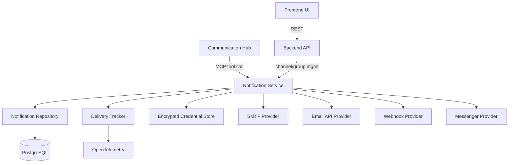
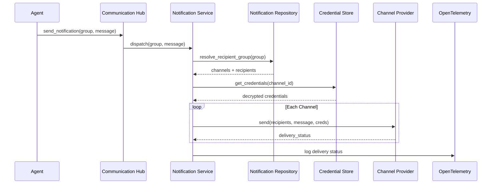

# Notification System — Architecture

## 1. Changed Components

| Component | Change |
|---|---|
| **Communication Hub** | Registers `send_notification` as an MCP tool; routes agent notification requests to the Notification Service |
| **Backend API** | New REST endpoints for managing notification channels, recipient groups, and querying delivery logs |
| **Frontend UI** | New admin pages for channel configuration and recipient group management |

---

## 2. New Components

**New components (shaded in diagram above):**

- **Notification Service** — Core orchestrator: resolves recipient groups, retrieves channel credentials, dispatches to channel providers, and records delivery outcomes
- **Notification Repository** — Database access layer for channels, recipient groups, and delivery records
- **Delivery Tracker** — Captures per-channel delivery status and failure events; emits structured records to OpenTelemetry
- **Channel Providers** — Pluggable implementations, one per channel type:
  - *SMTP Provider* — sends via SMTP relay
  - *Email API Provider* — sends via external email API (e.g., SendGrid, Mailgun)
  - *Webhook Provider* — HTTP POST to configured endpoint
  - *Messenger Provider* — integrates with instant messaging platforms (e.g., Teams, Slack)

---

## 3. Integration Points

- **Communication Hub → Notification Service**: `send_notification` registered as an MCP tool; agent calls are validated (OIDC JWT), then forwarded to the Notification Service
- **Backend API → Notification Service**: REST endpoints for CRUD on channels and recipient groups; all endpoints require JWT authentication and RBAC authorization
- **Frontend UI → Backend API**: Admin UI calls REST APIs using the existing authenticated HTTP client pattern
- **Notification Service → Encrypted Credential Store**: Channel credentials (SMTP passwords, API keys, webhook secrets) are stored encrypted at rest (AES-256, existing pattern); decrypted only at dispatch time
- **Delivery Tracker → OpenTelemetry**: Delivery outcomes (success, failure, retries) are emitted as OTEL structured log events and metrics, flowing to the existing collector pipeline

---

## 4. Data Flow

### Agent-Triggered Notification

### Admin Configuration Flow

1. Admin opens Channel/Group management page in Frontend UI
2. Frontend calls Backend API (REST) to create/update channel or recipient group
3. Backend API encrypts sensitive credentials before storing via Notification Repository
4. Confirmation returned to UI; channel is now available for use in SOPs and agent workflows

**Error handling:** If a channel provider returns a failure, the Notification Service logs the error via Delivery Tracker and continues dispatching to remaining channels in the group.

---

## 5. Master Arch Update Instructions

- **`docs/master/architecture/system-overview.md`** — Add Notification Service to the system component list; update the system-level diagram to include it alongside Communication Hub and Backend API
- **`docs/master/architecture/modules/`** — Create `notifications.md` documenting the Notification Service module: purpose, channel provider pattern, credential handling, and delivery tracking
- **`docs/master/architecture/communication-hub.md`** (or equivalent) — Add `send_notification` to the MCP tools table; note that the tool is available to all agents with appropriate role permissions
