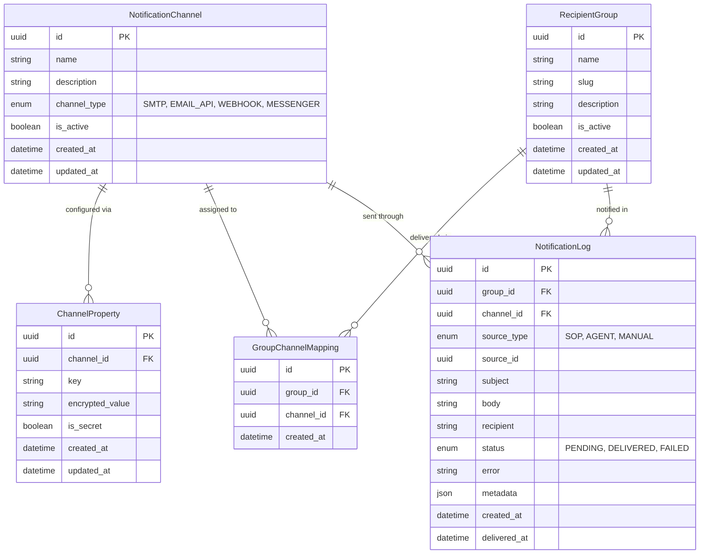

# Data Model — Implement Notifications

## 1. New Entities

### Entity Descriptions

**NotificationChannel** — a configured outbound destination (e.g., an SMTP server, a Slack workspace webhook, a Teams connector). `channel_type` drives which properties are required. One channel can be assigned to many recipient groups.

**ChannelProperty** — individual configuration value for a channel (e.g., `smtp_host`, `api_key`, `webhook_url`). Secret properties (`is_secret=true`) are encrypted at rest. Replaces the single encrypted configuration property on the existing entity with a typed, auditable key-value store.

**RecipientGroup** — a named, addressable audience (e.g., "SRE Team", "Support Team"). Groups are linked to one or more channels. Agents and SOPs target a group by slug; the platform resolves the channels and delivers to all of them.

**GroupChannelMapping** — an association linking a `RecipientGroup` to a `NotificationChannel`. A group may have multiple channels; a channel may serve multiple groups.

**NotificationLog** — immutable delivery record created for each channel attempt. Tracks the triggering source (`source_type` + `source_id`), the message content, delivery status, and any error detail. Supersedes the existing `NotificationEvent` entity with richer group and source attribution.

---

## 2. Modified Entities

**NotificationChannel** (existing entity)
- `channel_type` enum updated: values change from `(email, slack, teams, webhook)` to `(SMTP, EMAIL_API, WEBHOOK, MESSENGER)` to align with PRD channel taxonomy
- `encrypted_config` property removed; configuration migrates to `ChannelProperty` attributes

**NotificationEvent** (existing entity)
- Superseded by `NotificationLog`; existing records can be migrated or archived before the old entity is retired
- `group_id` and `source_type`/`source_id` attributes are net-new; `recipient` and `metadata` attributes carry over

---

## 3. Removed Entities / Attributes

| Entity / Attribute | Reason |
|---|---|
| `NotificationChannel.encrypted_config` | Replaced by `ChannelProperty` key-value store |
| `NotificationEvent` | Superseded by `NotificationLog` with group and source tracking |

---

## 4. Schema Layer References

The notification entities should be added to the schema layer as defined in the project's data model implementation. New entities include `NotificationChannel`, `RecipientGroup`, `GroupChannelMapping`, `ChannelProperty`, and `NotificationLog`. The existing `NotificationChannel` entity definition requires updates to the `channel_type` enum and removal of the `encrypted_config` attribute.

---

## 5. Master Data Model Update Instructions

- Update `docs/master/data-model/overview.md` to include new notification entities in the system-wide ER diagram
- Create `docs/master/data-model/modules/notifications/entities.md` to document the notification entity domain
