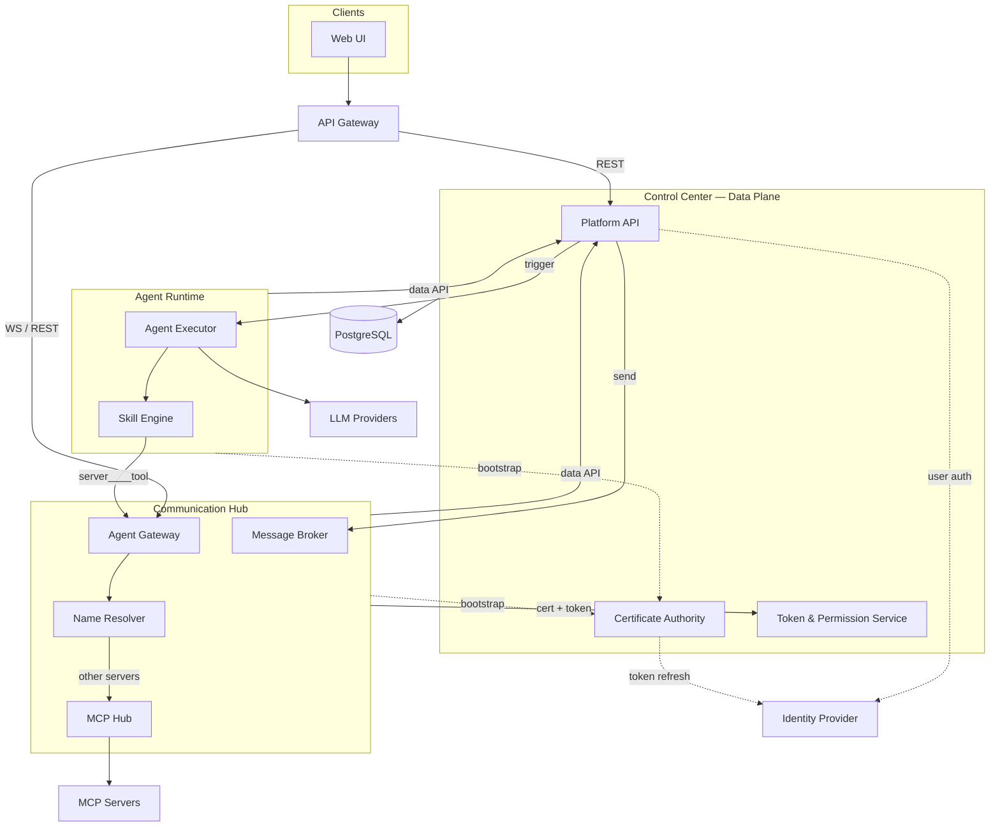
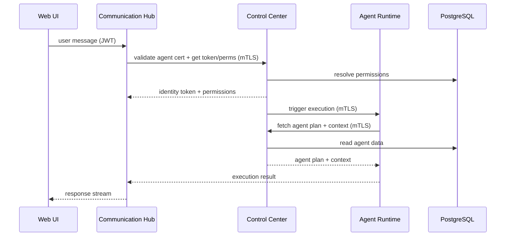
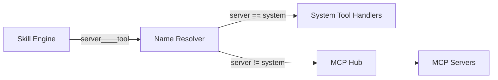

# Service Decomposition — Architecture Changes

## Changed Components

The monolithic backend is split into three independently deployable services. All logical components remain; only deployment boundaries and data access rules change.

| Component | Current Location | New Service |
|---|---|---|
| Platform API | Monolith | Control Center |
| Certificate Authority | Monolith | Control Center |
| Token & Permission Service | Monolith | Control Center |
| Plan Generation Service | Monolith | Control Center |
| Agent Executor | Monolith | Agent Runtime |
| Skill Engine | Monolith | Agent Runtime |
| MCP Hub | Monolith | Communication Hub |
| Model Config Service | Monolith | Agent Runtime |
| Message Broker | Monolith | Communication Hub |
| Agent Gateway | Monolith | Communication Hub |
| Session Manager | Monolith | Communication Hub |

**Critical constraint introduced**: Agent Runtime and Communication Hub have no direct database access. All data access flows through Control Center over mTLS.

---

## Service Architecture

Three deployable services with a clear data trust boundary — only Control Center reaches the database.

**Service responsibilities:**

- **Control Center** — Sole database owner; issues and revokes mTLS certificates; resolves identity tokens and permissions; serves data APIs to peer services; triggers agent execution and message dispatch
- **Agent Runtime** — Stateless AI executor; holds a short-lived agent-instance certificate; fetches all context from Control Center; no database access; dispatches all tool calls to Communication Hub using the `server____tool` convention — no local distinction between system and MCP tools
- **Communication Hub** — Message broker and Agent Gateway; holds a longer-lived service certificate; requests token + permissions from Control Center on every tool call; owns all tool routing via its Name Resolver; no database access

---

## Service Trust & Integration

### Certificate Lifecycle

- On startup, each peer service (Agent Runtime, Communication Hub) bootstraps with Control Center to receive an mTLS certificate
- Agent Runtime receives a short-lived agent-instance certificate; Communication Hub receives a longer-lived service certificate
- Certificates are renewed automatically before expiry; Control Center is the sole issuer
- If Control Center restarts and rotates its CA, peer services detect the CA change on next startup and re-bootstrap automatically
- Control Center revokes certificates for terminated agents or services whose trust is withdrawn

### Runtime Data Flow

- PostgreSQL is accessed only by Control Center; Agent Runtime and Communication Hub are stateless consumers
- Communication Hub resolves a short-lived identity token from Control Center on every tool call; the token is consumed internally and never forwarded to Agent Runtime
- All cross-service calls are authenticated with bidirectional mTLS

---

## Tool Naming & Routing

All tool names follow the `server____tool` convention (four underscores), making names globally unique across all registered MCP servers and built-in system tools.

- `system` is the reserved prefix for built-in platform tools (e.g., `system____save_result`, `system____send_notification`); MCP server names may not use this prefix
- All other prefixes identify a registered MCP server (e.g., `github____create_issue`)

**Agent Runtime** does not distinguish between system tools and MCP tools. The Skill Engine submits every tool call to Communication Hub's Agent Gateway using the full `server____tool` name. No routing decision is made within Agent Runtime.

**Communication Hub** owns the Name Resolver, which parses the tool name prefix and routes accordingly:

- The Name Resolver is the single authoritative location for all tool name parsing and validation; no other component performs this parsing
- Agent Runtime does not automatically invoke `system____save_result` at execution completion; agents must explicitly call it when instructed by their plan
