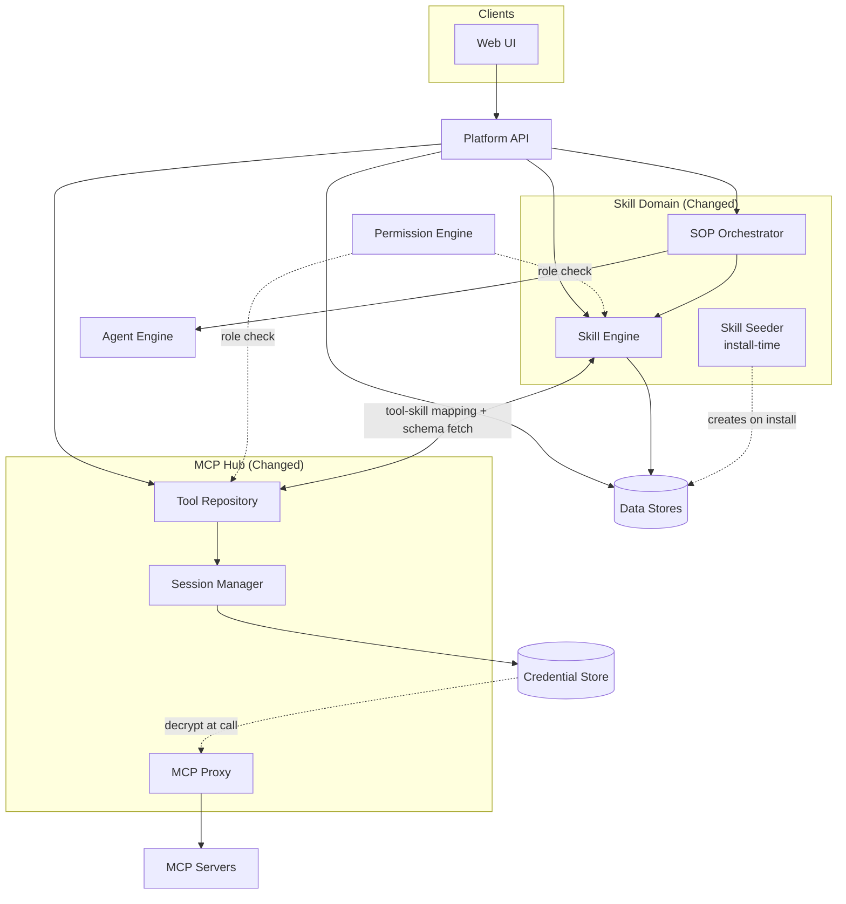
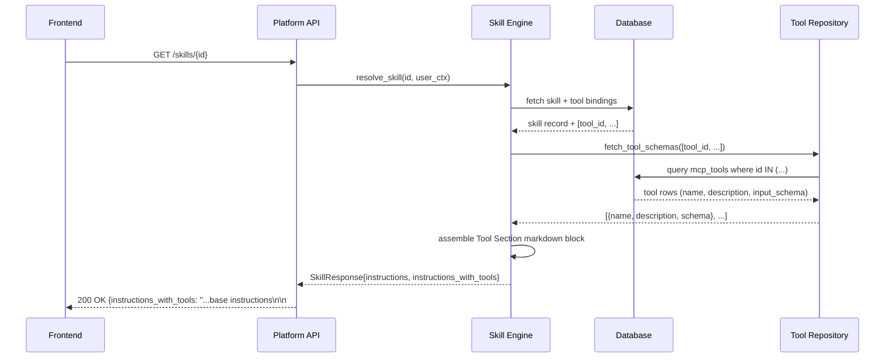
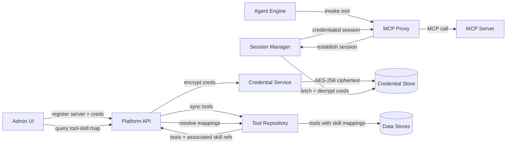
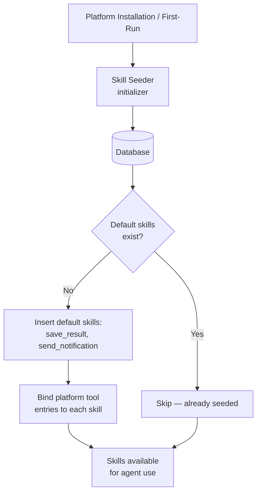

# Architecture — Enhance MCP Hub, Skills & SOPs

## Changed Components

Three existing components expand in scope and responsibility, and two new cross-cutting behaviours are introduced (tool schema assembly and default skill seeding):

| Component | What Changed |
|---|---|
| **MCP Hub** | Tool Repository gains tool-to-skill reverse mapping; Session Manager gains per-server named sessions; Credential Service handles AES-256 encrypt/decrypt lifecycle |
| **Skill Engine** | Resolves skills with multiple tool bindings; enforces role-based access per skill; handles server-slug namespace prefixes on tool names; **assembles `instructions_with_tools` by appending bound tool schemas to base instructions** |
| **SOP Orchestrator** | Differentiates step types (skill invocation vs. agent delegation); applies per-step instruction guidance; supports runtime step reordering |
| **Skill Seeder** | New initializer (runs at install/first-run) that creates default skills (`save_result`, `send_notification`) if absent |

No new top-level services are introduced. All changes are internal expansions of existing components or lightweight initializers.

---

## System Architecture — Changed Component View

### Integration Point Changes

| Integration | Before | After |
|---|---|---|
| **Skill Engine → Tool Repository** | Tool lookup by name | Bidirectional: tool lookup + reverse skill-membership query + schema fetch for `instructions_with_tools` assembly |
| **SOP Orchestrator → Agent Engine** | Not present | New: delegation steps hand off to Agent Engine instead of invoking Skill Engine |
| **Session Manager → Credential Store** | Single default credential per server | Named sessions per server, each with independent credential binding |
| **Permission Engine → Skill Engine** | Not present | Role membership checked before skill resolution |
| **Permission Engine → Tool Repository** | Not present | Role-filtered tool visibility in Tool Repository queries |
| **Skill Seeder → Data Stores** | Not present | New: idempotent insert of default skills at install/first-run |

---

## Data Flow — Skill Retrieval with Tool Schema Assembly

When a skill is fetched by the frontend (e.g. to pass to an agent or display in the UI), the Skill Engine assembles a read-only Tool Section appended to the base instructions. The `instructions_with_tools` field in the response is what agents consume — the base `instructions` field is the human-editable portion only.

**Key rules:**
- `instructions` — the human-authored base text; editable in the skill editor
- `instructions_with_tools` — computed on read; equals `instructions` + appended Tool Section; never stored separately
- The Tool Section is always regenerated from the current tool registry; schema drift is impossible
- The Tool Section cannot be edited by users; the UI renders it as read-only

---

## Data Flow — Tool-to-Skill Mapping & Credential Lifecycle

**Key flows:**
- Credentials are encrypted at registration time and decrypted only at tool-call time — never stored or returned in plaintext
- Tool sync populates the Tool Repository with server-slug-prefixed tool names; skill bindings are written when a skill is saved
- Tool Repository resolves both directions: tool → skills that use it, and skill → tools it binds

---

## Default Skills Seeding — Install-Time Mechanism

Default skills (`save_result`, `send_notification`) are created by the Skill Seeder, a lightweight idempotent initializer that runs during platform installation or on first-run startup. It does not run on every startup — only when the target skills are absent.

**Seeder behaviour:**
- Checks for skills by canonical name (`save_result`, `send_notification`) — name is the idempotency key
- If absent, inserts the skill record and binds the corresponding platform tool entries
- If present (e.g. user has edited them), leaves them untouched — seeder never overwrites
- Runs as part of the application startup sequence (after migrations, before the API accepts traffic)
- No external dependency; uses the same data store as the rest of the platform

---

## What to Update in `docs/master/architecture/`

| Document | Required Update |
|---|---|
| `modules/tool-execution.md` | Expand Skill Engine section: document multi-tool binding, role-based skill access, server-slug namespace, and `instructions_with_tools` assembly. Expand MCP Hub section: named sessions per server, credential encrypt/decrypt lifecycle. |
| `modules/tool-execution.md` | Add SOP Orchestrator as a distinct layer between Agent Engine and Skill Engine; document skill-invocation vs. agent-delegation step types. |
| `system-overview.md` | Update MCP Hub component responsibility row to include credential lifecycle and tool-to-skill reverse mapping. Update Skill Engine row to include role enforcement, multi-tool binding, and tool schema assembly. Add Skill Seeder as an install-time initializer entry. |
