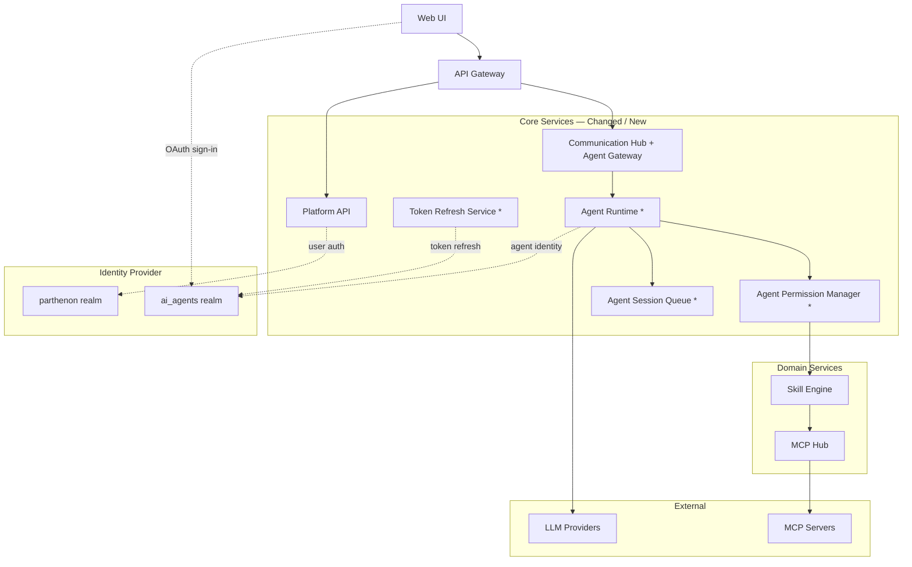
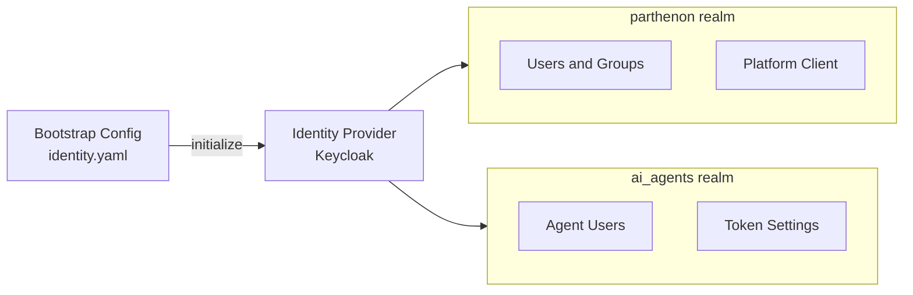
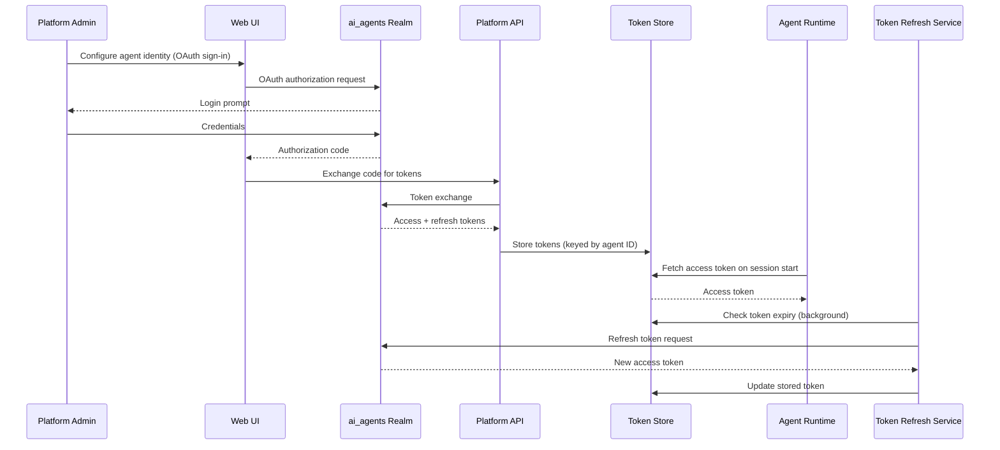
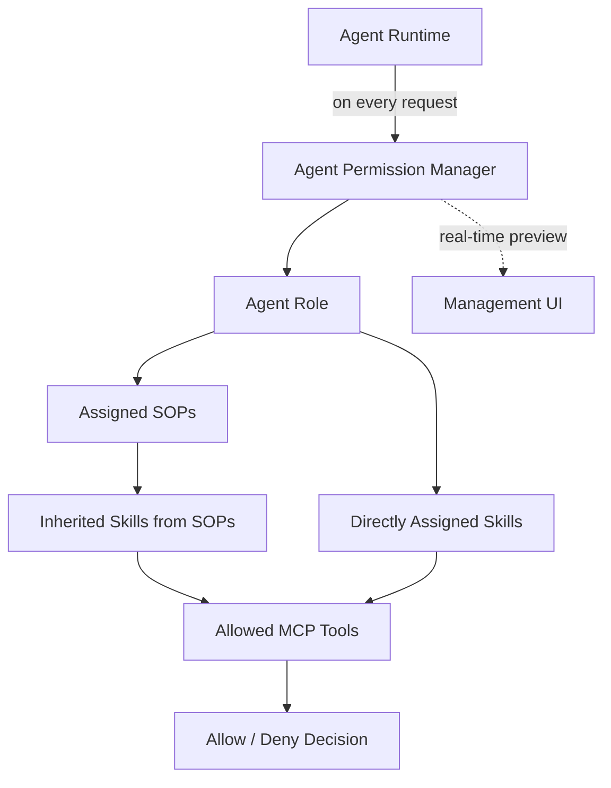
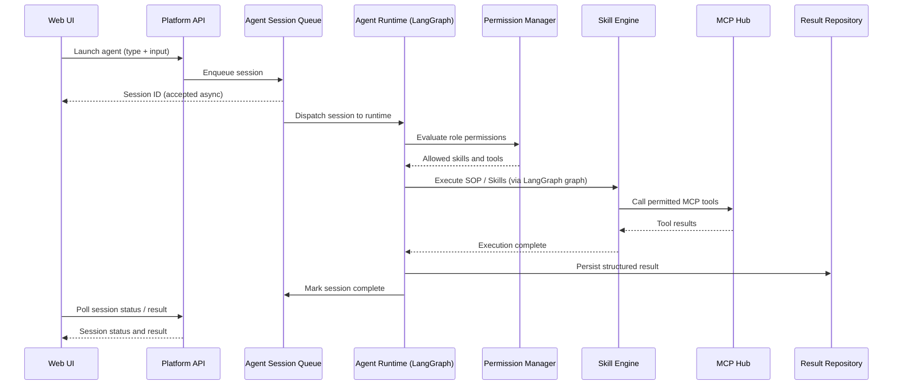

# Architecture: Implement Agent Runtime with Gateway

## Overview

This change introduces the **Agent Runtime** (powered by LangGraph), **Agent Permission Manager**, **Agent Session Queue**, and **Token Refresh Service** as new core components, and enhances the **Communication Hub** to serve as the **Agent Gateway**. Agent identities live in a dedicated `ai_agents` realm within the same identity provider used for human users; the bootstrap process initialises both realms, and an OAuth-based sign-in flow provisions agent credentials at configuration time.

---

## 1. Updated System Architecture

Components marked with `*` are new; the Communication Hub is extended to absorb the Agent Gateway role. The Identity Provider now exposes two realms: `parthenon` (human users) and `ai_agents` (agent users).

### Component Responsibilities (delta)

| Component | Status | Responsibility Added / Changed |
|---|---|---|
| **Platform API** | Extended | New endpoints for agent role management, agent type configuration, session status queries, and OAuth token exchange for agent identity provisioning |
| **Web UI** | Extended | New pages: Agent Role management, Agent Type configuration, Session tracking dashboard with conversational UI for chat agents; OAuth sign-in flow for agent identity setup |
| **Communication Hub** | Extended | Now serves as the **Agent Gateway** — accepts inbound agent execution requests, manages agent instance lifecycle, routes results back to callers |
| **Agent Runtime** | **New** | Manages agent instance lifecycle using **LangGraph** state machine framework; enforces permission boundaries; coordinates LLM inference and skill execution; fetches agent tokens from the Token Store |
| **Agent Permission Manager** | **New** | Evaluates an agent role's SOP and Skill assignments; calculates the complete set of allowed MCP tools; provides real-time tool preview to the management UI |
| **Agent Session Queue** | **New** | Accepts execution requests asynchronously; dispatches sessions to the Agent Runtime; tracks session state (pending → running → complete / failed); persists results |
| **Token Refresh Service** | **New** | Background service that monitors agent token expiry; proactively refreshes access tokens against the `ai_agents` realm using stored refresh tokens; updates the Token Store |

---

## 2. Agent Identity & Realm Architecture

Agent identities are **users** (not clients) inside a dedicated realm configured in `identity.yaml`. The bootstrap process initialises both realms in the identity provider on first deploy, mirroring how the `parthenon` user realm is set up.

**Key design decisions:**
- Agent identities are **realm users**, not OIDC clients — this aligns agent auth with the same user-based identity model used for humans and keeps audit trails consistent.
- The `ai_agents` realm name is configurable in `identity.yaml`; operators can substitute any realm name or point to a different realm in an external IdP.
- Bootstrap is idempotent — re-running on an already-initialised IdP is safe.

---

## 3. Agent Identity OAuth Flow

An administrator provisions an agent identity by performing an OAuth sign-in to an agent user account in the `ai_agents` realm. The resulting tokens are stored securely and used by the Agent Runtime at execution time. The Token Refresh Service keeps tokens valid in the background.

---

## 4. Agent Permission Inheritance

An agent role grants access by selecting SOPs and/or individual Skills. The Agent Permission Manager automatically calculates the full set of allowed MCP tools by traversing the SOP → Skill → Tool hierarchy. This calculation drives both runtime enforcement and the management UI preview.

**Key rules:**
- Granting an SOP automatically includes all Skills the SOP depends on, and all MCP tools those Skills require.
- Directly assigned Skills contribute their required MCP tools independently of any SOP.
- The Agent Runtime (using LangGraph state graphs) consults the Permission Manager on every session dispatch — no tool call is made without an allow decision.

---

## 5. Asynchronous Session Execution Flow

Agent execution is fully asynchronous. The caller receives a Session ID immediately and polls for results. The Agent Session Queue decouples request acceptance from runtime execution, enabling scalable, observable session processing. The Agent Runtime uses **LangGraph** to define agent behavior as state machine graphs with explicit node transitions.

---

## 6. Integration Points

| Integration | Protocol | Purpose |
|---|---|---|
| **Web UI → Platform API** | REST / JWT | Agent role and type management; session launch and status polling |
| **Web UI → ai_agents Realm** | OAuth 2.0 | Admin-initiated OAuth sign-in to provision agent user credentials |
| **Platform API → ai_agents Realm** | OAuth 2.0 | Token exchange during agent identity provisioning; token validation |
| **Communication Hub → Agent Runtime** | Internal | Routes agent execution requests; delivers results back to callers; for conversational agents, maintains bidirectional communication for chat messages |
| **Agent Runtime → Token Store** | Internal | Fetches stored access token for the agent identity on each session start |
| **Agent Runtime → ai_agents Realm** | OIDC / Bearer | Authenticates agent instances using their stored user token from the `ai_agents` realm |
| **Token Refresh Service → ai_agents Realm** | OAuth 2.0 refresh | Background refresh of agent access tokens using stored refresh tokens |
| **Agent Runtime → Agent Permission Manager** | Internal | Per-session permission evaluation before any skill or tool call |
| **Agent Permission Manager → Skill Engine** | Internal | Resolves SOP → Skill → MCP tool dependency graph |
| **Agent Session Queue → Data Stores** | Internal | Persists session state and structured results for audit and polling |
| **Agent Runtime → OTEL Collector** | OTLP | Emits traces, metrics, and logs for all agent actions and session transitions; includes LangGraph node transitions |

---

## 7. Master Architecture Update Instructions

The following files in `docs/master/architecture/` require updates when this change is promoted:

| File | Update Required |
|---|---|
| `system-overview.md` | Add **Agent Runtime (LangGraph)**, **Agent Permission Manager**, and **Agent Session Queue** to the component table and system diagram; update the Communication Hub row to note Agent Gateway role |
| `modules/agent-lifecycle.md` | Extend lifecycle sequence to include the asynchronous session path (Session Queue → Runtime → Result Repository) and the Permission Manager evaluation step; document LangGraph state machine approach |
| `modules/communication.md` | Add the Agent Gateway responsibility to the Communication Hub overview; show inbound agent requests flowing through CH to the Agent Runtime; document bidirectional chat communication for conversational agents |
| `modules/identity.md` | Add dual-realm topology: `parthenon` (users) and `ai_agents` (agent identities); document bootstrap initialisation of both realms; note that the `ai_agents` realm name is configurable via `identity.yaml` |
| *(new)* `modules/agent-permissions.md` | Create new module doc describing the Agent Permission Manager: role → SOP → Skill → MCP tool inheritance model and real-time preview behaviour |
| *(new)* `modules/token-refresh.md` | Create new module doc describing the Token Refresh Service: background polling cadence, token store update pattern, and failure/retry behaviour |
