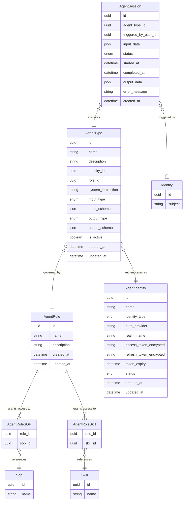

# Data Model: Implement Agent Runtime with Gateway

---

## 1. New Entities

This change introduces five new entities: **AgentRole**, **AgentRoleSOP**, **AgentRoleSkill**, **AgentIdentity**, and **AgentSession**. The existing **AgentType** entity is significantly modified (see Section 2).

### Entity Descriptions

| Entity | Purpose |
|--------|---------|
| **AgentRole** | A named permission set that grants an agent access to specific SOPs and/or Skills. The Agent Permission Manager uses this to calculate allowed MCP tools at runtime. |
| **AgentRoleSOP** | Join table linking an AgentRole to a Sop. Granting an SOP implicitly includes all Skills the SOP depends on and all MCP tools those Skills require. |
| **AgentRoleSkill** | Join table linking an AgentRole to a Skill directly (outside of any SOP). Contributes the Skill's required MCP tools to the role's allowed tool set. |
| **AgentIdentity** | Represents an agent's identity as a user account in a dedicated identity provider realm (e.g., `ai_agents`). Stores the encrypted OAuth tokens obtained by an administrator signing in to the agent user account via OAuth. Tokens are used at runtime and automatically refreshed as needed. |
| **AgentSession** | Tracks a single agent execution session from submission through completion. For task-based agents, tracks input/output and status. For conversational agents, maintains chat history. Persists input, output, status, and timing for audit and polling. |

#### AgentIdentity Field Details

| Field | Type | Purpose |
|-------|------|---------|
| `identity_type` | enum | Identity classification. Always `user` — agent identities are user accounts in the agent realm, not OIDC clients or service accounts. |
| `auth_provider` | string | Identifies the identity provider system (e.g., `keycloak`, `azure_entraid`). Supports multi-IDP deployments. |
| `realm_name` | string | The identity provider realm where this agent user account lives (e.g., `ai_agents`). Configurable per deployment via bootstrap config. |
| `access_token_encrypted` | string | Encrypted OAuth access token for this agent user. Used by the agent runtime to authenticate requests. |
| `refresh_token_encrypted` | string | Encrypted OAuth refresh token. Used to obtain a new access token when the current one expires, without requiring re-authentication. |
| `token_expiry` | datetime | Expiration timestamp of the current access token. The runtime uses this to decide when to trigger a token refresh before the next agent operation. |

### Enum Values

| Entity | Field | Values |
|--------|-------|--------|
| AgentIdentity | `identity_type` | `user` |
| AgentIdentity | `status` | `active`, `suspended`, `deprovisioned` |
| AgentType | `input_type` | `none`, `typed`, `conversation` |
| AgentType | `output_type` | `auto`, `typed`, `markdown` |
| AgentSession | `status` | `queued`, `running`, `completed`, `failed` |

---

## 2. Modified Entities

### AgentType

The existing `AgentType` entity is rearchitected to support the role-based permission model and the new identity/input/output configuration. The following changes apply:

**Fields added:**

| Field | Type | Purpose |
|-------|------|---------|
| `identity_id` | uuid (FK → AgentIdentity) | Replaces flat `identity_subject` string; links to managed identity entity |
| `role_id` | uuid (FK → AgentRole) | Associates the agent type with a permission role |
| `system_instruction` | string | Replaces `system_prompt`; renamed for clarity |
| `input_type` | enum | Defines how the agent accepts input: `none`, `typed`, or `conversation` |
| `input_schema` | json | JSON Schema describing expected input structure when `input_type = typed` |
| `output_type` | enum | Defines output format: `auto`, `typed`, or `markdown` |
| `output_schema` | json | JSON Schema describing expected output structure when `output_type = typed` |

**Fields removed:**

| Field | Reason |
|-------|--------|
| `mode` (sop-agent/skillful-agent) | Replaced by role-based SOP/Skill assignment; mode is implicit from role configuration |
| `sop_id` | Direct SOP binding replaced by AgentRoleSOP join via the role |
| `identity_subject` | Replaced by `identity_id` FK to AgentIdentity |
| `system_prompt` | Renamed to `system_instruction` |
| `max_instances` | Moved to operational configuration; not a schema field in this change |

---

## 3. Removed Entities

### AgentSkillAssignment

The existing `AgentSkillAssignment` entity (linking Skills directly to an AgentType) is removed. Skill permissions are now managed at the role level via `AgentRoleSkill`, which applies consistently to all agent types sharing that role.

---

## 4. Schema File References

All schema changes are made to declarative model files in `backend/app/db/models/`.

| File | Change |
|------|--------|
| `backend/app/db/models/agents.py` | Add `AgentRole`, `AgentRoleSOP`, `AgentRoleSkill`, `AgentIdentity`, `AgentJob` models; update `AgentType` fields; remove `AgentSkillAssignment` model |

---

## 5. Master Data Model Update Instructions

When this change is promoted, update the following files in `docs/master/data-model/`:

- **`modules/agents/entities.md`**: Replace current diagram and entity table with the new AgentRole, AgentRoleSOP, AgentRoleSkill, AgentIdentity, AgentType (updated), and AgentJob entities. Remove AgentSkillAssignment and AgentInstance entries (AgentInstance is superseded by AgentJob for asynchronous execution tracking).
- **`overview.md`**: Update the Agent Management domain section to include AgentRole, AgentIdentity, and AgentJob in the top-level entity list; remove AgentSkillAssignment.
