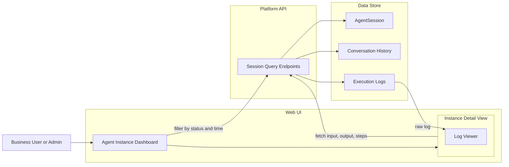

# Agent Instance Dashboard

## Overview

The Agent Instance Dashboard is a Web UI component that gives platform admins and business users visibility into all running and historical agent executions. Each row in the dashboard corresponds to one `AgentSession` record. Users can filter by session status and time range, then drill into an individual instance to see its structured input, output, and full conversation turn history.

## Component Architecture

## Dashboard Features

### Session List

- Lists all agent instances (one row per `AgentSession`)
- **Status filter:** `running` / `completed` / `failed` / `cancelled`
- **Time-range picker:** scopes results to a selected window
- Columns: agent type, status, start time, duration

### Instance Detail View

Selecting a session opens the Instance Detail View, which surfaces:

| Section | Content |
|---|---|
| **Input** | Structured input submitted to the session |
| **Output** | Structured or markdown output produced by the agent |
| **Conversation** | Full turn history (for conversational agent types) |
| **Log Viewer** | Three-panel view of session execution: **Summary Panel** (identity, role, SOP/skills, plan, model, result summary — shown by default), **Working Steps Panel** (LLM iterations and tool calls grouped per reasoning step — collapsed by default), **Raw Log Toggle** (switches to unprocessed raw log text; copyable). See [Execution Logs](execution-logs.md). |

## Backend Query Endpoints

The Platform API exposes session query endpoints that accept `status` and `time_range` parameters. No additional persistence schema is required beyond what the Agent Session Queue already tracks — the `AgentSession` record, conversation history table, and Execution Log Store are queried directly. See [Agent Runtime](agent-runtime/architecture.md) for session state management.
