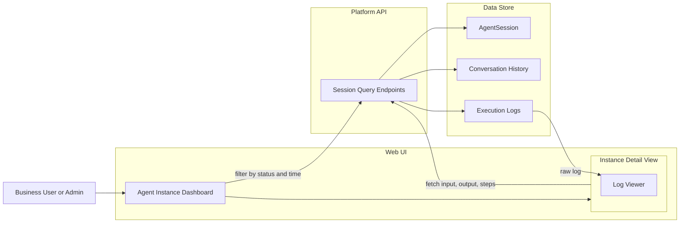

# Agent Instance Dashboard

## Overview

The Agent Instance Dashboard is a Web UI component that gives platform admins and business users visibility into all running and historical agent executions. Each row in the dashboard corresponds to one `AgentSession` record. Users can filter by session status and time range, then drill into an individual instance to see its structured input, output, and full conversation turn history.

## Component Architecture

```mermaid
flowchart LR
    User[Business User or Admin]

    subgraph WebUI[Web UI]
        AID[Agent Instance Dashboard]
        subgraph Detail[Instance Detail View]
            LogViewer[Log Viewer]
        end
    end

    subgraph API[Platform API]
        SQ[Session Query Endpoints]
    end

    subgraph Data[Data Store]
        AS[AgentSession]
        Conv[Conversation History]
        EL[Execution Logs]
    end

    User --> AID
    AID -->|filter by status and time| SQ
    AID --> Detail
    Detail -->|fetch input, output, steps| SQ
    SQ --> AS
    SQ --> Conv
    SQ --> EL
    EL -->|raw log| LogViewer
```

## Dashboard Features

### Session List

- Lists all agent instances (one row per `AgentSession`)
- **Status filter:** `running` / `completed` / `failed` / `cancelled`
- **Time-range picker:** scopes results to a selected window
- Columns: agent type, status, start time, duration, session title (for conversation-type agents)
- **Session column:** For conversation-type agent executions, displays the linked conversation session title; empty for non-conversational agents

### Sessions Tab (Conversation Agents Only)

For conversation-type agents, the Agent Type detail dialog includes a dedicated **Sessions** tab that lists all of the user's conversation sessions for that agent type:

- **Session list columns:** Title (auto-generated), Status (active / closed / archived), Last Active timestamp
- **Actions per session:** Resume (opens chat interface with full history), End (closes session), Archive (hides from active list)
- **"Start New Conversation" entry point** — creates a new session and opens the chat interface
- **User-scoped listing** — each user sees only their own sessions
- **Automatic refresh** — session list updates after create, end, and archive operations without page reload

The Sessions tab is visible **only** for agent types with `input_type = 'conversation'`. All other agent types (single-shot, workflow, etc.) do not display this tab.

### Instance Detail View

Selecting a session opens the Instance Detail View, which surfaces:

| Section | Content |
|---|---|
| **Input** | Structured input submitted to the session |
| **Output** | Structured or markdown output produced by the agent |
| **Conversation** | Full turn history (for conversational agent types) |
| **Log Viewer** | Three-panel view of session execution: **Summary Panel** (identity, role, SOP/skills, plan, model, result summary — shown by default), **Working Steps Panel** (LLM iterations and tool calls grouped per reasoning step — collapsed by default), **Raw Log Toggle** (switches to unprocessed raw log text; copyable). See [Execution Logs](execution-logs.md). |

## Backend Query Endpoints

The Platform API exposes session query endpoints that accept `status` and `time_range` parameters. No additional persistence schema is required beyond what the Agent Session Queue already tracks — the `AgentSession` record, conversation history table, and Execution Log Store are queried directly. See [Agent Runtime](agent-runtime/architecture.md) for session state management.
