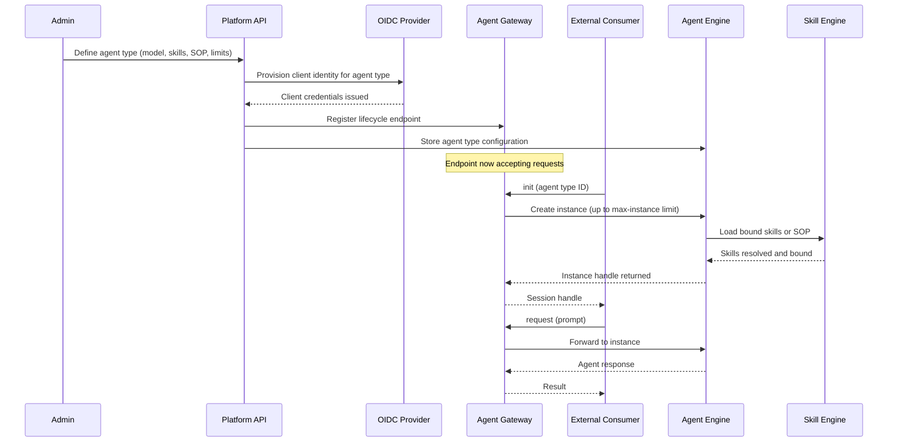

# Agent Lifecycle

## Overview

An agent progresses through a well-defined lifecycle: an admin **defines** an agent type, the platform **provisions** its identity and registers its gateway endpoint, and external consumers **interact** with instances through a structured protocol of init → request → response → close.

## Lifecycle Sequence

## Protocol Phases

### 1. Type Definition (Admin)

An administrator defines an agent type through the Platform API, specifying the bound LLM model, available skills or SOPs, instance limits, and behavioural constraints. The platform provisions a dedicated OIDC client identity for the agent type and registers a lifecycle endpoint on the Agent Gateway.

### 2. Init

An external consumer calls `init` on the Agent Gateway with an agent type identifier. The Agent Engine creates a new instance (subject to the configured max-instance limit), loads the bound skills or SOP via the Skill Engine, and returns a session handle through the gateway.

### 3. Request / Response

The consumer sends prompts to the session handle. The Agent Gateway forwards each request to the bound instance in the Agent Engine, which orchestrates model inference and skill execution before returning a result.

### 4. Question / Answer (Mid-Turn Clarification)

During a request, the agent may need additional information from the consumer before completing its task. The protocol supports a **question** sent back through the gateway, pausing execution until the consumer provides an **answer**, which resumes the turn.

### 5. Close

The consumer or a timeout closes the session. The Agent Engine tears down the instance and releases resources. The agent type and its gateway endpoint remain available for new sessions.
