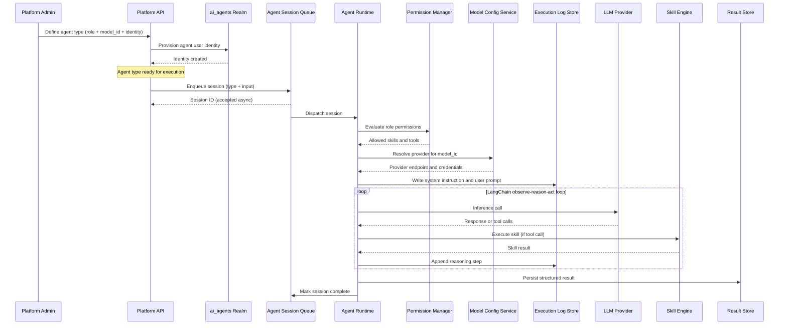

# Agent Lifecycle

## Overview

An agent progresses through a well-defined lifecycle: an admin **defines** an agent type (with a role, model reference, and identity), the platform **provisions** its identity in the `ai_agents` realm, and callers **launch** sessions asynchronously through the Agent Session Queue. The Agent Runtime (powered by the **LangChain deep agent** framework) executes each session via an observe → reason → act loop, coordinating permission evaluation, model resolution, skill execution, and execution log capture.

## Asynchronous Session Lifecycle

## Lifecycle Phases

### 1. Type Definition (Admin)

An administrator defines an agent type through the Platform API, specifying the linked agent role, the `model_id` referencing a Model Config, the assigned agent identity, and behavioural constraints. The platform provisions a dedicated user identity for the agent type in the `ai_agents` realm of the identity provider.

### 2. Session Enqueue

A caller (Web UI or internal service) launches an agent session by submitting the agent type and input to the Platform API. The API enqueues the request in the Agent Session Queue, which immediately returns a Session ID. Execution is fully asynchronous — the caller polls for status and result.

### 3. Dispatch and Permission Evaluation

The Agent Session Queue dispatches the session to the Agent Runtime. Before any LLM or tool call, the runtime:

1. Validates that the agent identity is explicitly assigned to the agent role (queries `agent_role_identities`).
2. Calls the Agent Permission Manager to evaluate the role's SOP and Skill assignments and resolve the complete allowed tool set.
3. Calls the Model Config Service to resolve the provider endpoint and encrypted credentials matching the agent type's `model_id` via the `enabled_models` lookup.

If identity-role validation fails, the session fails immediately with a permission error — no LLM or tool calls are made.

### 4. Execution Log Capture

Before the first LLM inference call, the Agent Runtime writes the full system instruction and user prompt to the Execution Log Store, keyed by `session_id`. This ensures the log reflects exactly what was sent to the model. Subsequent reasoning steps and tool calls are appended throughout the LangChain executor loop.

### 5. LangChain Observe → Reason → Act Loop

The Agent Runtime drives the LangChain deep agent executor. In each loop iteration:

- **Observe** — The agent receives the current context (messages, tool results).
- **Reason** — The LLM produces a response or a structured tool call.
- **Act** — The runtime routes tool calls to the Skill Engine, which executes the permitted MCP tools and returns results.

The loop continues until the LLM produces a final answer or a session limit is reached.

### 6. Result Persistence and Completion

The structured result, full conversation history, and complete execution log are persisted to the Result Store. The Agent Session Queue marks the session as complete. The Agent Instance Dashboard surfaces session status, filtering by state (running / completed / failed / cancelled) and time range. See [Agent Instance Dashboard](../agent-instance-dashboard.md) and [Execution Logs](../execution-logs.md).
