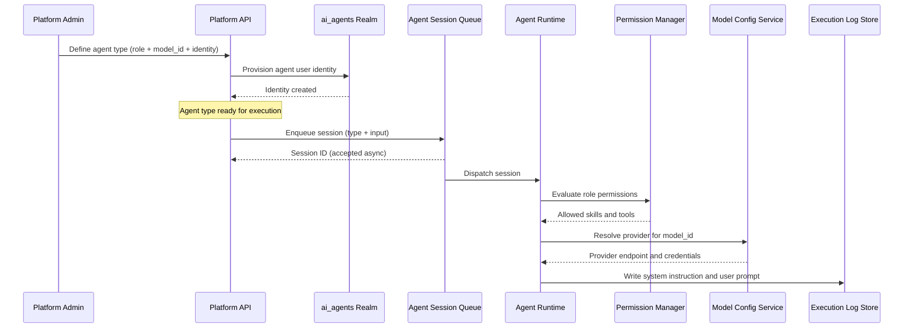
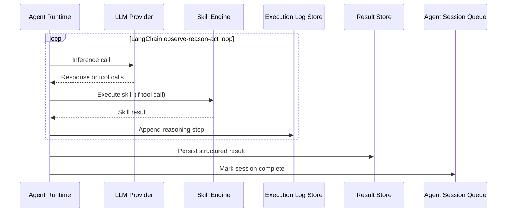
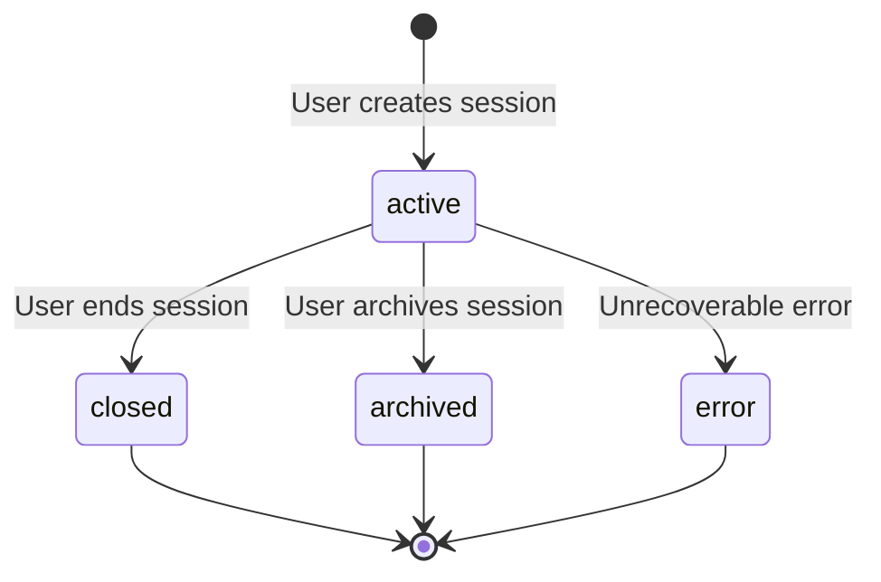

# Agent Lifecycle

## Overview

An agent progresses through a well-defined lifecycle: an admin **defines** an agent type (with a role, model reference, and identity), the platform **provisions** its identity in the `ai_agents` realm, and callers **launch** sessions asynchronously through the Agent Session Queue. The Agent Runtime (powered by the **LangChain deep agent** framework) executes each session via an observe → reason → act loop, coordinating permission evaluation, model resolution, skill execution, and execution log capture.

## Session Definition, Enqueue, and Dispatch

```mermaid
sequenceDiagram
    participant Admin as Platform Admin
    participant API as Platform API
    participant IdP as ai_agents Realm
    participant AJQ as Agent Session Queue
    participant AR as Agent Runtime
    participant APM as Permission Manager
    participant MCS as Model Config Service
    participant ELS as Execution Log Store

    Admin->>API: Define agent type (role + model_id + identity)
    API->>IdP: Provision agent user identity
    IdP-->>API: Identity created
    Note over API: Agent type ready for execution

    API->>AJQ: Enqueue session (type + input)
    AJQ-->>API: Session ID (accepted async)
    AJQ->>AR: Dispatch session
    AR->>APM: Evaluate role permissions
    APM-->>AR: Allowed skills and tools
    AR->>MCS: Resolve provider for model_id
    MCS-->>AR: Provider endpoint and credentials
    AR->>ELS: Write system instruction and user prompt
```

## Execution Loop and Completion

```mermaid
sequenceDiagram
    participant AR as Agent Runtime
    participant LLM as LLM Provider
    participant SE as Skill Engine
    participant ELS as Execution Log Store
    participant RS as Result Store
    participant AJQ as Agent Session Queue

    loop LangChain observe-reason-act loop
        AR->>LLM: Inference call
        LLM-->>AR: Response or tool calls
        AR->>SE: Execute skill (if tool call)
        SE-->>AR: Skill result
        AR->>ELS: Append reasoning step
    end
    AR->>RS: Persist structured result
    AR->>AJQ: Mark session complete
```

## Lifecycle Phases

### 1. Type Definition (Admin)

An administrator defines an agent type through the Platform API, specifying the linked agent role, the `model_id` referencing a Model Config, the assigned agent identity, and behavioural constraints. The platform provisions a dedicated user identity for the agent type in the `ai_agents` realm of the identity provider.

### 2. Session Enqueue

A caller (Web UI or internal service) launches an agent session by submitting the agent type and input to the Platform API. The API enqueues the request in the Agent Session Queue, which immediately returns a Session ID. Execution is fully asynchronous — the caller polls for status and result.

### 3. Dispatch and Permission Evaluation

The Agent Session Queue dispatches the session to the Agent Runtime. Before any LLM or tool call, the runtime:

1. Validates that the agent identity is explicitly assigned to the agent role (queries `agent_role_identities`).
2. Calls the Agent Permission Manager to evaluate the role's SOP and Skill assignments and resolve the complete allowed tool set.
3. Calls the Model Config Service to resolve the provider endpoint and encrypted credentials matching the agent type's `model_id` via the `enabled_models` lookup.

If identity-role validation fails, the session fails immediately with a permission error — no LLM or tool calls are made.

### 4. Execution Log Capture

Before the first LLM inference call, the Agent Runtime writes the full system instruction and user prompt to the Execution Log Store, keyed by `session_id`. This ensures the log reflects exactly what was sent to the model. Subsequent reasoning steps and tool calls are appended throughout the LangChain executor loop.

### 5. LangChain Observe → Reason → Act Loop

The Agent Runtime drives the LangChain deep agent executor. In each loop iteration:

- **Observe** — The agent receives the current context (messages, tool results).
- **Reason** — The LLM produces a response or a structured tool call.
- **Act** — The runtime routes tool calls to the Skill Engine, which executes the permitted MCP tools and returns results.

The loop continues until the LLM produces a final answer or a session limit is reached.

### 5a. Human-in-the-Loop Intervention — Suspend and Resume

During the observe-reason-act loop, an agent may call the `system____human_intervene` system tool to pause execution and request human input. When this occurs:

1. The Agent Runtime serialises the current execution context (messages, iteration count, tool results) and signals suspension to the Communication Hub.
2. The Communication Hub routes the tool call to Control Center for persistence.
3. Control Center persists the `InterveneRequest` record with `status=pending` and emits an `intervene_request_created` notification event.
4. The agent session transitions to `waiting_for_human` state — no further LLM or tool calls are made.
5. An operator (or business user viewing the live execution log stream) views the request through the Web UI and submits a response (approval Yes/No, choice selection, or free-form text).
6. The response flows: Web UI → Communication Hub → Control Center, where the `InterveneResponse` is persisted and the request status becomes `responded`.
7. Control Center signals resume through the Communication Hub to the Agent Runtime.
8. The Agent Runtime restores the execution context and injects the response value as the `human_intervene` tool's return value.
9. The observe-reason-act loop resumes with the human input available to the agent.

This suspend/resume cycle also applies to the inline intervene popup on the execution log streaming page — when a user is viewing live logs and the agent triggers an intervene request, a popup appears directly on the log page. After the user responds, the popup closes and the stream resumes automatically.

### 6. Result Persistence and Completion

The structured result, full conversation history, and complete execution log are persisted to the Result Store. The Agent Session Queue marks the session as complete. The Agent Instance Dashboard surfaces session status, filtering by state (running / waiting_for_human / completed / failed / cancelled) and time range. See [Agent Instance Dashboard](../agent-instance-dashboard.md) and [Execution Logs](../execution-logs.md).

## Conversational Session Lifecycle

For **conversation-type agents** (agents with `input_type = 'conversation'`), the platform provides persistent, user-named sessions with extended lifecycle management beyond the core agent execution lifecycle.

### Conversation Session State Machine

```mermaid
stateDiagram-v2
    [*] --> active : User creates session
    active --> closed : User ends session
    active --> archived : User archives session
    active --> error : Unrecoverable error
    closed --> [*]
    archived --> [*]
    error --> [*]
```

### Conversation Session Manager

The **Conversation Session Manager** orchestrates session lifecycle transitions and enforces ownership validation:

| Operation | Lifecycle Transition | Validation |
|---|---|---|
| **Create** | `null → active` | Authenticated user; validates agent type is conversation-type; sets `triggered_by_user_id` from JWT |
| **Resume** | (no transition) | User must own the session; returns full turn history with tool call records |
| **End** | `active → closed` | User must own the session; session no longer accepts new messages |
| **Archive** | `active → archived` | User must own the session; session excluded from default active listing |

All session management operations are user-scoped — users can only access their own sessions.

### Session Auto-Naming

When a new conversation session is created, the session starts with `title: null`. After the first user message is received and stored, the Communication Hub triggers the **Session Auto-Namer** as a background task:

1. Auto-namer constructs a title-generation prompt from the first user message
2. Calls the agent type's configured LLM via Model Config Service
3. Writes the generated title to the `ConversationSession` record
4. Pushes a `title_update` WebSocket event to the active client

Title generation is asynchronous and does not block the user's message processing. If the LLM call fails, the auto-namer falls back to a truncated version of the first user message (first 50 characters).

### Relationship to Agent Session Queue

The `ConversationSession` record is promoted from an internal execution detail to the primary user-facing session entity. It carries:

- `agent_job_id` — foreign key to the active `AgentSession` record (nullable; set when an execution is spawned)
- `title` — auto-generated session title (nullable until first turn completes)
- `triggered_by_user_id` — foreign key to the platform user who started the session
- `updated_at` — timestamp of last turn or status change; used for sorting sessions by recency

The Agent Session Queue continues to manage the core execution lifecycle (pending → running → complete / failed), while the Conversation Session Manager extends this with user-facing session persistence and lifecycle state (active → closed / archived).
