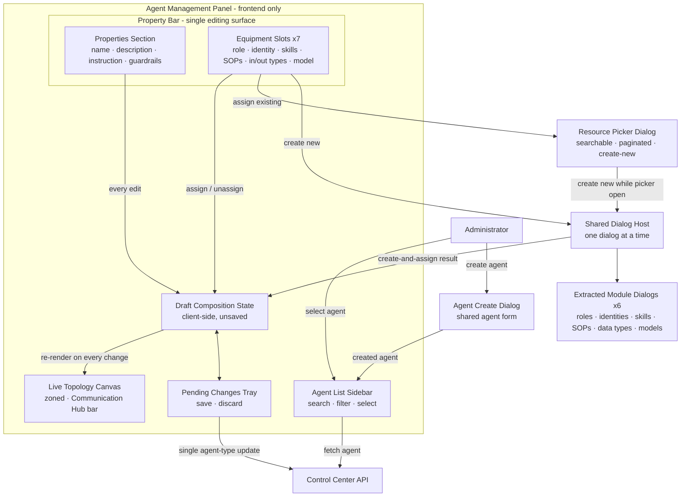
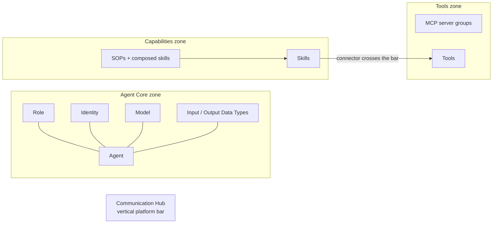
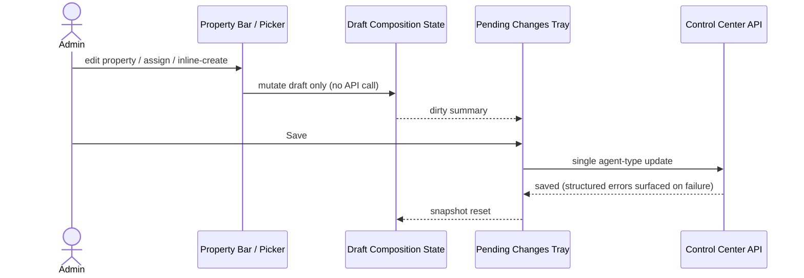

# Agent Management Panel

## Overview

The Agent Management Panel is a frontend-only composition module (route `/agents/panel`, Agents sidebar group) where an administrator configures an agent from a single three-region layout: agent list, live topology, and property bar. The property bar is the **single editing surface**: a Properties section edits every base agent property (name, description, system instruction, execution guardrails) and the equipment slots below it edit the equipped resources (role, identity, skills, SOPs, input data type, output data type, model). Agent creation keeps a dedicated dialog hosting the shared agent form — there is no edit dialog. All edits mutate a client-side draft; saving issues exactly one agent-type update to Control Center. No database, permission-model, or inter-service changes: the three-service segregation and Control-Center-only database access are untouched.

## Component Architecture

- **Draft Composition State** — an in-memory copy of the selected agent (base properties + equipment). Every assign/unassign/inline-create/property-edit mutates the draft only; no API calls until Save.
- **Property Bar** — owns ALL editing of an existing agent. Editing never opens a dialog; the create dialog exists only for new agents.
- **Resource Picker Dialog** — generic searchable + paginated selection surface behind every slot's "assign existing" action; supports "create new" from within the picker without losing selection context.

## Zoned Topology Layout

The live topology is composed client-side from the draft — it re-renders on every pre-save change without any runtime call to the Communication Hub service. The Communication Hub is drawn as a fixed platform element: a vertical bar between the Capabilities and Tools zones of the zoned graph (not a node). Empty slots render as dashed placeholders; direct skill→tool connectors cross the hub bar.

## Save Flow

Inline resource creation is the only immediate write — created resources must exist server-side before they can be referenced; that is the extracted dialogs' own existing behaviour, unchanged.

## Reuse Model

| Reused element | Role in the panel |
|---|---|
| Extracted module dialogs (roles, identities, skills, SOPs, data types, models) | Mounted by the Shared Dialog Host; inline creation behaves identically to the source modules; source module pages import the same shared components |
| Shared agent form | Hosted by the agent create dialog only — editing an existing agent happens exclusively in the property bar |
| Shared topology renderer | Backs both the panel canvas (zoned mode with hub bar) and the existing agent preview topologies (hub node via helper) — see [Agent Types](agent-types.md) |
| Resource picker dialog | Generic searchable + paginated "assign existing" surface for every slot, with in-place create-new |
| Data hooks + existing Control Center REST endpoints | All reads and the single save write flow through existing APIs — no new endpoints |

## Permission Gating

Each equipment slot declares its existing `agent::*` resource type — no new manifest entries and no permission-resolution changes. Read-only users can browse and review compositions; a denied slot list disables that slot's actions with an explanatory note instead of an error. See [Identity and Access Management](iam.md).
