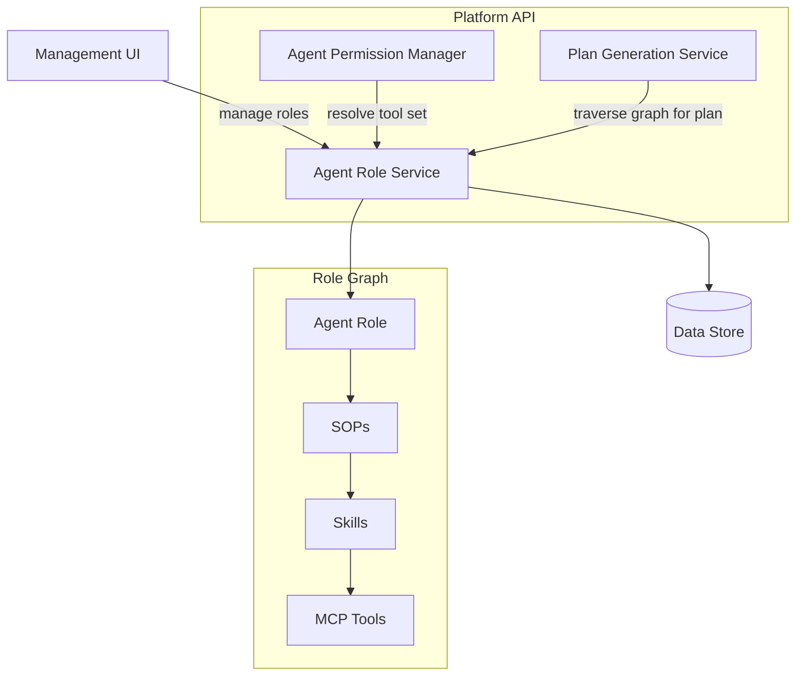

# Agent Roles

## Overview

Agent Roles define the behavioral scope of an agent — assigning SOPs, skills, and an agent identity. The Agent Role Service owns the role → SOP → Skill → Tool graph, which is the canonical source for permission resolution and for constructing LLM prompts that describe what an agent is authorised to do.

## Component Architecture

## Graph Traversal Query

The Agent Role Service exposes an internal read-only graph-traversal query consumed by two callers:

| Caller | Purpose |
|---|---|
| **Agent Permission Manager** | Resolves the allowed MCP tool set for a dispatched agent session |
| **Plan Generation Service** | Fetches the full role → SOP → Skill → Tool graph to construct the LLM plan prompt on agent type save |

The traversal returns the role record together with its assigned SOPs, the skills each SOP depends on, and the MCP tools each skill requires — in a single pass.
