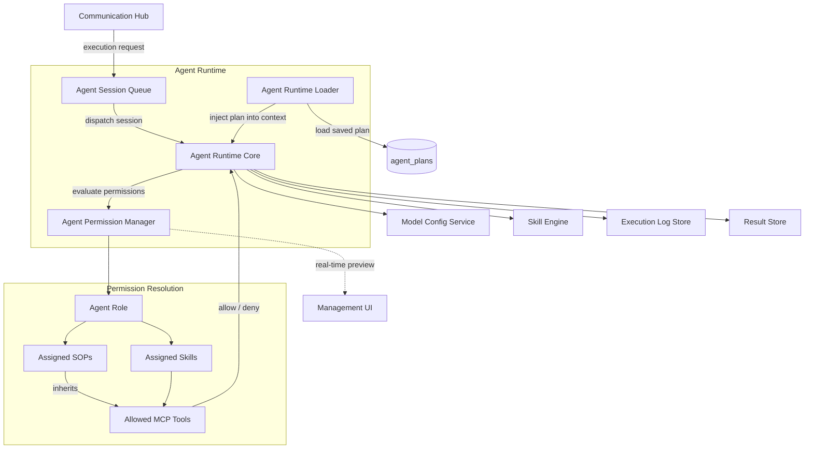
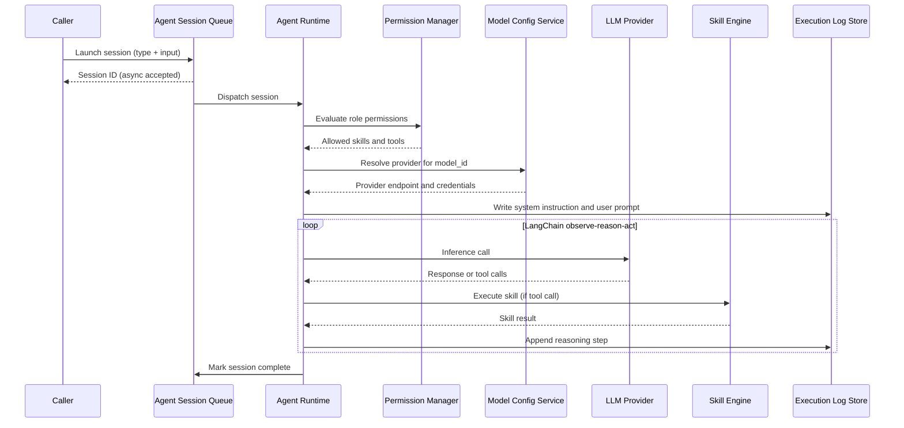

# Agent Runtime

## Overview

The Agent Runtime is the platform's execution core for agent sessions. It is powered by the **LangChain deep agent** framework and runs each session as an observe → reason → act loop, coordinating permission evaluation, model resolution, skill execution, and execution log capture. The Agent Session Queue decouples request acceptance from runtime execution, enabling asynchronous, scalable session processing. The Agent Permission Manager enforces role-scoped tool access on every session dispatch.

## Component Architecture



## Agent Session Queue

The Agent Session Queue accepts execution requests asynchronously and decouples callers from runtime execution.

**Session states:** `pending` → `running` → `complete` / `failed` / `cancelled`

**Responsibilities:**
- Accept session requests from the Platform API and return a Session ID immediately
- Dispatch pending sessions to the Agent Runtime for execution
- Track session state transitions and persist results, conversation history, and execution logs
- Support filtered queries by status and time range (backing the Agent Instance Dashboard)

## Agent Runtime Core

The Agent Runtime manages the full execution lifecycle for a single session.

**Pre-execution validation (in order):**

1. Load `AgentType` with its linked `AgentIdentity` and `AgentRole`
2. Query `agent_role_identities` — validate `EXISTS(identity_id = X AND role_id = Y)`
3. If not found: fail the session immediately with a permission error; no LLM or tool calls are made
4. Call the Agent Permission Manager to resolve the allowed tool set
5. Call the Model Config Service to resolve provider endpoint and credentials for the agent type's `model_id`

**Execution (LangChain observe → reason → act loop):**

1. Write full system instruction and user prompt to the Execution Log Store before the first LLM call
2. Call the resolved LLM provider endpoint
3. If the LLM returns a tool call: route to the Skill Engine; receive result; append reasoning step to log; continue loop
4. If the LLM returns a final answer: exit loop; persist structured result; mark session complete

## Agent Permission Manager

The Agent Permission Manager calculates the complete set of MCP tools an agent is allowed to invoke, based on the agent role's SOP and Skill assignments.

**Permission inheritance chain:**

```
Agent Role
  ├── Assigned SOPs  →  Inherited Skills  →  Required MCP Tools
  └── Directly Assigned Skills             →  Required MCP Tools
```

All tool references use the unified `mcp_slug/tool_name` format.

**Key rules:**
- Granting an SOP automatically includes all Skills the SOP depends on and all MCP tools those Skills require
- Directly assigned Skills contribute their required tools independently of any SOP
- The Agent Runtime consults the Permission Manager on every session dispatch — no tool call is made without an allow decision
- The Permission Manager also exposes a real-time preview API consumed by the management UI, so admins see the effective tool set as they configure roles

## Session Dispatch Flow



## Agent Runtime Loader

The Agent Runtime Loader is an extension to the Agent Runtime Core that loads a saved plan from the `agent_plans` table when initialising an agent session and injects it into the agent's system context before the first LLM call.

**Responsibilities:**
- On session start, query `agent_plans` for the plan associated with the agent type
- If a plan is found, prepend it to the agent's system context as execution guidance
- If no plan exists (e.g. plan generation failed at save time), proceed without plan context — no session failure

**Purpose:** The pre-approved plan guides the agent's observe → reason → act loop at runtime, aligning execution with the configuration-time intent expressed when the agent type was saved.

