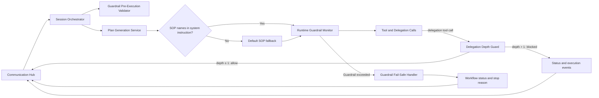
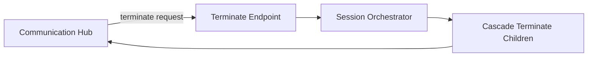
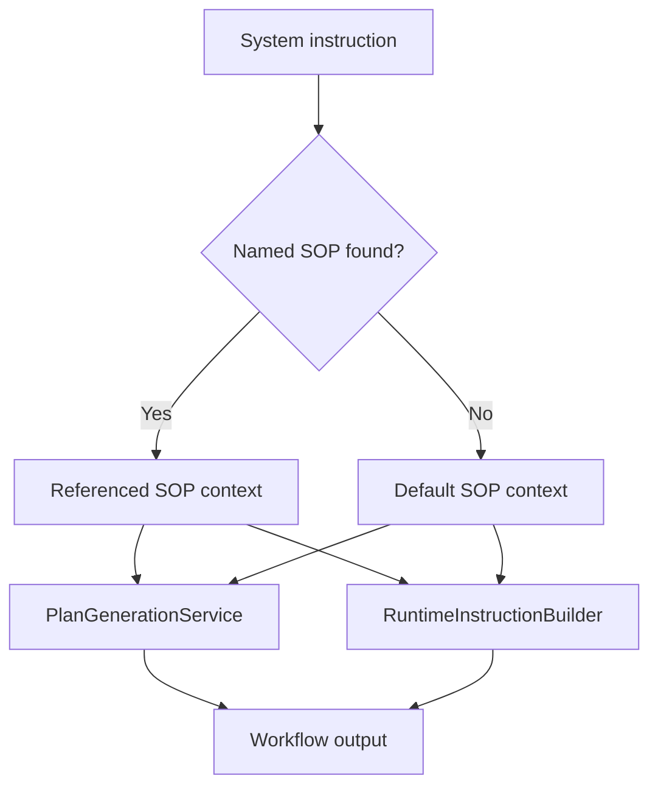

# Agent Runtime Architecture

## System Tool Binding & Routing

Agent Runtime binds LangChain `BaseTool` subclasses for all platform system tools, each holding a `CommHubToolClient` reference. Tool calls follow a mandatory routing path: Agent Runtime → Communication Hub → Control Center. Agent Runtime never accesses the database directly.

| System Tool | Purpose | Tool Call Path |
|---|---|---|
| `save_data` | Persist intermediate named data records during execution (zero or more per session) | AR → CH → CC |
| `get_data` | Query previously saved data by name, agent type, or session | AR → CH → CC |
| `get_output` | Query historical final outputs by agent type, session, or date range | AR → CH → CC |
| `query_result` | Query past typed agent outputs by data type name with optional filters | AR → CH → CC |
| `send_notification` | Send notifications via configured channels | AR → CH → CC |
| `get_recipient_group` | Resolve notification recipient groups | AR → CH → CC |
| `human_intervene` | Suspend execution and request human input (HITL) | AR → CH → CC |

## Typed Output Handling

When a non-conversational agent type has an assigned output data type (`output_data_type_id`), Agent Runtime performs a two-phase completion flow:

1. **Validation phase**: Calls Control Center's internal validation endpoint with the output payload and data type ID. Control Center validates against the schema and returns validation result.
2. **Persistence phase**: Calls Control Center's internal output persistence endpoint to persist the typed output with validation status, field values, and raw output fallback.

Structured output is enforced at the agent framework level via an output JSON schema passed during agent creation. The framework auto-promotes to provider-native JSON mode where supported.

The legacy `save_result` tool is decoupled from typed output — typed output is captured at session completion by the runtime executor, not via the agent's tool call.

## Delegation Depth Guard

Agent Runtime enforces a 1-level delegation depth limit for non-conversational (task) agents. A **Delegation Depth Guard** intercepts delegation tool calls (`agent____<slug>`) before dispatch:

- **Parent agent (depth 0)** delegates → allowed
- **Sub-agent (depth 1)** attempts to delegate → blocked; a `delegation_depth_blocked` log event is emitted
- **Conversational agents** are exempt — they use policy-defined `max_delegation_depth` (default 3)
- Enforced server-side at the Agent Runtime level — cannot be bypassed from the frontend

Depth is tracked via `RuntimeGuardrailState.delegation_depth`, incremented when a delegation tool call proceeds. When blocked, the sub-agent receives the blocked outcome as its tool result.

## Termination Governance

Agent Runtime exposes a control-plane termination endpoint reachable through the Communication Hub, which authenticates the caller with a service certificate. Agent Runtime rejects direct calls from Control Center — this preserves service segregation. Only Communication Hub service certificates are accepted on internal termination paths.

When a parent agent job is terminated, Agent Runtime cancels the in-flight task and walks the delegation graph to cancel all active delegated child jobs. The agent job status is updated to `terminated`, a distinct state from `failed` (genuine agent or runtime error). Late-arriving tool call completions or status updates are rejected by terminal-state guards.

## Execution Flow

```mermaid
flowchart LR
    CH[Communication Hub]
    ORCH[Session Orchestrator]
    PV[Guardrail Pre-Execution Validator]
    PG[Plan Generation Service]
    SOP{SOP names in system instruction?}
    DSOP[Default SOP fallback]
    RM[Runtime Guardrail Monitor]
    TC[Tool and Delegation Calls]
    DDG[Delegation Depth Guard]
    EVT[Status and execution events]

    CH --> ORCH
    ORCH --> PV
    ORCH --> PG
    PG --> SOP
    SOP -->|No| DSOP
    SOP -->|Yes| RM
    DSOP --> RM
    RM --> TC
    TC -->|delegation tool call| DDG
    DDG -->|depth ≤ 1: allow| CH
    DDG -->|depth > 1: blocked| EVT
    EVT --> CH
    RM -->|Guardrail exceeded| FS[Guardrail Fail-Safe Handler]
    FS --> ST[Workflow status and stop reason]
    ST --> CH
```

## Termination Cascade

```mermaid
flowchart LR
    CH[Communication Hub]
    ORCH[Session Orchestrator]
    TR[Terminate Endpoint]
    CB[Cascade Terminate Children]

    CH -->|terminate request| TR
    TR --> ORCH
    ORCH --> CB
    CB --> CH
```

```mermaid
flowchart TB
    SI[System instruction]
    SN{Named SOP found?}
    NSOP[Referenced SOP context]
    DSOP[Default SOP context]
    PGS[PlanGenerationService]
    RIB[RuntimeInstructionBuilder]
    OUT[Workflow output]

    SI --> SN
    SN -->|Yes| NSOP
    SN -->|No| DSOP
    NSOP --> PGS
    DSOP --> PGS
    NSOP --> RIB
    DSOP --> RIB
    PGS --> OUT
    RIB --> OUT
```
