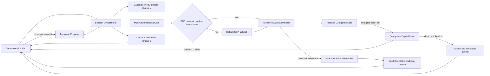
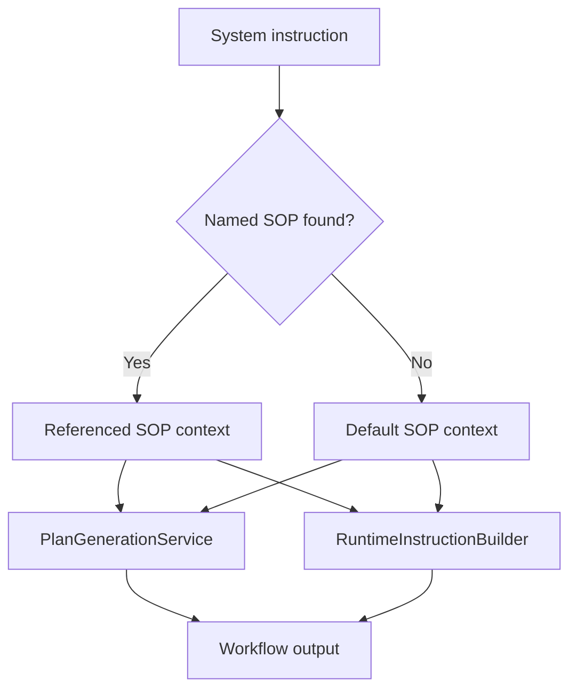

# Agent Runtime Architecture

## Delegation Depth Guard

Agent Runtime enforces a 1-level delegation depth limit for non-conversational (task) agents. A **Delegation Depth Guard** intercepts delegation tool calls (`agent____<slug>`) before dispatch:

- **Parent agent (depth 0)** delegates → allowed
- **Sub-agent (depth 1)** attempts to delegate → blocked; a `delegation_depth_blocked` log event is emitted
- **Conversational agents** are exempt — they use policy-defined `max_delegation_depth` (default 3)
- Enforced server-side at the Agent Runtime level — cannot be bypassed from the frontend

Depth is tracked via `RuntimeGuardrailState.delegation_depth`, incremented when a delegation tool call proceeds. When blocked, the sub-agent receives the blocked outcome as its tool result.

## Termination Governance

Agent Runtime exposes a control-plane termination endpoint that allows authorized callers to cancel an in-flight agent job. The endpoint is only reachable through the Communication Hub, which authenticates the caller with a service certificate. Agent Runtime's `ControlCenterCertificateMiddleware` rejects direct calls from Control Center — this preserves service segregation. The certificate middleware accepts only `service:communication-hub` service certificates on `/internal/agent/terminate/*` paths.

When a parent agent job is terminated, Agent Runtime cancels the in-flight task and walks the delegation graph to cancel all active delegated child jobs. The `AgentJob.status` is updated to `terminated`, a distinct state from `failed` (genuine agent or runtime error). Late-arriving tool call completions or status updates from the underlying LangChain deep-agent framework are rejected by terminal-state guards in the internal session-data endpoint.

```mermaid
flowchart LR
    CH[Communication Hub]
    ORCH[Session Orchestrator]
    PV[Guardrail Pre-Execution Validator]
    PG[Plan Generation Service]
    SOP{SOP names in system instruction?}
    DSOP[Default SOP fallback]
    RM[Runtime Guardrail Monitor]
    FS[Guardrail Fail-Safe Handler]
    TC[Tool and Delegation Calls]
    DDG[Delegation Depth Guard]
    EVT[Status and execution events]
    ST[Workflow status and stop reason]
    TR[Terminate Endpoint]
    CB[Cascade Terminate Children]

    CH --> ORCH
    ORCH --> PV
    ORCH --> PG
    PG --> SOP
    SOP -->|No| DSOP
    SOP -->|Yes| RM
    DSOP --> RM
    RM --> TC
    TC -->|delegation tool call| DDG
    DDG -->|depth ≤ 1: allow| CH
    DDG -->|depth > 1: blocked| EVT
    EVT --> CH
    RM -->|Guardrail exceeded| FS
    FS --> ST
    ST --> CH
    CH -->|terminate request| TR
    TR --> ORCH
    ORCH --> CB
    CB --> CH
```

```mermaid
flowchart TB
    SI[System instruction]
    SN{Named SOP found?}
    NSOP[Referenced SOP context]
    DSOP[Default SOP context]
    PGS[PlanGenerationService]
    RIB[RuntimeInstructionBuilder]
    OUT[Workflow output]

    SI --> SN
    SN -->|Yes| NSOP
    SN -->|No| DSOP
    NSOP --> PGS
    DSOP --> PGS
    NSOP --> RIB
    DSOP --> RIB
    PGS --> OUT
    RIB --> OUT
```
