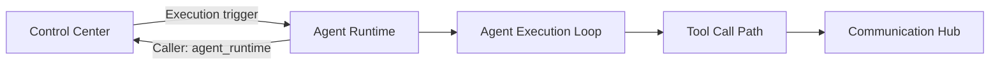
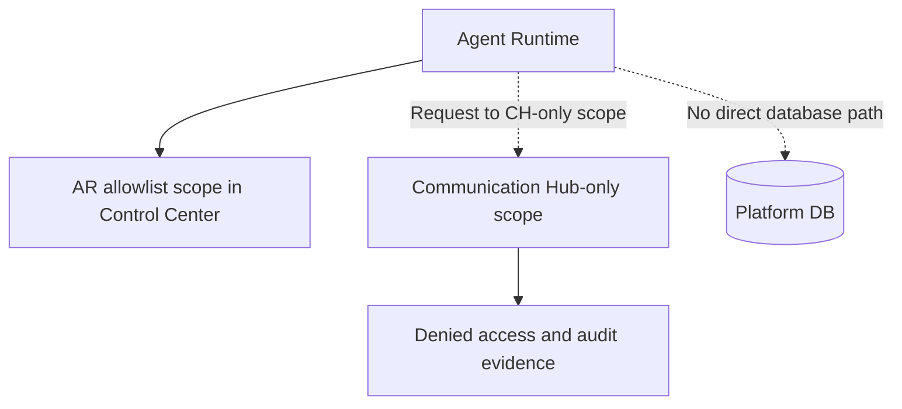

# Agent Runtime Architecture

```mermaid
flowchart LR
    CC[Control Center]
    AR[Agent Runtime]
    CH[Communication Hub]
    EXEC[Agent Execution Loop]
    TOOL[Tool Call Path]

    CC -->|Execution trigger| AR
    AR --> EXEC
    EXEC --> TOOL
    TOOL --> CH
    AR -->|Caller: agent_runtime| CC
```

```mermaid
flowchart TB
    AR2[Agent Runtime]
    ARA[AR allowlist scope in Control Center]
    CHS[Communication Hub-only scope]
    DENY[Denied access and audit evidence]
    DB[(Platform DB)]

    AR2 --> ARA
    AR2 -.->|Request to CH-only scope| CHS
    CHS --> DENY
    AR2 -.->|No direct database path| DB
```
