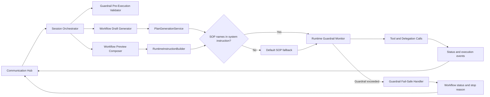
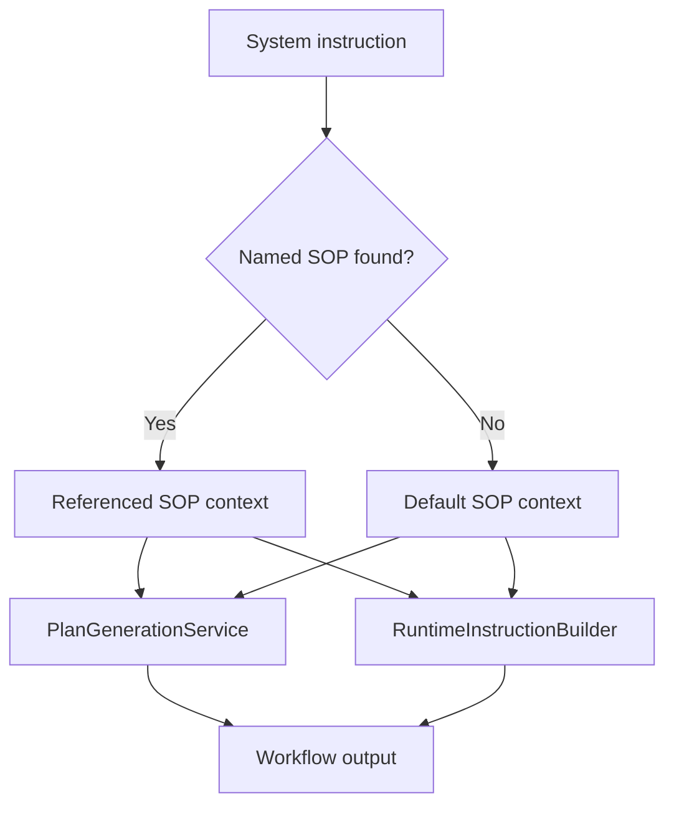

# Agent Runtime Architecture

```mermaid
flowchart LR
    CH[Communication Hub]
    ORCH[Session Orchestrator]
    PV[Guardrail Pre-Execution Validator]
    WDG[Workflow Draft Generator]
    WPC[Workflow Preview Composer]
    PGS[PlanGenerationService]
    RIB[RuntimeInstructionBuilder]
    SOP{SOP names in system instruction?}
    DSOP[Default SOP fallback]
    RM[Runtime Guardrail Monitor]
    FS[Guardrail Fail-Safe Handler]
    TC[Tool and Delegation Calls]
    EVT[Status and execution events]
    ST[Workflow status and stop reason]

    CH --> ORCH
    ORCH --> PV
    ORCH --> WDG
    ORCH --> WPC
    WDG --> PGS
    WPC --> RIB
    PGS --> SOP
    RIB --> SOP
    SOP -->|No| DSOP
    SOP -->|Yes| RM
    DSOP --> RM
    RM --> TC
    TC --> EVT
    EVT --> CH
    RM -->|Guardrail exceeded| FS
    FS --> ST
    ST --> CH
```

```mermaid
flowchart TB
    SI[System instruction]
    SN{Named SOP found?}
    NSOP[Referenced SOP context]
    DSOP[Default SOP context]
    PGS[PlanGenerationService]
    RIB[RuntimeInstructionBuilder]
    OUT[Workflow output]

    SI --> SN
    SN -->|Yes| NSOP
    SN -->|No| DSOP
    NSOP --> PGS
    DSOP --> PGS
    NSOP --> RIB
    DSOP --> RIB
    PGS --> OUT
    RIB --> OUT
```
