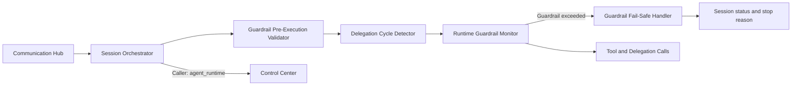
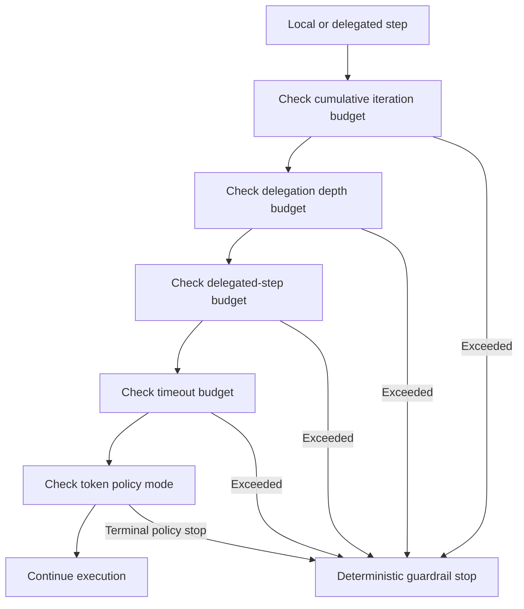

# Agent Runtime Architecture

```mermaid
flowchart LR
    CH[Communication Hub]
    ORCH[Session Orchestrator]
    PV[Guardrail Pre-Execution Validator]
    CD[Delegation Cycle Detector]
    RM[Runtime Guardrail Monitor]
    FS[Guardrail Fail-Safe Handler]
    TC[Tool and Delegation Calls]
    CC[Control Center]
    ST[Session status and stop reason]

    CH --> ORCH
    ORCH --> PV
    PV --> CD
    CD --> RM
    RM --> TC
    RM -->|Guardrail exceeded| FS
    FS --> ST
    ORCH -->|Caller: agent_runtime| CC
```

```mermaid
flowchart TB
    STEP[Local or delegated step]
    IT[Check cumulative iteration budget]
    DEP[Check delegation depth budget]
    DSB[Check delegated-step budget]
    TMO[Check timeout budget]
    TOK[Check token policy mode]
    GO[Continue execution]
    STOP[Deterministic guardrail stop]

    STEP --> IT
    IT --> DEP
    DEP --> DSB
    DSB --> TMO
    TMO --> TOK
    TOK --> GO
    IT -->|Exceeded| STOP
    DEP -->|Exceeded| STOP
    DSB -->|Exceeded| STOP
    TMO -->|Exceeded| STOP
    TOK -->|Terminal policy stop| STOP
```
