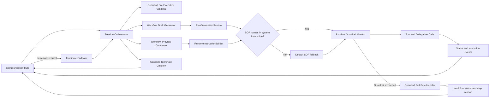
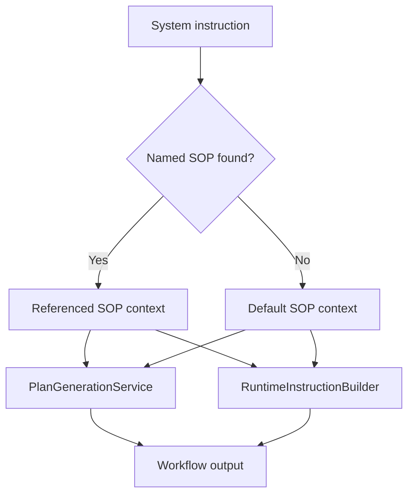

# Agent Runtime Architecture

## Termination Governance

Agent Runtime exposes a control-plane termination endpoint that allows authorized callers to cancel an in-flight agent job. The endpoint is only reachable through the Communication Hub, which authenticates the caller with a service certificate. Agent Runtime's `ControlCenterCertificateMiddleware` rejects direct calls from Control Center — this preserves service segregation. The certificate middleware accepts only `service:communication-hub` service certificates on `/internal/agent/terminate/*` paths.

When a parent agent job is terminated, Agent Runtime cancels the in-flight task and walks the delegation graph to cancel all active delegated child jobs. The `AgentJob.status` is updated to `terminated`, a distinct state from `failed` (genuine agent or runtime error). Late-arriving tool call completions or status updates from the underlying LangChain deep-agent framework are rejected by terminal-state guards in the internal session-data endpoint.

```mermaid
flowchart LR
    CH[Communication Hub]
    ORCH[Session Orchestrator]
    PV[Guardrail Pre-Execution Validator]
    WDG[Workflow Draft Generator]
    WPC[Workflow Preview Composer]
    PGS[PlanGenerationService]
    RIB[RuntimeInstructionBuilder]
    SOP{SOP names in system instruction?}
    DSOP[Default SOP fallback]
    RM[Runtime Guardrail Monitor]
    FS[Guardrail Fail-Safe Handler]
    TC[Tool and Delegation Calls]
    EVT[Status and execution events]
    ST[Workflow status and stop reason]
    TR[Terminate Endpoint]
    CB[Cascade Terminate Children]

    CH --> ORCH
    ORCH --> PV
    ORCH --> WDG
    ORCH --> WPC
    WDG --> PGS
    WPC --> RIB
    PGS --> SOP
    RIB --> SOP
    SOP -->|No| DSOP
    SOP -->|Yes| RM
    DSOP --> RM
    RM --> TC
    TC --> EVT
    EVT --> CH
    RM -->|Guardrail exceeded| FS
    FS --> ST
    ST --> CH
    CH -->|terminate request| TR
    TR --> ORCH
    ORCH --> CB
    CB --> CH
```

```mermaid
flowchart TB
    SI[System instruction]
    SN{Named SOP found?}
    NSOP[Referenced SOP context]
    DSOP[Default SOP context]
    PGS[PlanGenerationService]
    RIB[RuntimeInstructionBuilder]
    OUT[Workflow output]

    SI --> SN
    SN -->|Yes| NSOP
    SN -->|No| DSOP
    NSOP --> PGS
    DSOP --> PGS
    NSOP --> RIB
    DSOP --> RIB
    PGS --> OUT
    RIB --> OUT
```
