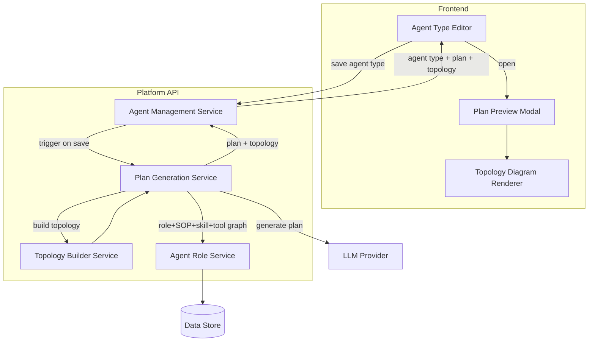

# Agent Types

## Overview

Agent Types define the configuration blueprint for an agent instance — specifying its assigned role, model, system instructions, and associated plan. On save, the Platform API triggers the Plan Generation Service synchronously: the service traverses the role → SOP → Skill → Tool graph, constructs a prompt with the agent's full context, invokes the configured LLM, and returns a structured plan alongside a topology payload. The save response includes both the persisted agent type and the generated plan, which the Agent Type Editor presents in a Plan Preview Modal.

## Component Architecture

## Extended Save Response Contract

The save response for an agent type includes two additional fields when plan generation succeeds:

| Field | Description |
|---|---|
| `plan` | Ordered array of LLM-generated step objects describing how the agent should carry out its role |
| `topology` | Node-edge graph payload representing the role → SOP → Skill → Tool hierarchy, used by the Topology Diagram Renderer |

If plan generation fails, the agent type is still persisted and the response includes an error indicator alongside the agent type record — plan generation failure is non-blocking.

## Integration Points

| Integration | Direction | Description |
|---|---|---|
| Agent Management Service → Plan Generation Service | Internal | Triggered synchronously on every agent type save |
| Plan Generation Service → Agent Role Service | Internal | Read-only graph traversal: role → SOPs → skills → tools |
| Plan Generation Service → LLM Provider | External | Prompt constructed from agent context; response parsed into structured plan steps |
| Platform API → Agent Type Editor | REST response | `plan` and `topology` fields appended to the agent-type save response |
