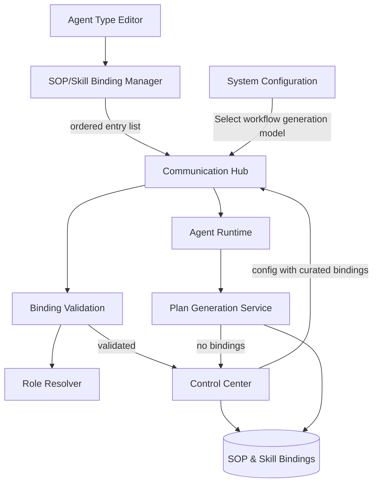
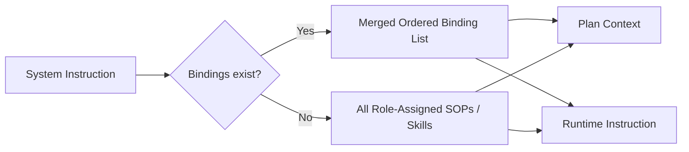
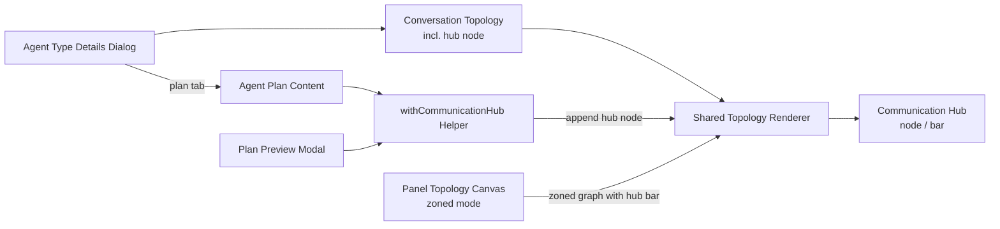

# Agent Types

```mermaid
flowchart TB
    ATE[Agent Type Editor]
    BME[SOP/Skill Binding Manager]
    CFG[System Configuration]
    AR[Agent Runtime]
    PGS[Plan Generation Service]
    BVS[Binding Validation]
    RR[Role Resolver]
    DB_Bindings[(SOP & Skill Bindings)]
    CH[Communication Hub]
    CC[Control Center]

    ATE --> BME
    BME -->|ordered entry list| CH
    CFG -->|Select workflow generation model| CH
    CH --> BVS
    BVS --> RR
    BVS -->|validated| CC
    CC --> DB_Bindings
    CC -->|config with curated bindings| CH
    CH --> AR
    AR --> PGS
    PGS --> DB_Bindings
    PGS -->|no bindings| CC
```

```mermaid
flowchart LR
    SI[System Instruction]
    B0{Bindings exist?}
    B1[Merged Ordered Binding List]
    B2[All Role-Assigned SOPs / Skills]
    P[Plan Context]
    R[Runtime Instruction]

    SI --> B0
    B0 -->|Yes| B1
    B0 -->|No| B2
    B1 --> P
    B2 --> P
    B1 --> R
    B2 --> R
```

## Agent Preview Topology

The agent preview surfaces render the agent's effective topology through the shared topology renderer. Every preview includes the **Communication Hub** as a static platform node (broker · agent gateway · MCP) connected to the agent by a dashed platform-messaging edge — for both conversational and typed/plan topologies. The [Agent Management Panel](agent-management-panel.md) renders the hub instead as a vertical bar between the Capabilities and Tools zones of its zoned graph; the hub is a diagram element only, with no runtime call to the Communication Hub service.

```mermaid
flowchart LR
    ATD[Agent Type Details Dialog]
    CTX[Conversation Topology<br/>incl. hub node]
    APC[Agent Plan Content]
    PPM[Plan Preview Modal]
    HUBF[withCommunicationHub Helper]
    RDR[Shared Topology Renderer]
    PT[Panel Topology Canvas<br/>zoned mode]
    CH[Communication Hub<br/>node / bar]

    ATD --> CTX
    ATD -->|plan tab| APC
    APC --> HUBF
    PPM --> HUBF
    CTX --> RDR
    HUBF -->|append hub node| RDR
    PT -->|zoned graph with hub bar| RDR
    RDR --> CH
```

- **Agent Type Details Dialog** — conversation topology includes the hub node; the plan tab renders through the plan content component.
- **Plan previews** — both plan surfaces append the hub node client-side at render time via the shared helper.
- **Agent Management Panel** — zoned composition of the draft, including the hub bar; see [Agent Management Panel](agent-management-panel.md).
