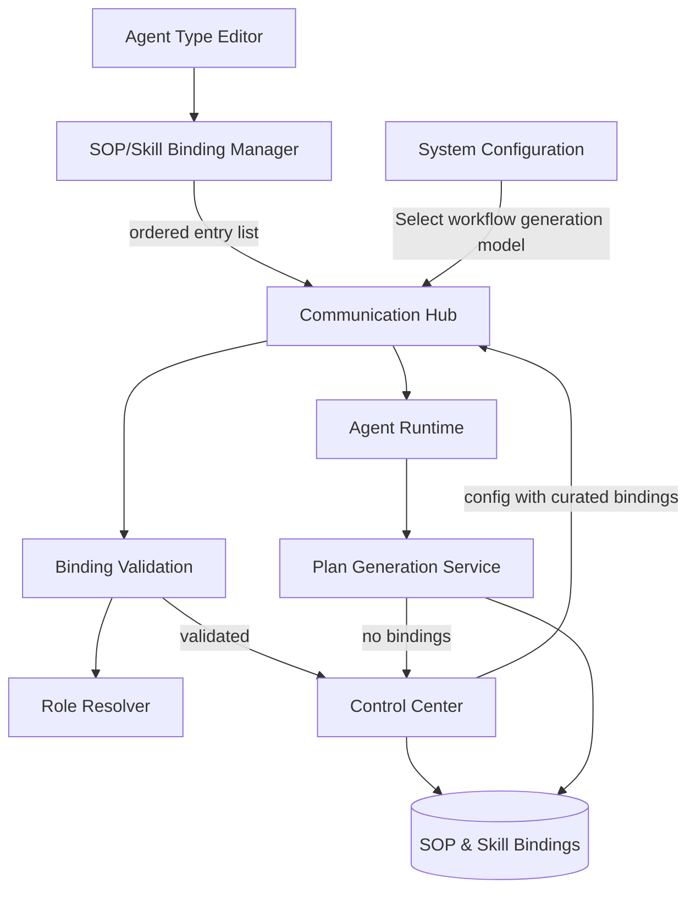
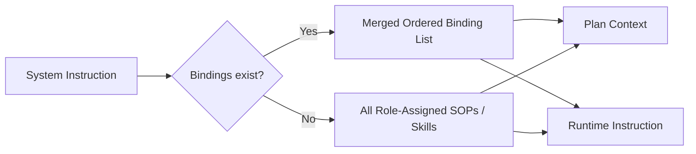

# Agent Types

```mermaid
flowchart TB
    ATE[Agent Type Editor]
    BME[SOP/Skill Binding Manager]
    CFG[System Configuration]
    AR[Agent Runtime]
    PGS[Plan Generation Service]
    BVS[Binding Validation]
    RR[Role Resolver]
    DB_Bindings[(SOP & Skill Bindings)]
    CH[Communication Hub]
    CC[Control Center]

    ATE --> BME
    BME -->|ordered entry list| CH
    CFG -->|Select workflow generation model| CH
    CH --> BVS
    BVS --> RR
    BVS -->|validated| CC
    CC --> DB_Bindings
    CC -->|config with curated bindings| CH
    CH --> AR
    AR --> PGS
    PGS --> DB_Bindings
    PGS -->|no bindings| CC
```

```mermaid
flowchart LR
    SI[System Instruction]
    B0{Bindings exist?}
    B1[Merged Ordered Binding List]
    B2[All Role-Assigned SOPs / Skills]
    P[Plan Context]
    R[Runtime Instruction]

    SI --> B0
    B0 -->|Yes| B1
    B0 -->|No| B2
    B1 --> P
    B2 --> P
    B1 --> R
    B2 --> R
```
