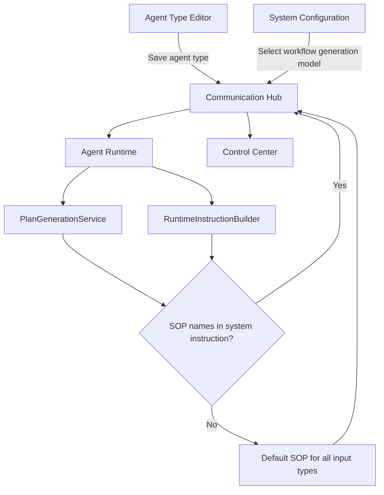
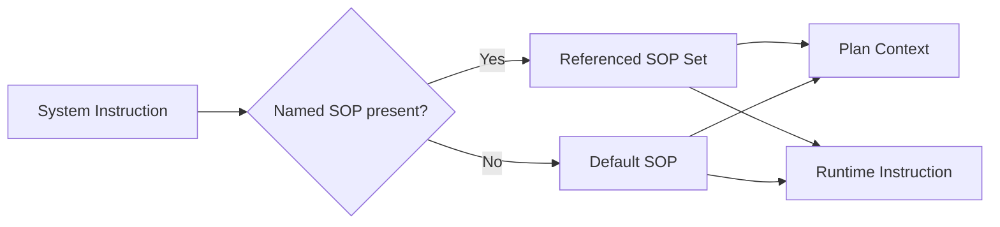

# Agent Types

```mermaid
flowchart TB
    ATE[Agent Type Editor]
    CFG[System Configuration]
    AR[Agent Runtime]
    PGS[PlanGenerationService]
    RIB[RuntimeInstructionBuilder]
    SOP{SOP names in system instruction?}
    DSOP[Default SOP for all input types]
    CH[Communication Hub]
    CC[Control Center]

    ATE -->|Save agent type| CH
    CFG -->|Select workflow generation model| CH
    CH --> AR
    AR --> PGS
    AR --> RIB
    PGS --> SOP
    RIB --> SOP
    SOP -->|No| DSOP
    SOP -->|Yes| CH
    DSOP --> CH
    CH --> CC
```

```mermaid
flowchart LR
    SI[System Instruction]
    S0{Named SOP present?}
    S1[Referenced SOP Set]
    S2[Default SOP]
    P[Plan Context]
    R[Runtime Instruction]

    SI --> S0
    S0 -->|Yes| S1
    S0 -->|No| S2
    S1 --> P
    S2 --> P
    S1 --> R
    S2 --> R
```
