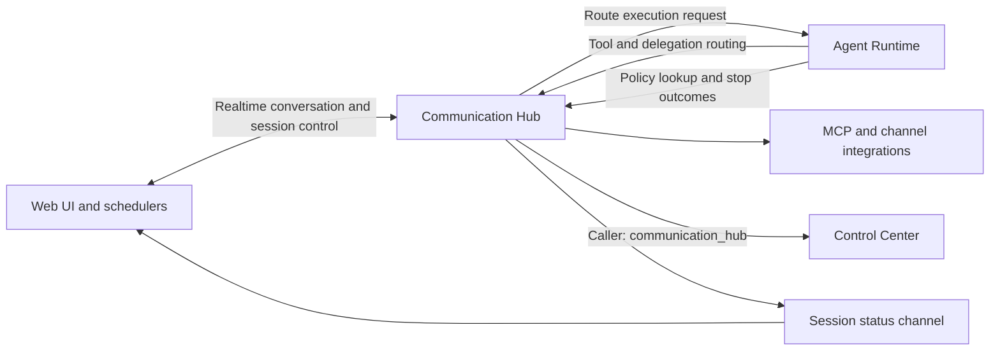
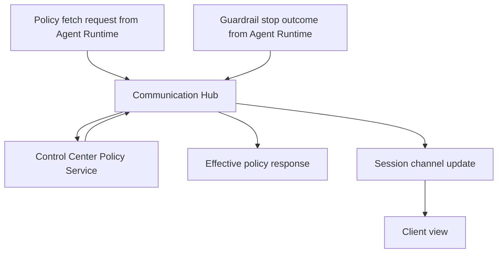

# Communication Hub Architecture

```mermaid
flowchart LR
    UI[Web UI and schedulers]
    CH[Communication Hub]
    AR[Agent Runtime]
    CC[Control Center]
    MCP[MCP and channel integrations]
    STAT[Session status channel]

    UI <-->|Realtime conversation and session control| CH
    CH -->|Route execution request| AR
    AR -->|Tool and delegation routing| CH
    CH --> MCP
    AR -->|Policy lookup and stop outcomes| CH
    CH -->|Caller: communication_hub| CC
    CH --> STAT
    STAT --> UI
```

```mermaid
flowchart TB
    P0[Policy fetch request from Agent Runtime]
    CH[Communication Hub]
    CC[Control Center Policy Service]
    P1[Effective policy response]
    S0[Guardrail stop outcome from Agent Runtime]
    S1[Session channel update]
    UI[Client view]

    P0 --> CH
    CH --> CC
    CC --> CH
    CH --> P1
    S0 --> CH
    CH --> S1
    S1 --> UI
```
