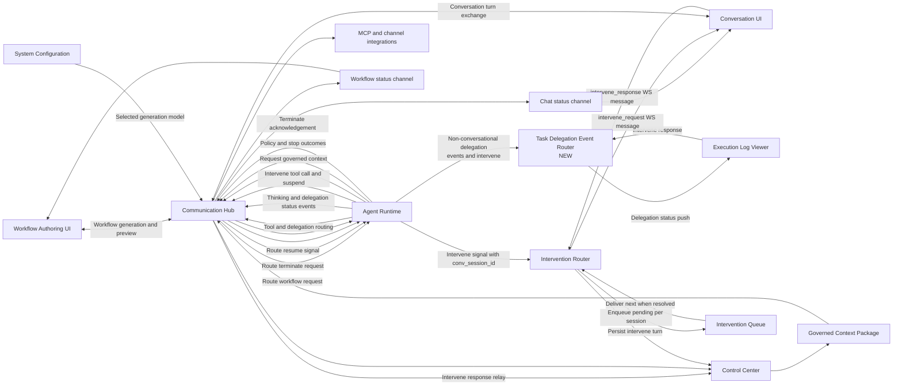
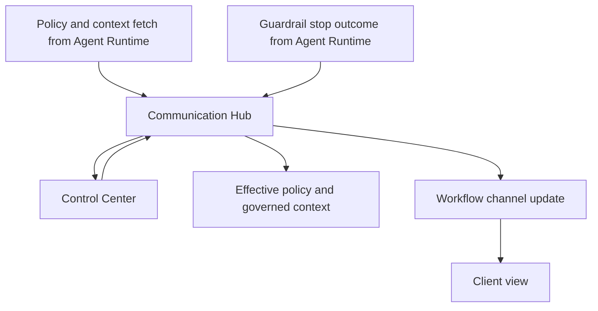

# Communication Hub Architecture

## Responsibilities

- **Message Broker**: Routes agent execution, tool calls, and delegation requests between Web UI, Agent Runtime, and Control Center. Detects intervention requests originating from delegated sub-agents within a conversation session and routes them to the parent conversation's UI via the Intervention Router.
- **Conversation Session Manager**: Manages conversation WebSocket connections, session state transitions, and intervention-pending flags that block new user messages until outstanding interventions are resolved.
- **Intervention Router**: Inspects `human_intervene` suspend signals for a `conversation_session_id`. When present, routes the intervention request to the connected WebSocket client of the parent conversation. When absent, falls through to the existing dashboard-based intervention flow.
- **Intervention Queue**: Per-conversation-session FIFO queue for intervention requests. When multiple delegated sub-agents request intervention concurrently, requests are delivered sequentially.
- **Task Delegation Event Router**: In-memory router that manages delivery of non-conversational delegation status events and intervention requests to execution log viewer clients. Maintains a mapping of active log viewer connections to parent task agent sessions. Pushes delegation status events (`delegation_started`, `delegation_waiting`, `delegation_resumed`, `delegation_depth_blocked`, `delegation_timeout`, `delegation_failed`) and intervention requests to the correct log viewer. Falls back to poll-based delivery when no live viewer is connected.
- **System Tool Router**: The `endpoint_map` dict in `_route_to_system_tool()` maps bare tool names to Control Center system-tool endpoint URLs. Routing entries include `save_data`, `get_data`, `get_output`, and `query_result` — each pointing to the corresponding `POST /api/v1/internal/system-tools/<tool>` URL on Control Center. No new structural components are needed; existing permission-check and certificate-forwarding infrastructure handles these tool calls automatically.

## WebSocket Message Types

### Intervention messages (new)
- `intervene_request` (server → client): Intervention prompt with type, reason, options, delegation context
- `intervene_response` (client → server): User's response with request_id and response value
- `intervene_cancel` (client → server): User's dismissal with request_id
- `intervene_status` (server → client): Lifecycle updates with request_id and status

### Chat message changes
- `chat` messages from client are rejected when session has pending intervention
