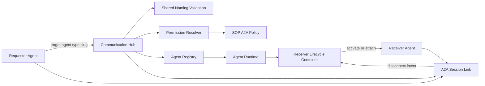
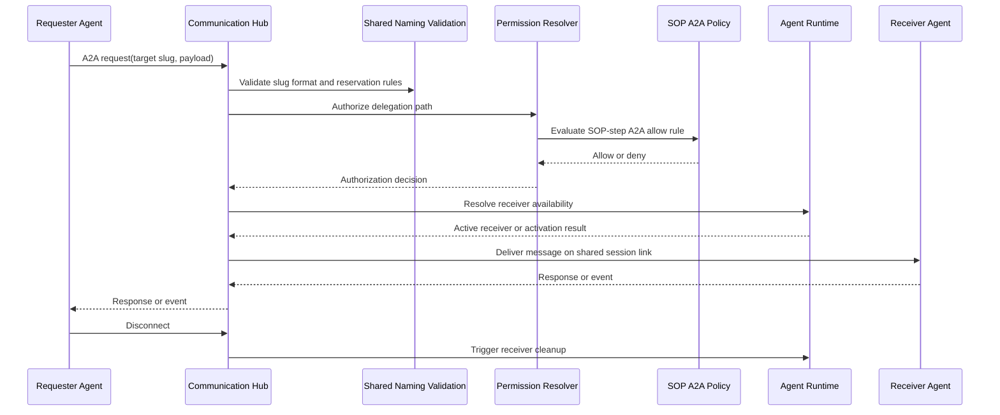

# Communication Hub

## Service Segregation Contract

Communication Hub uses service certificate-authenticated internal calls to Control Center and is restricted to its caller-specific allowlist.

Allowed Control Center internal groups:
- Certificate validation and tool-call authorization
- Session/conversation/A2A data endpoints
- System-tools endpoints (`save-result`, `send-notification`, `get-recipient-group`)
- MCP proxy endpoint

Denied by policy:
- Agent Runtime-only Control Center endpoints (for example `POST /api/v1/internal/data/sessions/claim-queued`)
- Any unknown or non-allowlisted internal endpoint

Communication Hub does not access the database directly; all persistence flows route through Control Center.

