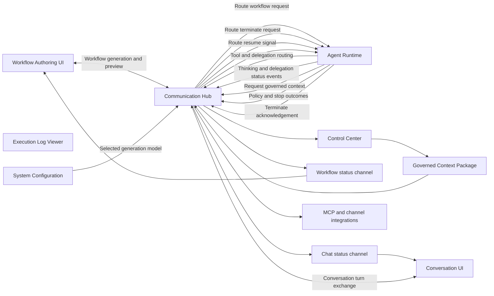
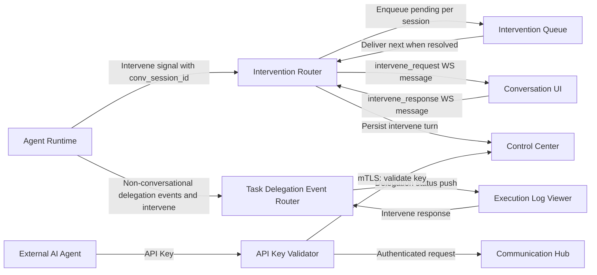
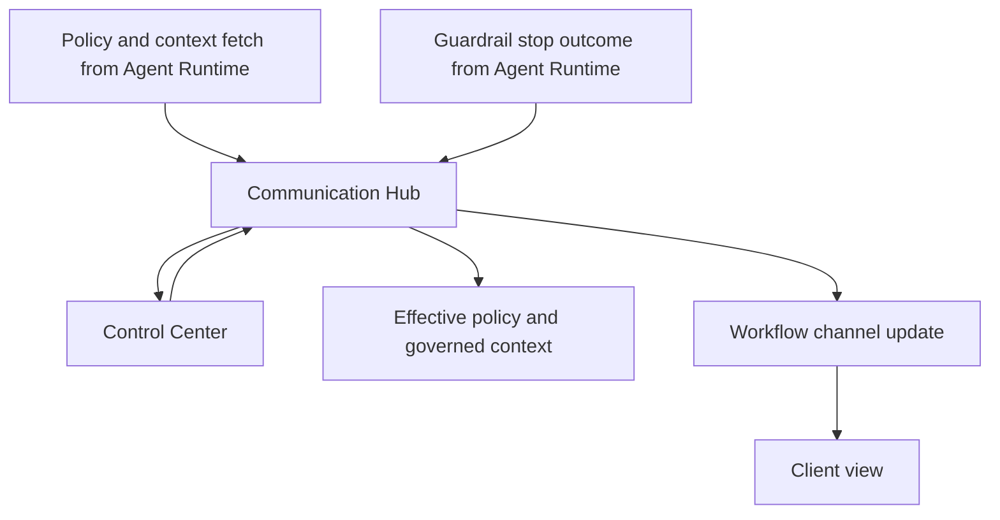
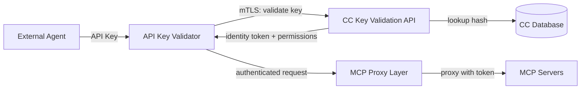

# Communication Hub Architecture

## Message Routing and UI Connections

## Intervention Routing and External Agents

## Dual Authentication Paths

Communication Hub accepts agents through two parallel authentication paths, converging at the same MCP proxy layer:

| Auth Path | Credential | Agent Type | Token Handling |
|-----------|-----------|------------|----------------|
| **mTLS Certificate** | X.509 client cert issued by CC CA | Internal Agent Runtime | AR receives decrypted identity token |
| **API Key** | Bearer token or query parameter | External third-party agents | CH holds identity token internally; never exposed |

External agents do not receive identity tokens. The API Key Validator calls Control Center's internal validation endpoint over mTLS, receives a resolved identity token, and holds it internally. CH injects the token only when proxying MCP tool requests to downstream servers.

## Responsibilities

- **Message Broker**: Routes agent execution, tool calls, and delegation requests between Web UI, Agent Runtime, and Control Center. Detects intervention requests originating from delegated sub-agents within a conversation session and routes them to the parent conversation's UI via the Intervention Router.
- **Conversation Session Manager**: Manages conversation WebSocket connections, session state transitions, and intervention-pending flags that block new user messages until outstanding interventions are resolved.
- **API Key Validator**: New middleware that intercepts requests bearing an API key (via `Authorization: Bearer` header or `?apiKey=` query parameter). Calls Control Center's internal validation endpoint over mTLS, receives the resolved identity/role/permission set, and caches the outcome for the request lifetime. External agents never receive the identity token — CH holds it exclusively for MCP request proxying.
- **Intervention Router**: Inspects `human_intervene` suspend signals for a `conversation_session_id`. When present, routes the intervention request to the connected WebSocket client of the parent conversation. When absent, falls through to the existing dashboard-based intervention flow.
- **Intervention Queue**: Per-conversation-session FIFO queue for intervention requests. When multiple delegated sub-agents request intervention concurrently, requests are delivered sequentially.
- **Task Delegation Event Router**: In-memory router that manages delivery of non-conversational delegation status events and intervention requests to execution log viewer clients. Maintains a mapping of active log viewer connections to parent task agent sessions. Pushes delegation status events (`delegation_started`, `delegation_waiting`, `delegation_resumed`, `delegation_depth_blocked`, `delegation_timeout`, `delegation_failed`) and intervention requests to the correct log viewer. Falls back to poll-based delivery when no live viewer is connected.
- **System Tool Router**: Maps bare tool names (`save_data`, `get_data`, `get_output`, `query_result`, `load_skills`) to Control Center internal system-tool endpoints. No new structural components are needed; existing permission-check and certificate-forwarding infrastructure handles these tool calls automatically.

## WebSocket Messages

The Communication Hub supports structured WebSocket messages for intervention and chat flows. Intervention messages include request delivery, response submission, cancellation, and status updates between server and client. Chat messages from clients are rejected when the session has a pending intervention, ensuring orderly resolution of HITL requests.
