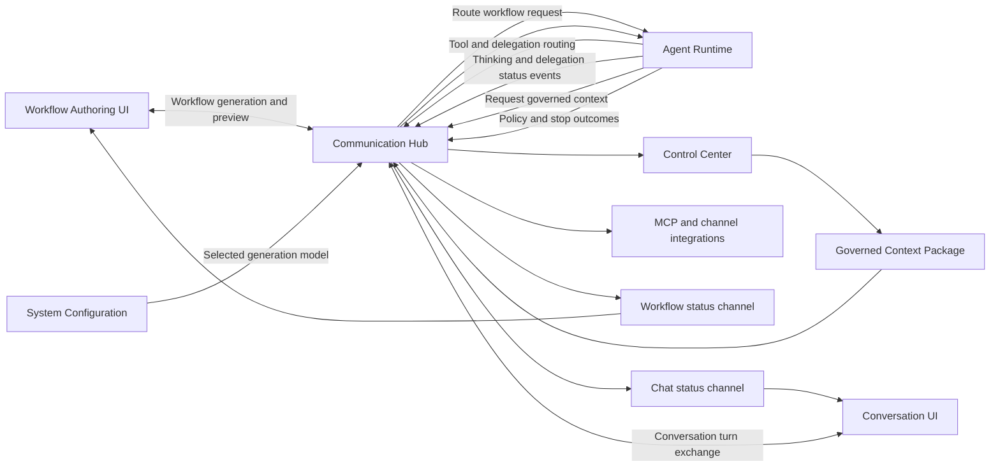
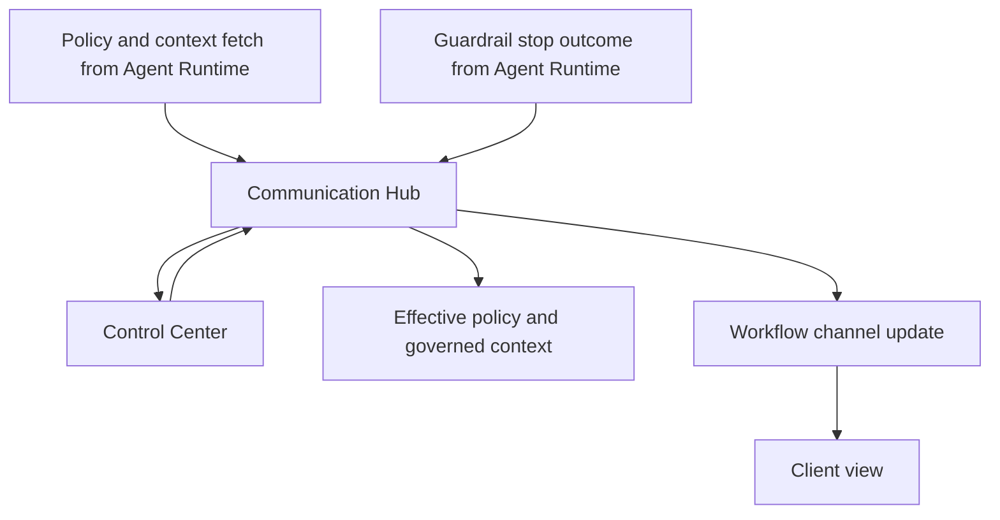

# Communication Hub Architecture

```mermaid
flowchart LR
    UI[Workflow Authoring UI]
    CHAT[Conversation UI]
    CFG[System Configuration]
    CH[Communication Hub]
    AR[Agent Runtime]
    CC[Control Center]
    MCP[MCP and channel integrations]
    STAT[Workflow status channel]
    CSTAT[Chat status channel]
    CTX[Governed Context Package]

    UI <-->|Workflow generation and preview| CH
    CHAT <-->|Conversation turn exchange| CH
    CFG -->|Selected generation model| CH
    CH -->|Route workflow request| AR
    AR -->|Tool and delegation routing| CH
    AR -->|Thinking and delegation status events| CH
    AR -->|Request governed context| CH
    CH --> CC
    CC --> CTX
    CTX --> CH
    CH --> AR
    CH --> MCP
    AR -->|Policy and stop outcomes| CH
    CH --> STAT
    CH --> CSTAT
    STAT --> UI
    CSTAT --> CHAT
```

```mermaid
flowchart TB
    P0[Policy and context fetch from Agent Runtime]
    CH[Communication Hub]
    CC[Control Center]
    P1[Effective policy and governed context]
    S0[Guardrail stop outcome from Agent Runtime]
    S1[Workflow channel update]
    UI[Client view]

    P0 --> CH
    CH --> CC
    CC --> CH
    CH --> P1
    S0 --> CH
    CH --> S1
    S1 --> UI
```
