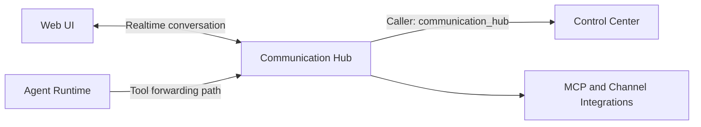
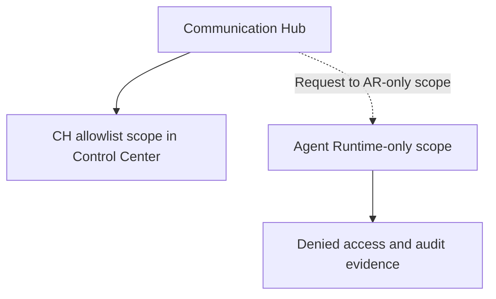

# Communication Hub Architecture

```mermaid
flowchart LR
    UI[Web UI]
    CH[Communication Hub]
    CC[Control Center]
    AR[Agent Runtime]
    MCP[MCP and Channel Integrations]

    UI <-->|Realtime conversation| CH
    CH -->|Caller: communication_hub| CC
    AR -->|Tool forwarding path| CH
    CH --> MCP
```

```mermaid
flowchart TB
    CH2[Communication Hub]
    CHA[CH allowlist scope in Control Center]
    ARS[Agent Runtime-only scope]
    DENY[Denied access and audit evidence]

    CH2 --> CHA
    CH2 -.->|Request to AR-only scope| ARS
    ARS --> DENY
```
