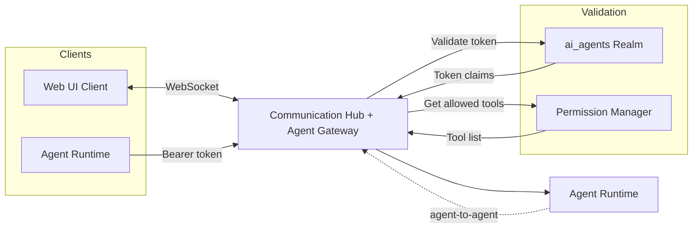

# Communication Hub

## Overview

The Communication Hub is the platform's central message broker and **Agent Gateway**. It handles three distinct messaging flows: **Web UI ↔ Agent** conversations over WebSocket, **Agent ↔ Agent** internal routing for multi-agent collaboration, and **inbound agent execution requests** from the Agent Runtime. Every inbound agent connection is authenticated against the `ai_agents` realm before any tools are exposed.

## Broker Topology

## Messaging Flows

### Web UI ↔ Agent

Users connect to the Communication Hub via WebSocket. When a user sends a message in a conversation, the hub routes it to the Agent Runtime, which orchestrates model inference and skill execution. Agent responses flow back through the hub to the connected client. For conversational agent types, the hub maintains bidirectional communication — the agent may ask clarifying questions mid-turn, which are surfaced to the user and answered before the turn resumes.

### Agent ↔ Agent

When an agent needs to collaborate with another agent — for example, delegating a sub-task or requesting information — the message is routed internally through the Communication Hub. This keeps inter-agent messaging on the same broker as user-facing conversations, enabling the platform to maintain a unified conversation history and apply consistent delivery guarantees.

### Inbound Agent Execution (Agent Gateway)

The Communication Hub accepts inbound agent execution requests and enforces OAuth authentication before exposing any tools. The enforcement sequence is:

1. Agent connects with an identity token in the `Authorization` header.
2. Hub validates the token with the `ai_agents` realm.
3. Hub extracts the identity subject and role claim from the validated token.
4. Hub validates the identity is explicitly assigned to the claimed role (queries `agent_role_identities`).
5. Hub resolves the allowed tool set for the role via the Agent Permission Manager.
6. Hub registers a dynamic MCP server exposing only the allowed tools — with no descriptions or schemas — so agents rely entirely on skill instructions.
7. Any tool call outside the allowed set is rejected.

## Responsibilities

- **Connection management** — Maintains WebSocket connections for all active Web UI sessions
- **Message routing** — Dispatches inbound messages to the correct agent instance and returns responses to the originating client
- **Inter-agent routing** — Brokers messages between agent instances for multi-agent collaboration
- **Conversation context** — Ensures messages are associated with the correct conversation and delivered in order
- **OAuth enforcement** — Validates every inbound agent connection against the `ai_agents` realm; rejects unauthenticated or unauthorized connections before exposing any tools
- **Dynamic tool exposure** — Exposes only the role-permitted tool set (resolved by the Agent Permission Manager) per connected agent; tool descriptions and schemas are intentionally omitted
