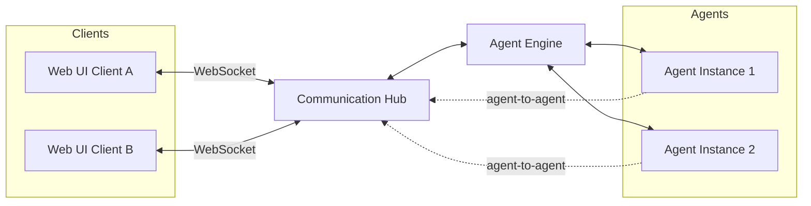

# Communication Hub

## Overview

The Communication Hub is the platform's central message broker. It handles two distinct messaging flows: **Web UI ↔ Agent** conversations over WebSocket, and **Agent ↔ Agent** internal routing for multi-agent collaboration. All real-time messaging passes through this single component, providing a unified point for message delivery, presence, and conversation management.

## Broker Topology

## Messaging Flows

### Web UI ↔ Agent

Users connect to the Communication Hub via WebSocket. When a user sends a message in a conversation, the hub routes it to the Agent Engine, which dispatches it to the appropriate agent instance. Agent responses flow back through the hub to the connected client. The hub maintains connection state and ensures messages are delivered to the correct conversation session.

### Agent ↔ Agent

When an agent needs to collaborate with another agent — for example, delegating a sub-task or requesting information — the message is routed internally through the Communication Hub. This keeps inter-agent messaging on the same broker as user-facing conversations, enabling the platform to maintain a unified conversation history and apply consistent delivery guarantees.

## Responsibilities

- **Connection management** — Maintains WebSocket connections for all active Web UI sessions
- **Message routing** — Dispatches inbound messages to the correct agent instance and returns responses to the originating client
- **Inter-agent routing** — Brokers messages between agent instances for multi-agent collaboration
- **Conversation context** — Ensures messages are associated with the correct conversation and delivered in order
