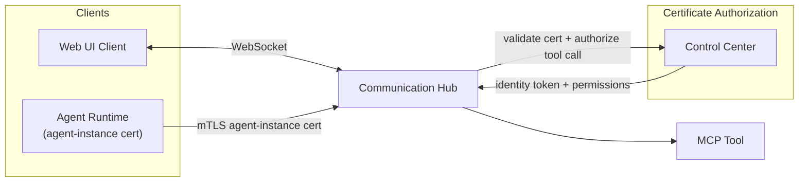

# Communication Hub

## Overview

The Communication Hub is the platform's central message broker and **Agent Gateway**. It handles three distinct messaging flows: **Web UI ↔ Agent** conversations over WebSocket, **Agent ↔ Agent** internal routing for multi-agent collaboration, and **inbound agent execution requests** from the Agent Runtime. Every inbound agent connection is authenticated using X.509 agent-instance certificates (mutual TLS). For each tool call, the hub validates the certificate and requests fresh identity tokens and permissions from the Control Center — identity tokens are used within the hub and never forwarded to the Agent Runtime.

## Broker Topology

```mermaid
flowchart LR
    subgraph Clients
        UI[Web UI Client]
        AR["Agent Runtime<br/>(agent-instance cert)"]
    end

    CH[Communication Hub]

    subgraph CertAuth[Certificate Authorization]
        CC[Control Center]
    end

    Tool[MCP Tool]

    UI <-->|WebSocket| CH
    AR -->|mTLS agent-instance cert| CH
    CH -->|validate cert + authorize tool call| CC
    CC -->|identity token + permissions| CH
    CH --> Tool
```

## Messaging Flows

### Web UI ↔ Agent

Users connect to the Communication Hub via WebSocket. When a user sends a message in a conversation, the hub routes it to the Agent Runtime, which orchestrates model inference and skill execution. Agent responses flow back through the hub to the connected client. For conversational agent types, the hub maintains bidirectional communication — the agent may ask clarifying questions mid-turn, which are surfaced to the user and answered before the turn resumes.

### Agent ↔ Agent

When an agent needs to collaborate with another agent — for example, delegating a sub-task or requesting information — the message is routed internally through the Communication Hub. This keeps inter-agent messaging on the same broker as user-facing conversations, enabling the platform to maintain a unified conversation history and apply consistent delivery guarantees.

### Inbound Agent Execution (Agent Gateway)

The Communication Hub accepts inbound agent execution requests and enforces certificate-based authentication before exposing any tools. The enforcement sequence is:

1. Agent Runtime connects presenting an X.509 agent-instance certificate via mutual TLS.
2. Hub calls the Control Center (`/internal/certificates/validate`) using its own service certificate to validate the agent's certificate.
3. Control Center returns the certificate type, agent type ID, and instance ID.
4. Hub calls the Control Center (`/internal/authorize/tool-call`) with the agent's certificate serial number and requested tool name.
5. Control Center resolves the agent's permissions, refreshes the identity token if needed, and returns the token and allowed tool set.
6. Hub executes the tool with the Control Center-provided identity token; the token is never forwarded to the Agent Runtime.
7. Any tool call outside the allowed set is rejected (403 Forbidden).

## Responsibilities

- **Connection management** — Maintains WebSocket connections for all active Web UI sessions
- **Message routing** — Dispatches inbound messages to the correct agent instance and returns responses to the originating client
- **Inter-agent routing** — Brokers messages between agent instances for multi-agent collaboration
- **Conversation context** — Ensures messages are associated with the correct conversation and delivered in order
- **Conversation session persistence** — Accepts `session_id` on WebSocket connect to associate messages with persistent conversation sessions; triggers Session Auto-Namer after the first user message lands
- **Certificate enforcement** — Validates agent-instance X.509 certificates on every inbound tool call via mutual TLS; rejects connections without a valid certificate
- **Control Center integration** — Calls Control Center on every tool call to validate the agent certificate and obtain fresh identity tokens and permissions (service certificate required)
- **Identity token isolation** — Executes tools with Control Center-provided identity tokens; tokens are never forwarded to Agent Runtime instances

## Conversation Session Persistence

For conversation-type agents, the Communication Hub supports persistent, user-named sessions with automatic title generation and lifecycle management.

### Session Association

When a Web UI client opens a WebSocket connection for a conversation agent, it includes a `session_id` parameter. The hub associates all subsequent messages with this session record, ensuring:

- Full conversation history is preserved across reconnects
- Turn ordering is maintained
- Session metadata (title, status, last active time) is updated after each message

### Session Auto-Naming

After the first user message is received and stored, the Communication Hub triggers the **Session Auto-Namer** as a background task:

1. Session Auto-Namer constructs a title-generation prompt from the user's opening message
2. Calls the agent type's configured LLM via the Model Config Service
3. Writes the generated title back to the session record
4. Pushes a `title_update` WebSocket message to the active client

This happens asynchronously — the user's message is processed and the agent response is delivered without waiting for title generation. If the LLM call fails, the auto-namer falls back to a truncated version of the first user message.

### Session Lifecycle Management

Session lifecycle operations (create, resume, end, archive) are handled by the **Conversation Session Manager**, which validates session ownership and enforces state transitions:

- **Create**: Authenticated user creates a new session for a conversation-type agent; session starts with `status: active` and `title: null`
- **Resume**: User requests full session history; manager validates ownership and returns all turns with tool call records
- **End**: User explicitly ends the session; status transitions to `closed` and session no longer accepts new messages
- **Archive**: User archives a session; status transitions to `archived` and session is excluded from the active sessions list

All session management endpoints enforce user-scoping — users can only access their own sessions.
