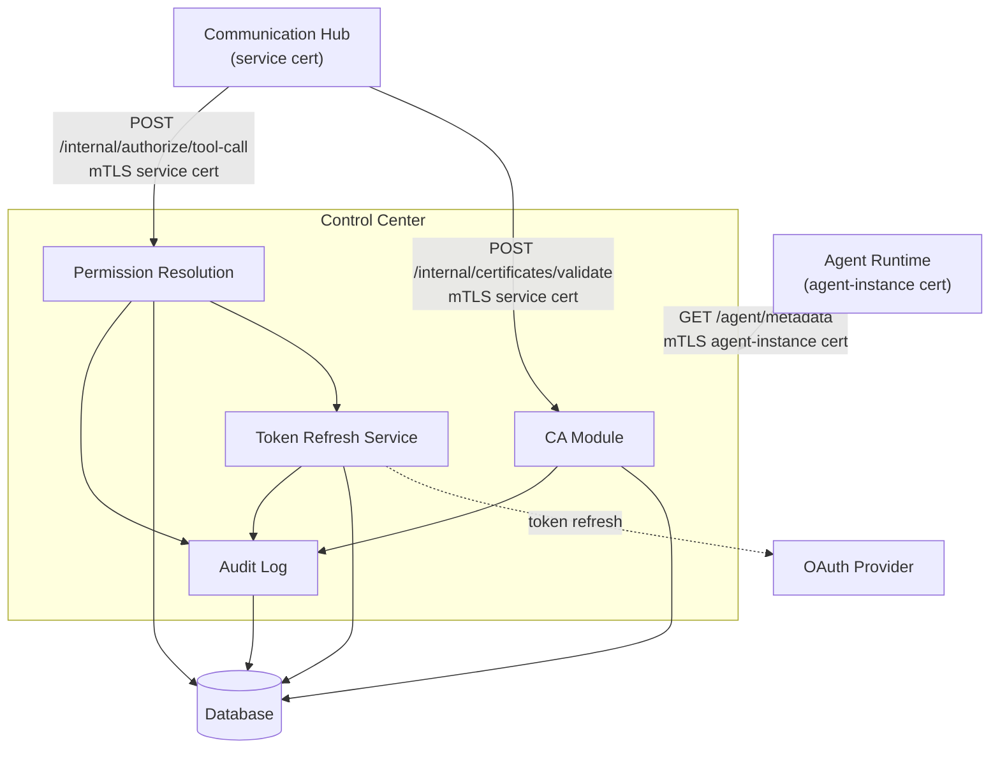

# Control Center

## Overview

The Control Center is the platform's Certificate Authority (CA) and identity authority. It issues and validates X.509 certificates for agent instances and services, stores all identity tokens encrypted at rest, automatically refreshes tokens via the OAuth provider, and authorizes every tool call by resolving agent certificates to current permissions. Identity tokens are accessible only to services presenting a valid service certificate — agent instances are cryptographically blocked from retrieving them.

## Component Architecture

## Sub-Components

### CA Module

Issues, signs, validates, and revokes X.509 certificates. Generates the root CA on first startup. Enforces two certificate types with distinct access controls:

| Certificate Type | CN Format | Validity | Allowed Endpoints |
|---|---|---|---|
| **Agent-instance** | `agent-instance:{agent_type_id}:{instance_id}` | 24 hours | `/agent/metadata`, Communication Hub tool endpoints |
| **Service** | `service:{service_name}` | 30 days | `/internal/certificates/validate`, `/internal/authorize/tool-call` |

Agent-instance certificates attempting to call `/internal/*` endpoints receive `403 Forbidden`.

### Token Refresh Service

Checks token expiration before returning identity for any permission request. Uses the stored refresh token to obtain a new access token from the OAuth provider when expired. Retries with exponential backoff (3 attempts: 1 s, 5 s, 15 s). Logs every refresh attempt.

### Permission Resolution

Maps agent certificates to current permissions and identity tokens. Accepts requests only from services presenting a valid service certificate. Extracts agent type and instance ID from the agent-instance certificate serial, resolves the agent type's assigned roles and SOPs, and returns the current identity token (refreshing it if needed) alongside the complete allowed tool set.

### Audit Log

Records all certificate validations, token refreshes, and permission checks with outcome, certificate serial, CN (including type), and requesting service. Enables detection of unauthorized access attempts and anomalous usage patterns.

## APIs

| API | Auth Required | Description |
|---|---|---|
| `GET /certificates/ca` | None | Return CA public certificate for distribution |
| `POST /certificates/issue` | Admin | Issue agent-instance or service certificate |
| `POST /certificates/revoke` | Admin | Add certificate to revocation list |
| `GET /agent/metadata` | Agent-instance cert | Return non-sensitive metadata (SOPs, skills, instructions, model configs) — no identity tokens |
| `POST /internal/certificates/validate` | **Service cert** | Validate an agent-instance certificate; return type and identity |
| `POST /internal/authorize/tool-call` | **Service cert** | Resolve permissions and return identity token for a tool call |
