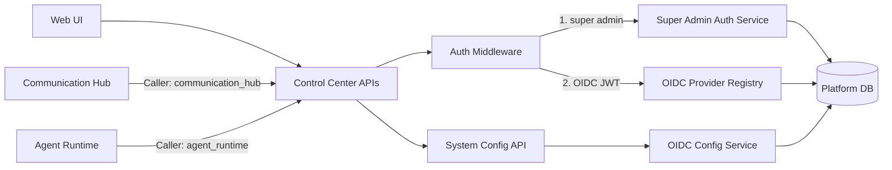
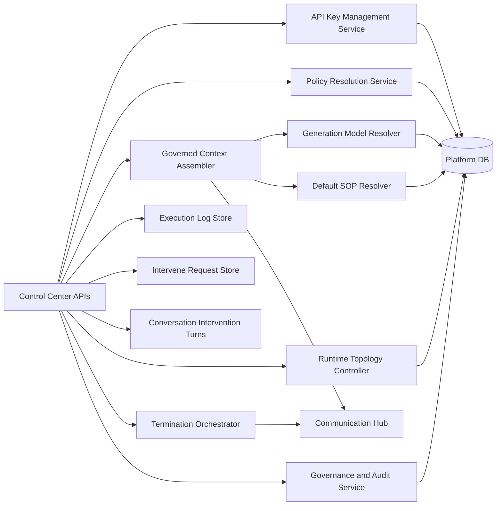
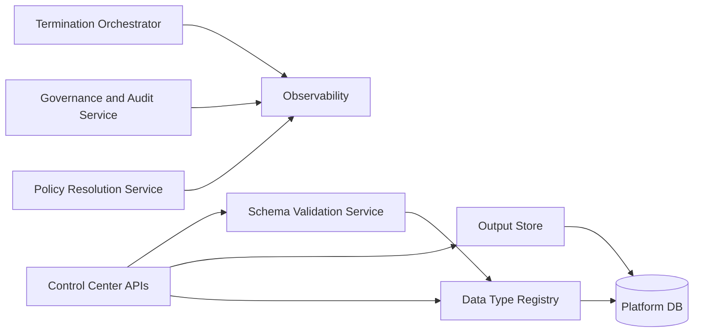
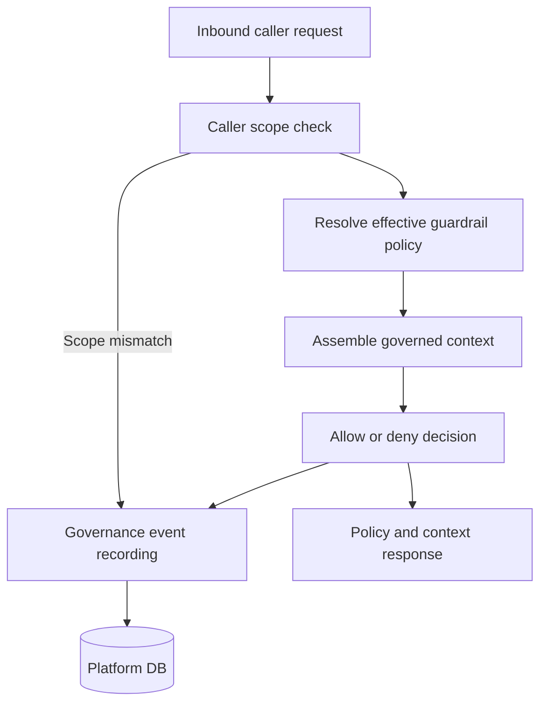
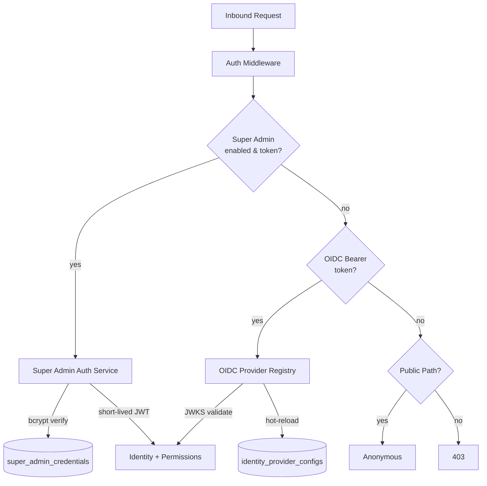
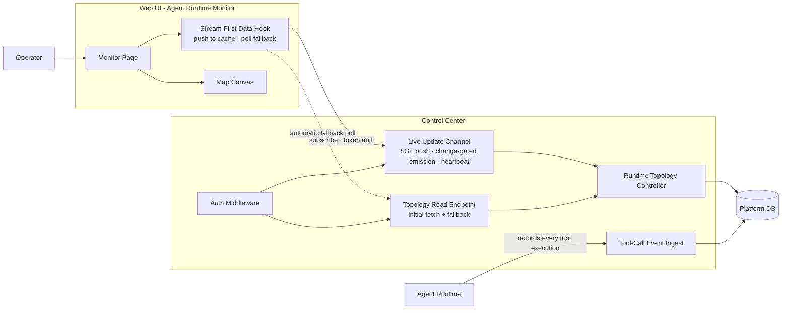
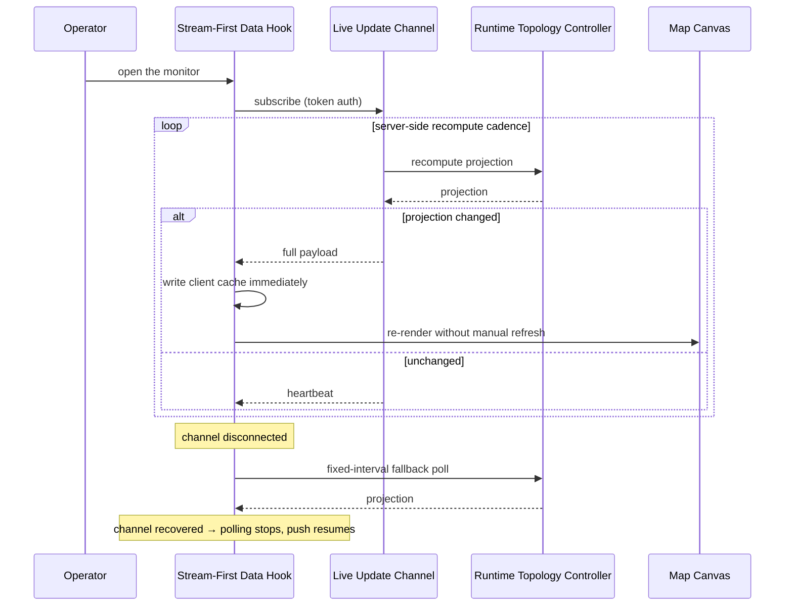
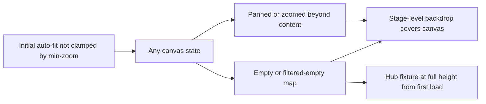

# Control Center Architecture

## API Layer and Authentication

## Core Platform Services

## Data Management and Observability

## Auth Middleware & OIDC Provider Registry

Control Center authentication is a three-tier pipeline shared across all inbound API calls:

### Super Admin Auth Service

- Stores bcrypt-hashed credentials in the `super_admin_credentials` table
- Issues short-lived internal JWTs (default 15-minute expiry, configurable)
- Seeded on first launch from environment variables (`SUPER_ADMIN_ENABLED`, `SUPER_ADMIN_USERNAME`, `SUPER_ADMIN_PASSWORD_HASH`)
- Enable/disable toggle: when disabled, all super admin login attempts are refused regardless of credentials
- Bypasses OIDC entirely — no external IdP dependency for super admin access

### OIDC Provider Registry

- In-memory cache of active provider configurations loaded from `identity_provider_configs` at startup
- Hot-reload: invalidated and refreshed when OIDC Config Service updates a provider, no restart required
- Caches JWKS keys per provider with TTL-based refresh
- Resolves provider type (`user` vs `agent`) from token claims or request context
- Supports concurrent multi-provider operation — separate issuers for users and agents

## OIDC Config Service

- Full CRUD for identity provider configurations in the `identity_provider_configs` table
- Validates OIDC Discovery endpoints (issuer reachability, `.well-known/openid-configuration` fetch)
- Encrypts client secrets at rest
- Supports provider type enumeration: `user` and `agent`
- Each provider entry: issuer URL, client ID, encrypted client secret, scopes, claims mapping
- Replaces the legacy static `config/identity.yaml` approach; DB is the source of truth

## System Config API — Identity Provider Endpoints

JWT-protected endpoints for managing identity provider configurations, super admin settings, and OIDC connectivity testing. All provider configuration is stored in the database and loaded at startup by the OIDC Provider Registry. Client secrets are encrypted at rest via AES-256-GCM.

## API Key Management Service

A new set of CC API endpoints and service logic for CRUD operations on API keys. Platform administrators provision API keys for external agent identities through JWT-protected REST endpoints.

- **Create**: Admin selects an existing agent identity and agent role; CC generates a cryptographically random key, stores its SHA-256 hash, and returns the clear-text key once
- **List**: Returns all keys with bound identity, role, status, creation date, and last-used date
- **Revoke**: Sets key status to `revoked`; immediately invalidates it for future authentication
- **Internal Validation**: mTLS-protected endpoint called exclusively by Communication Hub. CH sends the hashed key value; CC looks up the hash, checks status, resolves the bound identity/role/permission set, and returns the identity token. External agents never receive this token — CH holds it internally for MCP proxying.

### API Key Store (`agent_api_keys` table)

New table in the Platform DB storing SHA-256 hashed key values with metadata including identity binding, role assignment, status, and timestamp tracking. Managed through CC's standard model and Alembic migration toolchain.

### Permission Resolution Chain (API Key Path)

API keys reuse the existing permission engine without modification. The resolution chain is:

`API Key → bound agent identity → bound agent role → policy evaluation → allowed tools/skills/SOPs`

This is the same model used by internal agents — the API key provides an alternative entry point into the identity → role → permission resolution chain.

## Conversation Intervention Persistence

- **Conversation Intervention Turns**: Extension of `ConversationTurn` persistence to support `intervene_request` and `intervene_response` turn types. Stores intervention type (approval/choice/text), prompt text, available options, operator identity, response value, and timestamp. Turns are persisted in chronological order within the conversation stream for audit traceability.
- **Intervene Request Store**: Extended to accept and persist conversation context fields (`conversation_session_id`, `delegation_depth`) on `InterveneRequest`. Automatically creates paired `intervene_response` conversation turns when responses are submitted to conversation-scoped requests. Non-conversational flow (no `conversation_session_id`) is unchanged.

## Task Delegation Event Persistence

- **Execution Log Store**: Accepts new delegation-related execution log event types: `delegation_started`, `delegation_waiting`, `delegation_resumed`, `delegation_depth_blocked`, `delegation_timeout`, `delegation_failed`. These are persisted to the `ExecutionLogEntry` table via the internal log append endpoint and delivered to log viewers via the existing NDJSON stream.
- **Parent-Child Resolution**: Non-conversational intervention requests use the existing `AgentJob.parent_job_id` FK chain to resolve parent context — `InterveneRequest.agent_session_id` identifies the sub-agent session, and the parent is reached via FK traversal. No new schema columns were added.
- **Pending Intervention Query**: Returns outstanding intervention requests for a task agent session, used by the execution log viewer on reconnect to re-surface dialogs.
- **Delegation Status Query**: Returns current delegation state (active sub-agent types, depths, exit conditions) by querying recent delegation-related `ExecutionLogEntry` entries.

## Agent Runtime Monitoring

Runtime observability of the agent topology is a Control Center responsibility. The **Agent Runtime Monitor** is a real-time, map-style operator view of the running agent topology — executions, delegation tree, trigger entities, and the Communication Hub / MCP tool layer. Every read, event ingest, and live push for this view is served by the Control Center, preserving the rule that only Control Center accesses the database.

### Live Update Channel

The monitor's data is delivered over a **push-based live update channel** served by the Control Center. The projection is recomputed on a short server-side cadence and the full payload is emitted only when it changed (hash comparison against the last emission); heartbeat traffic keeps the channel alive through intermediaries, and each channel session has a bounded lifetime after which the client re-subscribes or drops to the fallback path.

**Delivery properties:**

| Property | Behavior |
|---|---|
| **Push base** | Server-sent events over the existing runtime-topology surface |
| **Emission policy** | Full projection payload, emitted only when the projection hash differs from the last emission — no redundant traffic on idle systems |
| **Keep-alive** | Heartbeat keeps the channel open through intermediaries |
| **Lifetime** | Each channel session is bounded; on expiry the client re-subscribes or falls back |
| **Authentication** | Session token passed as a query parameter (the event-stream transport cannot carry an Authorization header) and validated against the OIDC client — the established pattern of the Communication Hub chat channel |
| **Authorization** | The same agent-read permission as the topology read endpoint |

### Stream-First Data Flow

The monitor is **stream-first**: on open, the frontend data hook subscribes to the live channel and writes each pushed projection into the client cache immediately, so no polling occurs while the channel is healthy. The fixed-interval poll survives only as an **automatic fallback** while the channel is disconnected, and reverts to the stream on recovery.

### Canvas Presentation Guarantees

The map canvas is the monitor's primary surface and must remain legible in every state. Three guarantees hold architecturally:

| Guarantee | Intent |
|---|---|
| **Stage-level backdrop** | The grid-dot background is painted at stage level so it covers the entire canvas when panning or zooming beyond drawn content and when the view is filtered empty |
| **Full-height hub fixture** | The Communication Hub fixture spans the full canvas height from first load, even when the map is empty |
| **Unclamped initial fit** | The initial auto-fit is not constrained by the interactive minimum zoom — only interactive zooming is |

### Canvas Structure and Focus

- **Delegation-tree team containers** — one tree per row, columns represent delegation depth
- **Trigger-entity column** — person and schedule cards with per-entity coloured edges into the execution graph
- **Communication Hub fixture** — MCP nodes and tool-call chips with orthogonal tool-call routes
- **Directed focus graph** — hovering or clicking any entity highlights its full up- and downstream reachable set; the execution-to-MCP edge is one-way, so shared tool servers never leak focus sideways
- Intervention-waiting and terminal-direct executions stay visible so delegation chains remain readable

### Permission Parity

The live channel enforces the same access model as the read endpoint: the presenting identity is resolved and validated against the OIDC client, and the same agent-read permission gates both paths. Parity matters operationally — a client that can view the topology can equally subscribe to its live updates, and no separate permission is granted for the push channel. The resolved identity also feeds the monitor's provenance attribution.

### Provenance and Tool-Call Observability

- **Trigger provenance** — every execution carries a human attribution anchor resolved from the requesting identity at creation (manual runs, conversation sessions, schedules, and delegated children inherit it); unknown originators are shown as none, never a placeholder
- **Tool-call events** — Agent Runtime records every tool execution and reports it to the Control Center ingest; the projection unions these event records with conversation tool-call history. Reporting is fire-and-forget: a failed report never breaks tool execution, and Agent Runtime never writes the database

## Agent Data Type Registry

- **Data Type Registry**: Centralized catalogue of reusable typed schemas (`AgentDataType` model) stored in the `agent_data_types` table. Each data type defines a name, slug (canonical runtime identifier), description, and an ordered array of field definitions with types: `string`, `number`, `boolean`, `date`, `enum`. Administrators manage data types via CRUD REST endpoints. The registry enforces uniqueness on name and slug, blocks deletion when referenced by agent types (409 Conflict with referencing type list), and requires at least one field per data type.
- **API**: JWT-protected CRUD endpoints for data types. A `?usage=true` query returns referencing agent type counts for delete-guard UI.

## Output Store

- **Output Store** (`AgentOutput` model): Immutable typed output records in the `agent_outputs` table. Each record links to a data type, agent type, execution session, stores field values matching the data type schema, validation status (valid or validation_error), and raw output fallback. Queried by data type, agent type, date range, and session.
- **Agent Outputs Page**: Paginated JWT-protected query and CSV export endpoints.
- **Internal API**: mTLS-protected endpoints for Agent Runtime output persistence and `query_result` tool queries.
- **System Tool Endpoints** (mTLS-protected): Persists `AgentData` intermediate records, queries `AgentData` with filter guard, queries `AgentOutput` by filters, and resolves data type names to return matching typed outputs.

## Schema Validation Service

- **Schema Validation Service**: Lightweight payload validator invoked by Agent Runtime via mTLS. Accepts a data type ID and a payload, fetches the schema from the Data Type Registry, validates field types (string, number, boolean, ISO 8601 date, enum membership), required field presence, and default values. Returns validation result with field-level error details. Validation failure does not block execution — results are persisted with `validation_error` status and the raw output as fallback.
