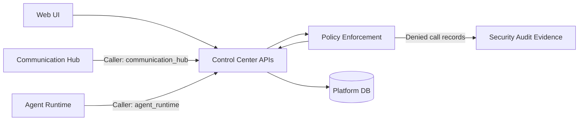
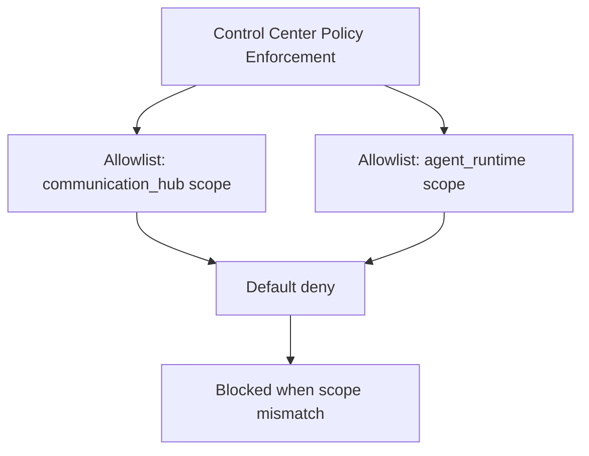

# Control Center Architecture

```mermaid
flowchart LR
    UI[Web UI]
    CH[Communication Hub]
    AR[Agent Runtime]
    PEP[Policy Enforcement]
    API[Control Center APIs]
    DB[(Platform DB)]
    AUD[Security Audit Evidence]

    UI --> API
    CH -->|Caller: communication_hub| API
    AR -->|Caller: agent_runtime| API
    API --> PEP
    PEP --> API
    API --> DB
    PEP -->|Denied call records| AUD
```

```mermaid
flowchart TB
    PEP2[Control Center Policy Enforcement]
    CHA[Allowlist: communication_hub scope]
    ARA[Allowlist: agent_runtime scope]
    DENY[Default deny]
    B1[Blocked when scope mismatch]

    PEP2 --> CHA
    PEP2 --> ARA
    CHA --> DENY
    ARA --> DENY
    DENY --> B1
```
