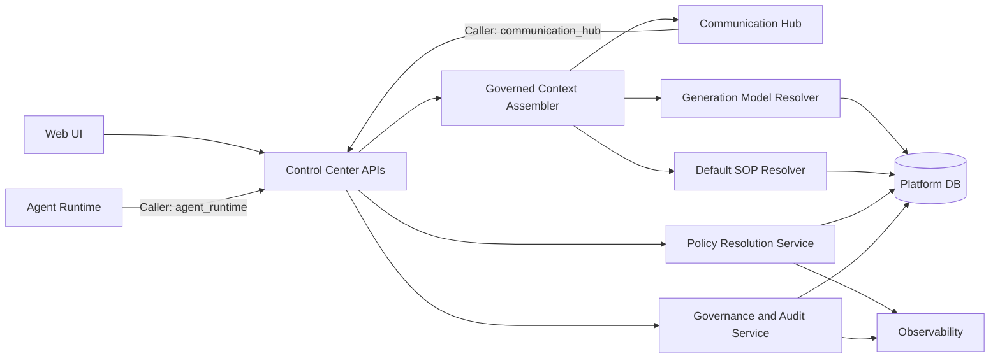
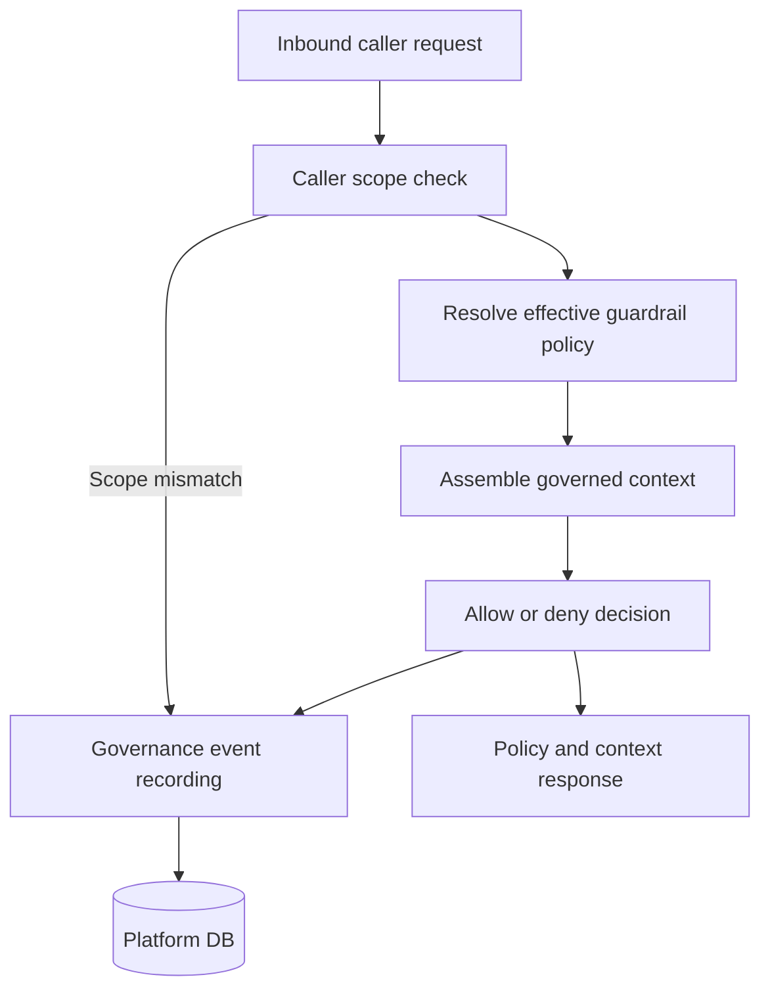

# Control Center Architecture

```mermaid
flowchart LR
    UI[Web UI]
    CH[Communication Hub]
    AR[Agent Runtime]
    API[Control Center APIs]
    POL[Policy Resolution Service]
    CTX[Governed Context Assembler]
    CFG[Generation Model Resolver]
    SOP[Default SOP Resolver]
    GOV[Governance and Audit Service]
    DB[(Platform DB)]
    OBS[Observability]

    UI --> API
    CH -->|Caller: communication_hub| API
    AR -->|Caller: agent_runtime| API
    API --> POL
    API --> CTX
    CTX --> CFG
    CTX --> SOP
    CFG --> DB
    SOP --> DB
    API --> GOV
    POL --> DB
    GOV --> DB
    CTX --> CH
    POL --> OBS
    GOV --> OBS
```

```mermaid
flowchart TB
    CALL[Inbound caller request]
    AUTH[Caller scope check]
    POLICY[Resolve effective guardrail policy]
    CONTEXT[Assemble governed context]
    DECIDE[Allow or deny decision]
    LOG[Governance event recording]
    REPLY[Policy and context response]
    DB[(Platform DB)]

    CALL --> AUTH
    AUTH --> POLICY
    POLICY --> CONTEXT
    CONTEXT --> DECIDE
    DECIDE --> LOG
    LOG --> DB
    DECIDE --> REPLY
    AUTH -->|Scope mismatch| LOG
```
