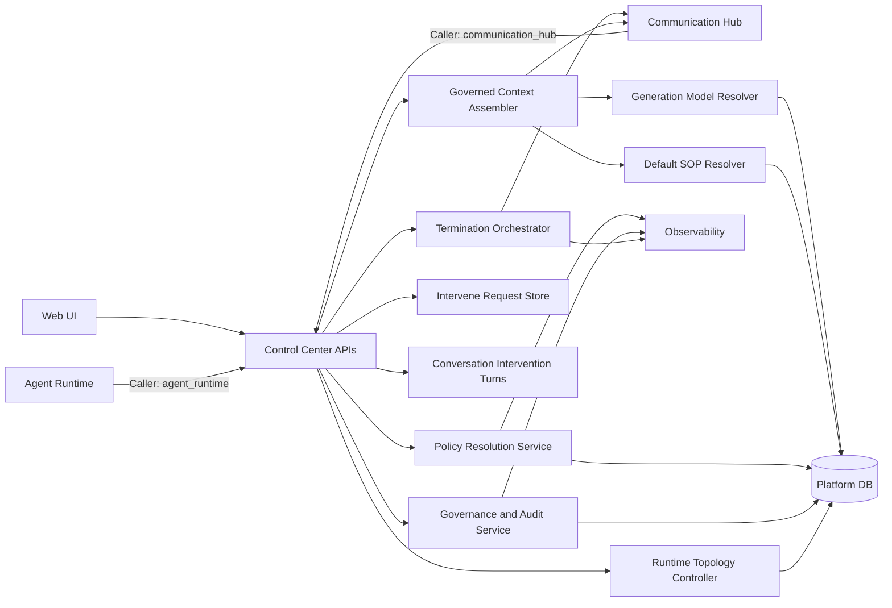
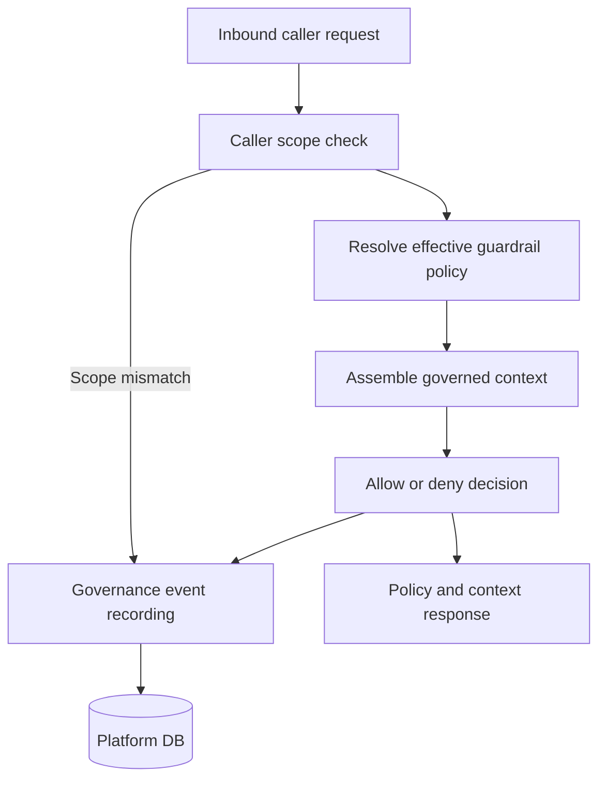

# Control Center Architecture

## Conversation Intervention Persistence

- **Conversation Intervention Turns**: Extension of `ConversationTurn` persistence to support `intervene_request` and `intervene_response` turn types. Stores intervention type (approval/choice/text), prompt text, available options, operator identity, response value, and timestamp. Turns are persisted in chronological order within the conversation stream for audit traceability.
- **Intervene Request Store**: Extended to accept and persist conversation context fields (`conversation_session_id`, `delegation_depth`) on `InterveneRequest`. Automatically creates paired `intervene_response` conversation turns when responses are submitted to conversation-scoped requests. Non-conversational flow (no `conversation_session_id`) is unchanged.
