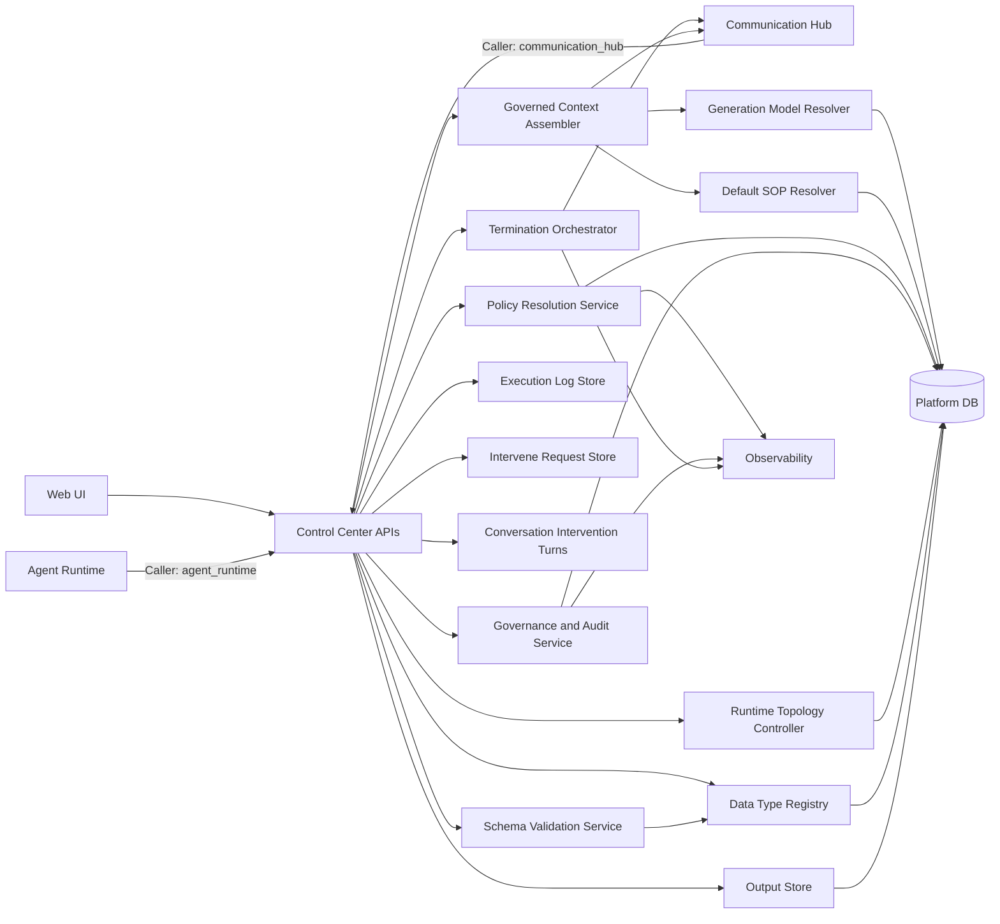
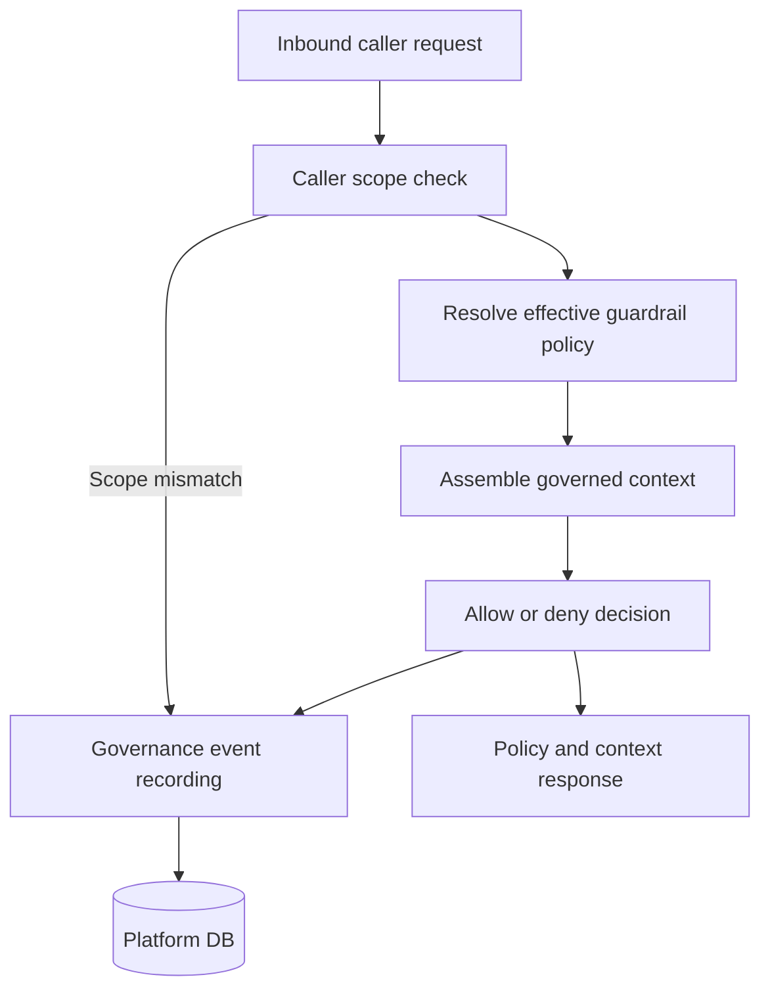

# Control Center Architecture

## Conversation Intervention Persistence

- **Conversation Intervention Turns**: Extension of `ConversationTurn` persistence to support `intervene_request` and `intervene_response` turn types. Stores intervention type (approval/choice/text), prompt text, available options, operator identity, response value, and timestamp. Turns are persisted in chronological order within the conversation stream for audit traceability.
- **Intervene Request Store**: Extended to accept and persist conversation context fields (`conversation_session_id`, `delegation_depth`) on `InterveneRequest`. Automatically creates paired `intervene_response` conversation turns when responses are submitted to conversation-scoped requests. Non-conversational flow (no `conversation_session_id`) is unchanged.

## Task Delegation Event Persistence

- **Execution Log Store**: Accepts new delegation-related execution log event types: `delegation_started`, `delegation_waiting`, `delegation_resumed`, `delegation_depth_blocked`, `delegation_timeout`, `delegation_failed`. These are persisted to the `ExecutionLogEntry` table via the internal log append endpoint and delivered to log viewers via the existing NDJSON stream.
- **Parent-Child Resolution**: Non-conversational intervention requests use the existing `AgentJob.parent_job_id` FK chain to resolve parent context — `InterveneRequest.agent_session_id` identifies the sub-agent session, and the parent is reached via FK traversal. No new schema columns were added.
- **Pending Intervention Query**: `GET /api/v1/agent-jobs/{session_id}/interventions/pending` returns outstanding intervention requests for a task agent session, used by the execution log viewer on reconnect to re-surface dialogs.
- **Delegation Status Query**: `GET /api/v1/agent-jobs/{session_id}/delegation/status` returns current delegation state (active sub-agent types, depths, exit conditions) by querying recent delegation-related `ExecutionLogEntry` entries.

## Agent Data Type Registry

- **Data Type Registry**: Centralized catalogue of reusable typed schemas (`AgentDataType` model) stored in the `agent_data_types` table. Each data type defines a name, slug (canonical runtime identifier), description, and an ordered array of field definitions with types: `string`, `number`, `boolean`, `date`, `enum`. Administrators manage data types via CRUD REST endpoints (`/api/v1/data-types`). The registry enforces uniqueness on name and slug, blocks deletion when referenced by agent types (409 Conflict with referencing type list), and requires at least one field per data type.
- **API**: `GET/POST /api/v1/data-types`, `GET/PUT/DELETE /api/v1/data-types/{id}` — JWT-protected for administrators. `?usage=true` returns referencing agent type counts for delete-guard UI.

## Output Store

- **Output Store** (`AgentOutput` model): Immutable typed output records in the `agent_outputs` table. Each record links to a `data_type_id` (FK → `agent_data_types`), `agent_type_id`, `execution_session_id`, stores `field_values` (JSONB matching the data type schema), `validation_status` (enum: `valid` | `validation_error`), and `raw_output` (Text fallback). Queried by data type, agent type, date range, and session.
- **Agent Outputs Page API**: `GET /api/v1/agent-outputs` — paginated query with filters; `GET /api/v1/agent-outputs/export` — CSV `StreamingResponse`. JWT-protected.
- **Internal API**: `POST /api/v1/internal/agent-outputs` (mTLS) for Agent Runtime output persistence; `GET /api/v1/internal/agent-outputs` for `query_result` tool queries.
- **System Tool Endpoints** (mTLS-protected): `POST /api/v1/internal/system-tools/save-data` (persists `AgentData` intermediate records), `POST /api/v1/internal/system-tools/get-data` (queries `AgentData` with filter guard), `POST /api/v1/internal/system-tools/get-output` (queries `AgentOutput` by filters), `POST /api/v1/internal/system-tools/query-result` (resolves data type name to ID, returns matching typed outputs).

## Schema Validation Service

- **Schema Validation Service**: Lightweight payload validator invoked by Agent Runtime via `POST /api/v1/internal/validate-output` (mTLS). Accepts `data_type_id` and a payload, fetches the schema from the Data Type Registry, validates field types (string, number, boolean, ISO 8601 date, enum membership), required field presence, and default values. Returns `{valid, errors[]}` with field-level error details. Validation failure does not block execution — results are persisted with `validation_status = validation_error` and the raw output as fallback.
