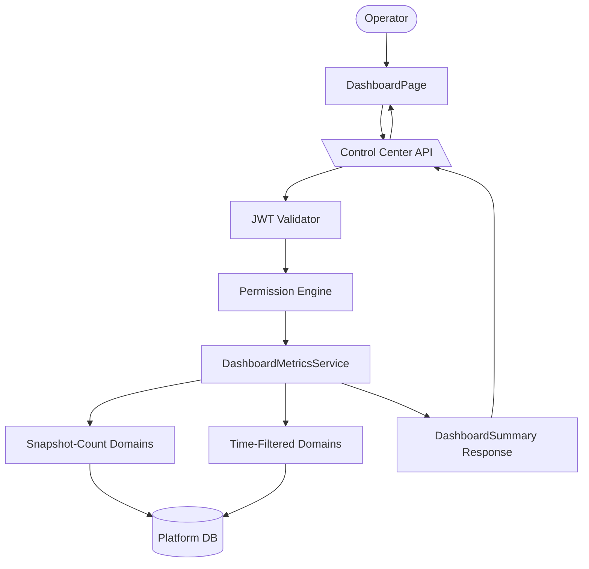

# Dashboard Operational Metrics

The dashboard module provides an operational metrics overview, aggregating counts across multiple data domains into a single summary endpoint. Each data domain is individually permission-guarded, and the UI renders permission-denied placeholders rather than hiding cards.

## Snapshot-Count Domains

Queried without a time filter — returns current state counts:

- Agent Types (with active/running breakdown)
- Agent Identities
- Agent Roles
- MCP Servers
- Model Configurations (enabled only)
- Active Schedules
- Pending Intervention Requests

## Time-Filtered Domains

Queried with a `start_time` / `end_time` range (defaults to last 24 hours):

- Agent Executions (completed/failed breakdown)
- Guardrail Threshold Breach Events
- Execution Log Failures
- Model Usage Posture Breaches

## Permission Model

| Card | Required Permission |
|------|-------------------|
| Agent Types | `RT_AGENT` (read) |
| Agent Executions | `RT_AGENT` (read) |
| Pending Interventions | `RT_AGENT_HUMAN_INTERVENTION` (read) |
| Model Configurations | `RT_AGENT_MODEL_CONFIGS` (read) |
| Model Usage Posture Breaches | `RT_AGENT_MODEL_CONFIGS` (read) |
| Active Schedules | `RT_AGENT_SCHEDULES` (read) |
| Agent Identities | `RT_AGENT_IDENTITIES` (read) |
| Agent Roles | `RT_AGENT_ROLES` (read) |
| MCP Servers | `RT_INTEGRATION_MCP_HUB` (read) |
| Guardrail Breach Events | `RT_AGENT_TRAILS` (read) |
