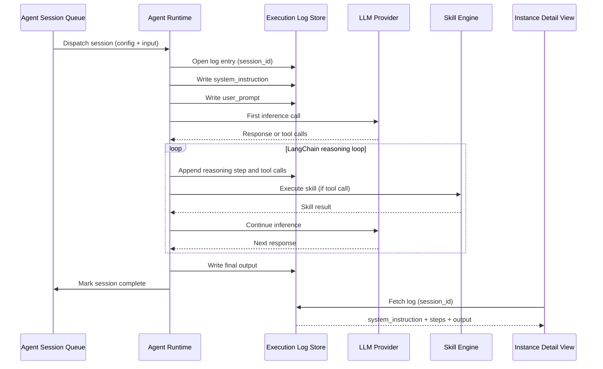

# Execution Logs

## Overview

Every agent session records the full system instruction and user prompt **before** the first LLM inference call, followed by all intermediate reasoning steps and tool calls appended throughout the LangChain executor loop. The complete log is surfaced in the Agent Instance Dashboard detail view. Log entries are append-only and keyed by `session_id`.

## Capture Flow

## Log Entry Structure

| Field | Written When | Content |
|---|---|---|
| **session_id** | Log open | Unique identifier for the session |
| **system_instruction** | Before first LLM call | Full system prompt as sent to the model |
| **user_prompt** | Before first LLM call | Full user input as sent to the model |
| **reasoning_steps** | During loop | Each LLM response turn and any tool calls issued |
| **tool_calls** | During loop | Tool name (`mcp_slug/tool_name`), input, and result per call |
| **final_output** | After loop | Structured or markdown output produced by the agent |

## Presentation Levels

The raw log entry is consumed by the **Log Presenter**, a frontend-only transformation layer embedded inside the **Log Viewer** component in the Instance Detail View. The Log Presenter reads the existing fields (`system_instruction`, `user_prompt`, `reasoning_steps`, `tool_calls`, `final_output`) and derives the display-ready structure. The backend log format and API response contract are not modified.

| Panel | Content | Default State |
|---|---|---|
| **Summary Panel** | Identity, role, SOP/skills loaded, plan, model, result summary | Visible |
| **Working Steps Panel** | All LLM iterations and tool calls, grouped per reasoning step | Collapsed |
| **Raw Log Toggle** | Switches the entire view to unprocessed raw log text; copyable | Off |

See [Agent Instance Dashboard](agent-instance-dashboard.md) for how the Log Viewer is embedded in the Instance Detail View.

## Key Design Decisions

- The system instruction and user prompt are written **before** the first LLM call — not reconstructed after — ensuring the log reflects exactly what was sent.
- Log entries are append-only; no entries are modified or deleted after the session completes.
- Entries are keyed by `session_id`; the UI always receives a consistent snapshot regardless of when it queries.
- The Log Presenter is a pure frontend transformation — no new backend calls, no schema changes, no API contract modifications.
